# Technical Specification

# 1. Introduction

## 1.1 Executive Summary

**Project Overview**

The `Nested-submodules-SK` repository is a minimal, early-stage JavaScript calculator codebase. Its tracked source consists of exactly seven files organized under two top-level folders: `calculator-core/`, which provides a small arithmetic library, and `calculator-ui/`, which provides a static, browser-oriented calculator mockup. The arithmetic library resides entirely in `calculator-core/math-engine/` and exposes four independent CommonJS modules — `add.js`, `subtract.js`, `multiply.js`, and `divide.js` — each implementing a single binary operation. The user-interface layer consists of `calculator-ui/index.html`, `calculator-ui/app.js`, and `calculator-ui/style.css`.

A defining characteristic of the codebase in its current state is that these two halves are **not connected**. `calculator-ui/index.html` contains no `<script>` tag and no stylesheet `<link>`, so it loads neither its sibling `app.js` nor `style.css`; and none of the UI files reference the arithmetic modules in `calculator-core`. The repository therefore delivers arithmetic primitives alongside a disconnected visual shell rather than a functioning end-to-end calculator.

A naming clarification is warranted: although the repository is titled "Nested-submodules-SK," it contains **no Git submodules** — there is no `.gitmodules` file, no nested `.git` directory, and `git submodule status` reports nothing. `calculator-core` and `calculator-ui` are ordinary directories inside a single, flat Git repository on the `main` branch.

**Repository at a Glance**

| Attribute | Detail (as observed in the repository) |
|---|---|
| Repository | `Nested-submodules-SK` (`github.com/Sandeep01Kumar/Nested-submodules-SK`) |
| Domain | Basic four-function arithmetic calculator |
| Composition | `calculator-core/` (library) + `calculator-ui/` (static mockup) |
| Tracked source files | 7 total; no manifests, tests, build config, or dependencies |
| Module system | CommonJS (`module.exports`) in `calculator-core/math-engine/` |
| Integration state | Unintegrated — UI and core are mutually disconnected |
| Version control | Single flat repo, branch `main`, no tags, no submodules |

**Core Problem Addressed**

Interpreted strictly from the artifacts present, the codebase addresses two elementary, self-contained needs. First, `calculator-core/math-engine/` supplies reusable, dependency-free implementations of the four basic arithmetic operations that can be imported individually into any CommonJS/Node.js context. Second, `calculator-ui/` sketches the visual starting point for an on-screen calculator, providing a titled heading, a display field, and operation/digit buttons. The repository does not contain any written problem statement, requirements document, or business justification; the "problem being solved" is therefore inferred from the code itself and is best characterized as *providing arithmetic building blocks and an initial UI scaffold* rather than fulfilling a documented business mandate.

**Key Stakeholders and Users**

No stakeholder register, ownership document, or user description exists anywhere in the repository. The roles below are *implied by the structure and technology of the code*, not drawn from any formal artifact:

| Role (implied) | Relationship to the codebase | Grounding evidence |
|---|---|---|
| JavaScript / Node.js developers | Would `require()` the arithmetic modules as utilities | CommonJS `module.exports` in the four `math-engine` files |
| Front-end developers | Would extend the static mockup into a working UI | `calculator-ui/index.html`, `app.js`, `style.css` |
| End users | Would eventually operate the on-screen calculator | `<input id="display">` and buttons in `index.html` |
| Repository maintainer | Sole committer of all seven files | Git history author `Sandeep01Kumar <sandeep@blitzy.com>` |

The single-author commit history — seven commits each titled simply "Create &lt;file&gt;," all dated 2026-07-20 — together with the complete absence of build, test, and business artifacts is consistent with an instructional or scaffold-stage project rather than a production system.

**Expected Business Impact and Value Proposition**

Because the repository contains no roadmap, KPIs, service-level agreements, or business metrics, no monetary or organizational impact can be asserted from evidence. The value that *is* demonstrable from the code is purely technical and structural: the `math-engine` modules are stateless, synchronous, and free of external dependencies, and each is independently require-able, which makes them trivial to embed, reason about, and unit-test in isolation. The counterbalancing limitation, equally evident in the source, is that the modules perform no input validation or error handling (for example, `divide.js` applies no zero-divisor guard) and the UI is not yet wired to any logic — so the codebase presently functions as a clean foundation to build upon rather than as a deliverable calculator. Any statement of business value beyond this technical baseline would be unsupported by the repository and is therefore intentionally omitted.

## 1.2 System Overview

This overview describes the system as it exists in the repository today. Every capability, component, and limitation stated below is drawn directly from the seven tracked source files; where the section prompt calls for information that the repository does not contain (market positioning, enterprise integrations, formal KPIs), that absence is reported explicitly rather than inferred.

### 1.2.1 Project Context

**Business Context and Market Positioning**

The repository occupies the most generic possible software domain — a four-function arithmetic calculator — and contains no documents that establish a market, product strategy, competitive positioning, or business objective. There is no `README`, no requirements or design document, and no `package.json` description field. Consequently, no market positioning can be asserted from evidence; the project is best understood as a technical scaffold whose context is defined entirely by its code.

**Current System Limitations**

The codebase is not documented as replacing or upgrading any prior system, so there is no legacy predecessor to describe. The relevant limitations are therefore those of the *current* codebase itself, all directly observable in the source:

| # | Current limitation (observed) | Evidence |
|---|---|---|
| 1 | The UI is inert — `index.html` loads no script and no stylesheet | No `<script>` tag or `<link>` element in `index.html` |
| 2 | UI and core are fully disconnected | No `require()` or reference between `calculator-ui` and `calculator-core` |
| 3 | No input validation or error handling anywhere | None of the four `math-engine` modules validates operands |
| 4 | Division-by-zero is unguarded | `divide.js` returns `a / b`, yielding `Infinity`/`-Infinity`/`NaN` per JS semantics |
| 5 | No aggregator or single entry point | No `index.js` in `math-engine`; modules must be required individually |
| 6 | No tests, build tooling, or dependencies | No `package.json`, test files, or CI configuration exist |
| 7 | UI exposes only a partial keypad | Only buttons `1`, `2`, `+`, and `=` are present in `index.html` |

**Integration with the Existing Enterprise Landscape**

The system integrates with nothing external. The `math-engine` modules have no imports and perform no I/O, networking, persistence, or resource management; the UI files reference no external resources, CDNs, or APIs. There are no dependencies to install and no runtime services to connect to. The repository is entirely self-contained.

### 1.2.2 High-Level Description

**Primary System Capabilities**

- **Arithmetic operations (library):** Four independently importable functions — addition, subtraction, multiplication, and division — each accepting two positional operands and returning the native JavaScript result of the corresponding operator.
- **Static calculator surface (UI):** A minimal HTML page presenting a heading, a display input field, and four buttons (`1`, `2`, `+`, `=`); a stylesheet sizing buttons to 50×40 pixels; and a script that logs a single load-time message to the console.

It is important to state plainly that these capabilities are *latent and unconnected*: the arithmetic functions are never invoked by the UI, and the UI's assets are never loaded by its own HTML page.

**Major System Components**

| Component | Location | Responsibility (as observed) |
|---|---|---|
| Math engine | `calculator-core/math-engine/` | Four stateless CommonJS functions: `add`, `subtract`, `multiply`, `divide` |
| UI mockup | `calculator-ui/` | Static `index.html` (display + buttons), `style.css` (button sizing), `app.js` (console log) |

The following diagram depicts the two components, their files, and — critically — the integration links that are absent in the current codebase.

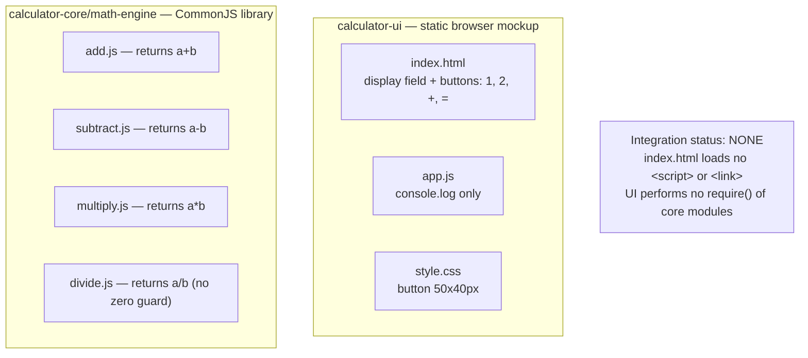
```mermaid
flowchart TB
    subgraph UILayer["calculator-ui — static browser mockup"]
        HTML["index.html<br/>display field + buttons: 1, 2, +, ="]
        JS["app.js<br/>console.log only"]
        CSS["style.css<br/>button 50x40px"]
    end
    subgraph CoreLib["calculator-core/math-engine — CommonJS library"]
        Add["add.js — returns a+b"]
        Sub["subtract.js — returns a-b"]
        Mul["multiply.js — returns a*b"]
        Div["divide.js — returns a/b (no zero guard)"]
    end
    Gap["Integration status: NONE<br/>index.html loads no &lt;script&gt; or &lt;link&gt;<br/>UI performs no require() of core modules"]
```

**Core Technical Approach**

The arithmetic library follows a deliberately simple, one-function-per-file CommonJS pattern with a single default-style export per module and no shared state:

```javascript
function add(a, b) { return a + b; }
module.exports = add;
```

The UI layer uses plain, framework-free, un-bundled static web assets (a bare HTML document without a doctype, one global CSS rule, and a one-line script). There is no build step, transpilation, package manager, module bundler, or test harness anywhere in the repository. Execution semantics are entirely synchronous, and all arithmetic behavior — including numeric coercion and edge cases such as division by zero — is inherited from the JavaScript runtime rather than being explicitly implemented.

### 1.2.3 Success Criteria

**Measurable Objectives**

The repository defines no explicit objectives. The criteria below are *derived from the code* and are verifiable by direct inspection or trivial execution; they are presented as reasonable acceptance conditions for the artifacts that exist, not as documented commitments:

| Derived objective | Verifiable condition | Source file |
|---|---|---|
| Correct addition | `add(a, b)` equals `a + b` for numeric input | `add.js` |
| Correct subtraction | `subtract(a, b)` equals `a - b` | `subtract.js` |
| Correct multiplication | `multiply(a, b)` equals `a * b` | `multiply.js` |
| Correct division | `divide(a, b)` equals `a / b` (JS semantics) | `divide.js` |
| Module loadability | Each file is `require()`-able and exports one function | `module.exports` in each module |
| UI renders the shell | Display field and four buttons appear on the page | `index.html` |

**Critical Success Factors**

The repository documents no success factors. Based strictly on the integration gaps evident in the source (Section 1.2.1), the factors that would be critical to evolving this scaffold into a working calculator are: wiring `index.html` to load `app.js` and `style.css`; connecting the UI to the `math-engine` functions (via a bundler or a browser-compatible module strategy, since the modules are CommonJS); introducing operand validation and explicit division-by-zero handling; and adding an aggregating entry point together with a test and build setup. These are inferred remediation factors, not commitments recorded in the codebase.

**Key Performance Indicators (KPIs)**

No KPIs, service-level agreements, performance targets, or quality thresholds are defined anywhere in the repository. There are no metrics instrumentation, benchmarks, or monitoring artifacts. Accordingly, no KPIs can be reported from evidence, and none are fabricated here.

## 1.3 Scope

Scope here is defined by what the repository actually contains and does. In-scope items are those present and functional in the seven tracked files; out-of-scope items are capabilities, integrations, and use cases that are demonstrably absent. No planned or roadmap items are asserted, because the repository contains no roadmap.

### 1.3.1 In-Scope Elements

**Core Features and Functionalities**

| Aspect | In-scope element (present in the repository) | Evidence |
|---|---|---|
| Must-have capability | Four arithmetic functions: `add`, `subtract`, `multiply`, `divide` | `calculator-core/math-engine/*.js` |
| Must-have capability | Static calculator surface: display field + buttons `1`, `2`, `+`, `=` | `calculator-ui/index.html` |
| Must-have capability | Load-time console notification | `calculator-ui/app.js` |
| Must-have capability | Uniform button sizing (50×40 px) | `calculator-ui/style.css` |
| Primary workflow | `require()` a module and invoke it with two operands to obtain a result | `module.exports` in each module |
| Primary workflow | Open `index.html` to view the static calculator shell | `calculator-ui/index.html` |
| Essential integrations | None — the repository contains and requires no integrations | No imports/dependencies across the repo |
| Key technical requirement | A CommonJS-capable runtime (e.g., Node.js) to load the modules | `module.exports` pattern |
| Key technical requirement | A web browser to render the static page | `index.html` + `style.css` |

**Implementation Boundaries**

| Boundary dimension | Coverage in the repository | Evidence |
|---|---|---|
| System boundary | Seven files across `calculator-core` and `calculator-ui`; two independent execution surfaces (Node `require`; browser page render) | Repository file tree |
| User groups covered | Developers consuming the modules; viewers of the static page — no roles, accounts, or authentication | Code structure; no auth artifacts |
| Geographic / market coverage | None defined; no localization, internationalization, or regional configuration | Absence of any such artifacts |
| Data domains included | Transient numeric operands and results plus a single text display field; no stored or persisted data | `math-engine` functions; `<input id="display">` |

The single genuinely functional workflow in scope is the library path: importing one of the four modules and calling it with two arguments. The UI path is in scope only as a *static rendering* — the page displays its shell, but no interactive calculation workflow is included because the UI is not wired to any logic.

### 1.3.2 Out-of-Scope Elements

**Explicitly Excluded Features and Capabilities**

| Category | Excluded / absent (not implemented in the repository) | Evidence of absence |
|---|---|---|
| Feature | UI-to-engine integration, "equals" computation, and display updates | No event handlers or references in `index.html`/`app.js` |
| Feature | The page loading its own `app.js` and `style.css` | No `<script>` or `<link>` in `index.html` |
| Feature | Input validation and error handling | None present in any `math-engine` module |
| Feature | Safe division-by-zero handling | `divide.js` returns `a / b` with no guard |
| Feature | Full keypad (`0`, `3`–`9`), other operators (`−`, `×`, `÷`), decimals | Only `1`, `2`, `+`, `=` exist in `index.html` |
| Feature | Advanced math (powers, roots, modulo, memory, history) | No such code exists |
| Feature | An aggregating entry point / index for the library | No `index.js` in `math-engine` |
| Integration | External APIs, databases/persistence, networking, authentication | No dependencies, I/O, or network code |
| Tooling | Build, bundling, automated tests, CI/CD, package publication | No `package.json`, test files, or CI configuration |

**Future Phase Considerations**

The repository contains no roadmap, backlog, milestone, or phased plan of any kind. The remediation items identified in Section 1.2.3 (wiring the UI, connecting it to the engine, adding validation and division-by-zero handling, and introducing tests and build tooling) are natural next steps implied by the current gaps, but they are **not documented or scheduled** in any repository artifact and are stated here only as observations, not commitments.

**Integration Points Not Covered**

No integration surface exists or is planned in the code. Specifically out of scope are: browser consumption of the CommonJS modules (there is no bundler or interop layer to make `module.exports` usable in the browser); any HTTP/API integration; any database or file-based persistence; any messaging, caching, or external service; and any package-registry distribution of the library.

**Unsupported Use Cases**

- Performing an actual calculation through the on-screen UI (the buttons trigger nothing and the display is never updated).
- Dividing by zero and receiving a validated or friendly result (the operation returns `Infinity`/`-Infinity`/`NaN`).
- Passing non-numeric or missing operands and receiving graceful handling (behavior falls through to raw JavaScript coercion).
- Using digits or operators beyond the four buttons present (`1`, `2`, `+`, `=`).
- Any stateful, multi-step, or expression-based calculation, memory, or history feature.

## 1.4 References

The following repository artifacts were inspected and cited as evidence for this Introduction. All claims in Sections 1.1–1.3 are grounded in these sources.

**Files Examined**

- `calculator-core/math-engine/add.js` — Established the addition module: `function add(a,b){ return a+b; }` with `module.exports = add`; no validation or error handling.
- `calculator-core/math-engine/subtract.js` — Established the subtraction module (`return a-b`), same single-function CommonJS shape.
- `calculator-core/math-engine/multiply.js` — Established the multiplication module (`return a*b`), same shape.
- `calculator-core/math-engine/divide.js` — Established the division module (`return a/b`) with no zero-divisor guard.
- `calculator-ui/index.html` — Established the static UI shell (`<h2>Calculator</h2>`, `<input id="display">`, buttons `1`,`2`,`+`,`=`) and the absence of any `<script>`/`<link>` (page loads no assets, has no handlers).
- `calculator-ui/app.js` — Established the one-line bootstrap `console.log("Calculator UI loaded")` with no logic.
- `calculator-ui/style.css` — Established the single `button` rule (`width:50px; height:40px`); no display/layout styling.

**Folders Examined**

- `` (repository root) — Confirmed exactly two top-level folders and no root-level files.
- `calculator-core/` — Confirmed it contains only the `math-engine/` subfolder.
- `calculator-core/math-engine/` — Confirmed the four arithmetic modules and the absence of any aggregator/`index.js`.
- `calculator-ui/` — Confirmed the three static UI files.

**Version-Control and Repository Inspection Findings**

- Git history (`git log`) — Established seven commits, all authored by `Sandeep01Kumar <sandeep@blitzy.com>` on 2026-07-20, each titled "Create &lt;file&gt;"; branch `main`; no tags.
- Submodule/structure checks (`git submodule status`, `.gitmodules` search, nested `.git` search) — Confirmed that, despite the repository name "Nested-submodules-SK," no Git submodules exist.
- Manifest/tooling search (`find` for `package.json`, tests, CI, Dockerfile, tsconfig, `.gitignore`, lockfiles) — Confirmed the absence of build manifests, tests, dependencies, and CI/CD configuration.

**External Sources**

- None. No web sources were consulted; every statement in this section derives solely from the repository.

# 2. Product Requirements

## 2.1 Feature Catalog

This section decomposes the `Nested-submodules-SK` repository into discrete, independently testable features. Every feature, requirement, priority, and status below is derived **exclusively** from the seven tracked source files; where the section prompt calls for information the repository does not contain (formal business value, documented priorities, compliance regimes, performance targets), that absence is reported explicitly rather than invented. Consistent with the system described in Sections 1.1–1.3, the codebase is an early-stage, unintegrated scaffold — an arithmetic library plus a disconnected static UI mockup — so the feature model reflects latent, artifact-level capabilities rather than a working end-to-end calculator.

**Decomposition approach.** The four arithmetic modules in `calculator-core/math-engine/` are grouped into a single cohesive library feature (F-001), with each operation captured as an individually testable requirement. The three files in `calculator-ui/` are modeled as three *separate* features (F-002, F-003, F-004) because they are not wired together — `index.html` loads neither `app.js` nor `style.css` — and treating them separately makes the integration gaps explicit (see Section 2.3).

**Feature index (at a glance)**

| Feature ID | Feature Name | Priority | Status |
|---|---|---|---|
| F-001 | Arithmetic Operations Library | Critical | Completed (as authored) |
| F-002 | Static Calculator Interface Shell | High | Completed (as authored) |
| F-003 | UI Bootstrap Logging Script | Low | Completed (as authored) |
| F-004 | Button Presentation Stylesheet | Low | Completed (as authored) |

**Categorization and source mapping**

| Feature ID | Feature Category | Primary Source Artifact(s) |
|---|---|---|
| F-001 | Core Arithmetic Library | `calculator-core/math-engine/add.js`, `subtract.js`, `multiply.js`, `divide.js` |
| F-002 | User Interface | `calculator-ui/index.html` |
| F-003 | User Interface | `calculator-ui/app.js` |
| F-004 | User Interface | `calculator-ui/style.css` |

**Interpretation of the metadata fields (important caveats):**

- **Priority Level** is *derived* from each artifact's centrality to the calculator domain; the repository documents no formal priorities. F-001 is Critical because the arithmetic functions are the only functional logic in the system; F-002 is High as the intended user-facing surface; F-003 and F-004 are Low as diagnostic/cosmetic concerns.
- **Status** of `Completed (as authored)` means the artifact is committed and performs its literal function when executed in isolation. It does **not** imply end-to-end product completeness — Sections 1.1 and 1.2 establish that the UI and core are mutually disconnected, so the composite "working calculator" is not a feature that exists.

### 2.1.1 F-001: Arithmetic Operations Library

**Feature Metadata**

| Attribute | Value |
|---|---|
| Unique ID | F-001 |
| Feature Name | Arithmetic Operations Library |
| Feature Category | Core Arithmetic Library |
| Priority Level | Critical |
| Status | Completed (as authored) |

**Description**

| Aspect | Detail |
|---|---|
| Overview | A dependency-free CommonJS library at `calculator-core/math-engine/` comprising four independent modules — `add.js`, `subtract.js`, `multiply.js`, `divide.js` — each exporting a single synchronous binary function that operates on two positional operands `a` and `b`. |
| Business Value | The repository documents no market, KPIs, or monetary impact (see Section 1.1). The demonstrable value is technical and structural: reusable, stateless arithmetic primitives that are trivial to embed, reason about, and unit-test in isolation. |
| User Benefits | A JavaScript/Node.js developer can `require()` any single operation à la carte without pulling in additional code, shared state, or configuration. |
| Technical Context | Each module uses a one-function-per-file pattern with a single default-style `module.exports`. Arithmetic delegates directly to native JavaScript operators (`+`, `-`, `*`, `/`), inheriting the runtime's numeric coercion and edge-case behavior. There is no input validation, no error handling, and no divide-by-zero guard. |

**Dependencies**

| Dependency Type | Detail |
|---|---|
| Prerequisite Features | None. Each of the four modules is fully self-contained; there are no cross-module imports and no aggregating `index.js`. |
| System Dependencies | A CommonJS-capable runtime (e.g., Node.js) is required to `require()` and invoke the modules. |
| External Dependencies | None. No third-party packages, no `package.json`, no installed dependencies exist anywhere in the repository. |
| Integration Requirements | To be consumed by the browser UI (F-002), a bundler or CommonJS-to-browser interop layer would be required; none exists. The library is not currently referenced by any UI file. |

### 2.1.2 F-002: Static Calculator Interface Shell

**Feature Metadata**

| Attribute | Value |
|---|---|
| Unique ID | F-002 |
| Feature Name | Static Calculator Interface Shell |
| Feature Category | User Interface |
| Priority Level | High |
| Status | Completed (as authored — static shell only) |

**Description**

| Aspect | Detail |
|---|---|
| Overview | A bare static HTML document (`calculator-ui/index.html`) that renders a `Calculator` heading (`<h2>`), a display input field (`<input id="display">`), and four buttons labeled `1`, `2`, `+`, and `=`. |
| Business Value | No documented business value. The artifact provides the visual starting point for an on-screen calculator (see Section 1.1's "UI scaffold" characterization). |
| User Benefits | An end user sees the calculator shell rendered in a browser; a front-end developer receives a concrete markup skeleton to extend. |
| Technical Context | Framework-free markup with no `<!doctype>`. The document contains no `<script>` tag and no stylesheet `<link>`, so it loads neither `app.js` (F-003) nor `style.css` (F-004). It has no event handlers, no `type`/`onclick` attributes, and no accessibility attributes, so it is inert — it renders but performs no calculation. |

**Dependencies**

| Dependency Type | Detail |
|---|---|
| Prerequisite Features | None at render time; the page renders standalone. |
| System Dependencies | A web browser to parse and render the static markup. |
| External Dependencies | None. No CDNs, external stylesheets, fonts, or scripts are referenced. |
| Integration Requirements | To become interactive, the page would need to load F-003/F-004 and invoke F-001; none of those links are present, so no integration is realized. |

### 2.1.3 F-003: UI Bootstrap Logging Script

**Feature Metadata**

| Attribute | Value |
|---|---|
| Unique ID | F-003 |
| Feature Name | UI Bootstrap Logging Script |
| Feature Category | User Interface |
| Priority Level | Low |
| Status | Completed (as authored) |

**Description**

| Aspect | Detail |
|---|---|
| Overview | A single-statement script (`calculator-ui/app.js`) that writes the message `Calculator UI loaded` to the console when executed. |
| Business Value | No documented business value. It functions as a load-time diagnostic breadcrumb. |
| User Benefits | A developer observing the console receives confirmation that the script executed — but only if the script is actually loaded. |
| Technical Context | The file contains exactly one `console.log(...)` call and no imports, exports, variables, functions, classes, or calculator logic. Because `index.html` includes no `<script>` reference, this script is never executed in the page context. |

**Dependencies**

| Dependency Type | Detail |
|---|---|
| Prerequisite Features | None. |
| System Dependencies | Any JavaScript runtime with a console (browser or Node.js) to execute the statement. |
| External Dependencies | None. |
| Integration Requirements | Execution in the page requires `index.html` (F-002) to add a `<script src="app.js">` element; that element is absent. |

### 2.1.4 F-004: Button Presentation Stylesheet

**Feature Metadata**

| Attribute | Value |
|---|---|
| Unique ID | F-004 |
| Feature Name | Button Presentation Stylesheet |
| Feature Category | User Interface |
| Priority Level | Low |
| Status | Completed (as authored) |

**Description**

| Aspect | Detail |
|---|---|
| Overview | A minimal stylesheet (`calculator-ui/style.css`) containing a single global rule that sizes every `<button>` element to `width: 50px` and `height: 40px`. |
| Business Value | No documented business value. It provides basic, uniform button dimensions for the UI. |
| User Benefits | Consistent button sizing across the keypad — but only if the stylesheet is linked into the page. |
| Technical Context | The file defines one `button` selector with two declarations and nothing else: no display/layout rules, no responsive behavior, no CSS variables, no imports, and no selector targeting the `#display` field. Because `index.html` includes no `<link>` element, the rule is never applied to the rendered page. |

**Dependencies**

| Dependency Type | Detail |
|---|---|
| Prerequisite Features | None functionally, though the rule is only meaningful against the `<button>` elements provided by F-002. |
| System Dependencies | A web browser CSS engine to apply the rule. |
| External Dependencies | None. |
| Integration Requirements | Application to the page requires `index.html` (F-002) to add a `<link rel="stylesheet" href="style.css">` element; that element is absent. |

## 2.2 Functional Requirements

This section enumerates the testable functional requirements for each feature in the catalog. Requirement IDs follow the `F-XXX-RQ-YYY` convention. Every acceptance criterion is verifiable by direct inspection or trivial execution of the exact source files. To respect the four-column limit, each feature's requirements are presented across focused tables: **Requirement Details**, **Acceptance Criteria**, **Technical Specifications** (Inputs/Outputs and Performance/Data), and **Validation Rules** (Business/Data and Security/Compliance).

A recurring, evidence-based finding applies system-wide: none of the modules perform input validation or error handling, none touch I/O or the network, and the repository defines no compliance regime or performance targets. These "none" values are therefore factual observations, not omissions.

### 2.2.1 F-001: Arithmetic Operations Library — Functional Requirements

**Requirement Details**

| Requirement ID | Description | Priority | Complexity |
|---|---|---|---|
| F-001-RQ-001 | `add(a, b)` returns the sum `a + b` | Must-Have | Low |
| F-001-RQ-002 | `subtract(a, b)` returns the difference `a - b` | Must-Have | Low |
| F-001-RQ-003 | `multiply(a, b)` returns the product `a * b` | Must-Have | Low |
| F-001-RQ-004 | `divide(a, b)` returns the quotient `a / b` (no zero guard) | Must-Have | Low |
| F-001-RQ-005 | Each module exposes its function as a single CommonJS export | Must-Have | Low |

**Acceptance Criteria**

| Requirement ID | Acceptance Criteria |
|---|---|
| F-001-RQ-001 | `add(2, 3)` equals `5`; `add(-1, 1)` equals `0`; result equals the native `a + b` for numeric input |
| F-001-RQ-002 | `subtract(5, 3)` equals `2`; `subtract(0, 1)` equals `-1`; result equals the native `a - b` |
| F-001-RQ-003 | `multiply(4, 3)` equals `12`; `multiply(-2, 3)` equals `-6`; result equals the native `a * b` |
| F-001-RQ-004 | `divide(6, 3)` equals `2`; `divide(1, 0)` returns `Infinity`; `divide(0, 0)` returns `NaN` (JS semantics, unguarded) |
| F-001-RQ-005 | `require()` of each of the four module files returns a value of type `function` |

**Technical Specifications — Inputs & Outputs**

| Requirement ID | Input Parameters | Output / Response |
|---|---|---|
| F-001-RQ-001 | Two positional operands `a`, `b` (untyped) | Value of `a + b` (Number when numeric; native coercion otherwise) |
| F-001-RQ-002 | Two positional operands `a`, `b` (untyped) | Value of `a - b` (operands coerced to Number by `-`) |
| F-001-RQ-003 | Two positional operands `a`, `b` (untyped) | Value of `a * b` (operands coerced to Number by `*`) |
| F-001-RQ-004 | Two positional operands `a`, `b` (untyped) | Value of `a / b`; `Infinity`, `-Infinity`, or `NaN` when `b` is `0` |
| F-001-RQ-005 | None (module load via `require`) | The single exported function reference |

**Technical Specifications — Performance & Data**

| Requirement ID | Performance Criteria | Data Requirements |
|---|---|---|
| F-001-RQ-001 through RQ-004 | Synchronous, constant-time O(1); no documented performance target | Transient in-memory operands and result; no state, no persistence |
| F-001-RQ-005 | Synchronous module load; no documented target | No data; returns a function reference only |

**Validation Rules — Business & Data**

| Requirement ID | Business Rules | Data Validation |
|---|---|---|
| F-001-RQ-001 | Uses native `+`; string operands trigger concatenation coercion (e.g., `'2' + 3` yields `'23'`) | None — operands are not type-checked |
| F-001-RQ-002 | Uses native `-`; operands coerced to Number (e.g., `'a' - 1` yields `NaN`) | None |
| F-001-RQ-003 | Uses native `*`; operands coerced to Number | None |
| F-001-RQ-004 | Uses native `/` with no divide-by-zero handling | None — zero divisor and non-numeric operands are not checked |
| F-001-RQ-005 | One function per file; single default-style `module.exports`; no aggregating index | None |

**Validation Rules — Security & Compliance**

| Requirement ID | Security Requirements | Compliance Requirements |
|---|---|---|
| F-001-RQ-001 through RQ-005 | None applicable — modules perform no I/O, networking, or persistence and hold no secrets | None documented in the repository |

### 2.2.2 F-002: Static Calculator Interface Shell — Functional Requirements

**Requirement Details**

| Requirement ID | Description | Priority | Complexity |
|---|---|---|---|
| F-002-RQ-001 | Render the application heading `Calculator` in an `<h2>` | Must-Have | Low |
| F-002-RQ-002 | Render a display input field identified by `id="display"` | Must-Have | Low |
| F-002-RQ-003 | Render keypad buttons labeled `1`, `2`, `+`, `=` | Must-Have | Low |

**Acceptance Criteria**

| Requirement ID | Acceptance Criteria |
|---|---|
| F-002-RQ-001 | Opening `index.html` in a browser displays the heading text `Calculator` |
| F-002-RQ-002 | The rendered page contains exactly one `<input>` element whose `id` is `display` |
| F-002-RQ-003 | The rendered page contains exactly four buttons labeled `1`, `2`, `+`, `=`, in that order |

**Technical Specifications — Inputs & Outputs**

| Requirement ID | Input Parameters | Output / Response |
|---|---|---|
| F-002-RQ-001 | None (static markup) | Rendered `<h2>` heading element |
| F-002-RQ-002 | Free-text a user may type (never read by any script) | Rendered text `<input>` element |
| F-002-RQ-003 | None (buttons have no `type` or handler) | Four rendered `<button>` elements |

**Technical Specifications — Performance & Data**

| Requirement ID | Performance Criteria | Data Requirements |
|---|---|---|
| F-002-RQ-001 through RQ-003 | Static browser render; no scripting, no documented target | Static markup only; transient text in the display field is never consumed |

**Validation Rules — Business & Data**

| Requirement ID | Business Rules | Data Validation |
|---|---|---|
| F-002-RQ-001 | Fixed heading label `Calculator` | None |
| F-002-RQ-002 | Single display field addressed by `id="display"` | None — no script reads or validates the field |
| F-002-RQ-003 | Partial keypad only (`1`, `2`, `+`, `=`); no other digits or operators; clicks trigger nothing | None — no event handlers attached |

**Validation Rules — Security & Compliance**

| Requirement ID | Security Requirements | Compliance Requirements |
|---|---|---|
| F-002-RQ-001 through RQ-003 | None applicable — static HTML with no dynamic content, scripts, or external resources | None documented (no accessibility/ARIA attributes present; document has no `<!doctype>`) |

### 2.2.3 F-003: UI Bootstrap Logging Script — Functional Requirements

**Requirement Details**

| Requirement ID | Description | Priority | Complexity |
|---|---|---|---|
| F-003-RQ-001 | Emit the console message `Calculator UI loaded` on execution | Could-Have | Low |

**Acceptance Criteria**

| Requirement ID | Acceptance Criteria |
|---|---|
| F-003-RQ-001 | Executing `app.js` (e.g., via `node app.js` or a `<script>` load) writes exactly `Calculator UI loaded` to the console |

**Technical Specifications — Inputs & Outputs**

| Requirement ID | Input Parameters | Output / Response |
|---|---|---|
| F-003-RQ-001 | None | A single line written to `console` |

**Technical Specifications — Performance & Data**

| Requirement ID | Performance Criteria | Data Requirements |
|---|---|---|
| F-003-RQ-001 | Single synchronous statement; no documented target | None — fixed literal string, no state |

**Validation Rules — Business & Data**

| Requirement ID | Business Rules | Data Validation |
|---|---|---|
| F-003-RQ-001 | Fixed message string; never invoked by `index.html` (no `<script>` tag) | None |

**Validation Rules — Security & Compliance**

| Requirement ID | Security Requirements | Compliance Requirements |
|---|---|---|
| F-003-RQ-001 | None applicable — no I/O beyond console output, no external input | None documented |

### 2.2.4 F-004: Button Presentation Stylesheet — Functional Requirements

**Requirement Details**

| Requirement ID | Description | Priority | Complexity |
|---|---|---|---|
| F-004-RQ-001 | Apply uniform dimensions (`width: 50px`, `height: 40px`) to all `<button>` elements | Could-Have | Low |

**Acceptance Criteria**

| Requirement ID | Acceptance Criteria |
|---|---|
| F-004-RQ-001 | When the stylesheet is linked, every `<button>` renders at 50px wide by 40px tall |

**Technical Specifications — Inputs & Outputs**

| Requirement ID | Input Parameters | Output / Response |
|---|---|---|
| F-004-RQ-001 | None | Applied CSS box dimensions on `<button>` elements |

**Technical Specifications — Performance & Data**

| Requirement ID | Performance Criteria | Data Requirements |
|---|---|---|
| F-004-RQ-001 | Static stylesheet application; no documented target | None |

**Validation Rules — Business & Data**

| Requirement ID | Business Rules | Data Validation |
|---|---|---|
| F-004-RQ-001 | Global `button` selector applies to every button on the page; never linked by `index.html` | None |

**Validation Rules — Security & Compliance**

| Requirement ID | Security Requirements | Compliance Requirements |
|---|---|---|
| F-004-RQ-001 | None applicable — presentational CSS only | None documented |

## 2.3 Feature Relationships

This section documents only the relationships that are evident in the source code. The dominant, verifiable finding is the **absence** of runtime relationships between features: there are no `require()` links between the UI and the arithmetic library, and `index.html` contains neither a `<script>` tag nor a stylesheet `<link>`. The relationships depicted below therefore distinguish realized links (none exist) from the intended-but-absent integration edges implied by the artifacts. This is consistent with the component diagram in Section 1.2.2 and the out-of-scope integration items in Section 1.3.2.

### 2.3.1 Feature Dependency Map

In the diagram, solid edges would denote realized runtime dependencies — there are **none**. Every edge shown is dashed and labeled `ABSENT`, representing an integration a working calculator would require but which does not exist in the current code.

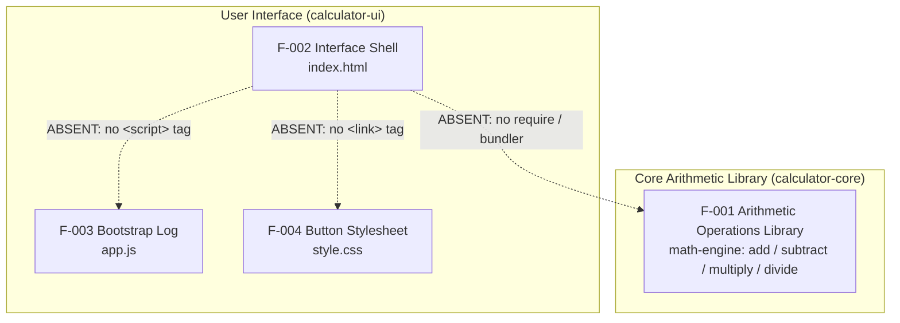
```mermaid
flowchart TB
    subgraph Core["Core Arithmetic Library (calculator-core)"]
        F001["F-001 Arithmetic Operations Library<br/>math-engine: add / subtract / multiply / divide"]
    end
    subgraph UIGroup["User Interface (calculator-ui)"]
        F002["F-002 Interface Shell<br/>index.html"]
        F003["F-003 Bootstrap Log<br/>app.js"]
        F004["F-004 Button Stylesheet<br/>style.css"]
    end
    F002 -. "ABSENT: no &lt;script&gt; tag" .-> F003
    F002 -. "ABSENT: no &lt;link&gt; tag" .-> F004
    F002 -. "ABSENT: no require / bundler" .-> F001
```

**Realized dependencies:** none. Each feature executes or renders in complete isolation. F-001's four modules do not import one another; the three UI features do not reference one another; and the UI does not reference the library.

### 2.3.2 Integration Points

Every integration point below is a *potential* seam implied by the artifacts. All are currently unrealized, which is the load-bearing fact for this system.

| Integration Point | Mechanism That Would Be Required | Status in Code |
|---|---|---|
| Page loads its bootstrap script (F-002 → F-003) | `<script src="app.js">` in `index.html` | Absent |
| Page loads its stylesheet (F-002 → F-004) | `<link rel="stylesheet" href="style.css">` in `index.html` | Absent |
| UI invokes arithmetic logic (F-002 → F-001) | A bundler or CommonJS-to-browser interop plus `require()` calls and event handlers | Absent |
| Library aggregation across F-001 modules | An `index.js` barrel re-exporting the four functions | Absent (modules must be required individually) |

### 2.3.3 Shared Components

No shared *runtime* component exists. The only shared elements are structural (code patterns and directory co-location), not executing dependencies.

| Shared Element | Shared By | Nature of Sharing |
|---|---|---|
| CommonJS one-function-per-file export pattern | F-001 (all four `math-engine` modules) | A repeated code convention, not a shared runtime module |
| `calculator-ui/` directory | F-002, F-003, F-004 | Physical co-location only; no runtime coupling |
| The `<button>` elements | F-002 (defines them), F-004 (would style them) | A selector-target relationship that is unrealized because the stylesheet is never linked |

### 2.3.4 Common Services

There are **no common services** in the repository. Specifically, there is no aggregating entry point or barrel module, no shared configuration, no dependency-injection container, no shared state, no logging/telemetry service (F-003's `console.log` is a standalone statement, not a service consumed by others), and no runtime orchestration layer. Each feature is self-contained, which both explains the system's simplicity and confirms that the "working calculator" composite is not present.

## 2.4 Implementation Considerations

This section captures the implementation considerations for each feature, organized by dimension. The repository documents no non-functional requirements, service-level agreements, or performance targets (confirmed in Section 1.2.3), so the performance, scalability, and security notes below are derived from directly observable code characteristics — not from documented commitments.

### 2.4.1 Technical Constraints

| Feature | Technical Constraints |
|---|---|
| F-001 | CommonJS `module.exports` cannot be consumed directly in a browser without a bundler or interop layer; operands are untyped with no enforcement; arithmetic is bound by IEEE-754 double-precision and native JavaScript coercion; no aggregating `index.js`, so each module must be required individually |
| F-002 | Bare HTML with no `<!doctype>` (risking browser quirks mode); inert markup (no scripting); partial keypad (only `1`, `2`, `+`, `=`); no accessibility/ARIA attributes |
| F-003 | Executes only when loaded by a runtime; because `index.html` has no `<script>` tag, it is dormant in the browser context; logs a fixed literal only |
| F-004 | Uses an unscoped global `button` selector (affects every button on any page it is applied to); never linked by `index.html`, so it is never applied; no layout or responsive rules |

### 2.4.2 Performance Requirements

| Feature | Performance Characteristics (observed; no documented target) |
|---|---|
| F-001 | Synchronous, constant-time O(1) per invocation; negligible cost; no async work or blocking I/O |
| F-002 | Single static render; negligible; no runtime scripting cost |
| F-003 | A single synchronous statement; negligible |
| F-004 | A single CSS rule; negligible style-computation cost |

### 2.4.3 Scalability Considerations

| Feature | Scalability Considerations |
|---|---|
| F-001 | Stateless and side-effect-free, so functions are safe to call repeatedly and concurrently; however, the absence of a barrel export means every new consumer wires each module individually, and adding operations scales linearly as new files |
| F-002 | The static page does not scale interactively; expanding to a full keypad or dynamic display requires manual markup and eventual scripting |
| F-003 | Not a scaling concern — a single, standalone log statement |
| F-004 | The global selector applies uniformly to any number of buttons but provides no per-element or responsive control |

### 2.4.4 Security Implications

System-wide, the attack surface is minimal: no feature performs I/O, networking, persistence, authentication, or secret handling, and none use `eval` or dynamic code execution.

| Feature | Security Implications |
|---|---|
| F-001 | No input validation, so non-numeric operands are silently coerced (e.g., string concatenation in `add`, `NaN` results elsewhere) and division by zero is unguarded; there is no injection surface because the modules touch no DOM, I/O, or network |
| F-002 | Static HTML with no dynamic content offers no XSS vector in its current form; the display field is never read, so there is no input-handling risk; no Content-Security-Policy or sanitization exists, which would become relevant once the UI is wired |
| F-003 | Console output only; emits a fixed string and handles no sensitive data |
| F-004 | Presentational CSS only; no security implication |

### 2.4.5 Maintenance Requirements

System-wide, there are no automated tests, no build tooling, no CI, no linter, and no dependency manifest, so there is no automated regression safety net; correctness is verified only by manual inspection or trivial execution.

| Feature | Maintenance Requirements |
|---|---|
| F-001 | The one-function-per-file pattern is easy to read and modify, but the lack of tests means regressions go undetected, and there is no manifest or versioning to track the library |
| F-002 | Markup edits are straightforward but fully manual; no templating or component reuse exists |
| F-003 | Trivial to maintain given its single-statement size |
| F-004 | Trivial to maintain; a single rule with no dependencies |

## 2.5 Requirements Traceability Matrix

The matrix traces every functional requirement to its parent feature, its exact source artifact, and a concrete verification method. Because the repository contains no automated tests, verification methods describe how each requirement can be confirmed by trivial execution or direct inspection of the cited file.

### 2.5.1 Requirement-to-Source Traceability

| Requirement ID | Parent Feature | Source Artifact |
|---|---|---|
| F-001-RQ-001 | F-001 | `calculator-core/math-engine/add.js` |
| F-001-RQ-002 | F-001 | `calculator-core/math-engine/subtract.js` |
| F-001-RQ-003 | F-001 | `calculator-core/math-engine/multiply.js` |
| F-001-RQ-004 | F-001 | `calculator-core/math-engine/divide.js` |
| F-001-RQ-005 | F-001 | All four `math-engine` modules |
| F-002-RQ-001 | F-002 | `calculator-ui/index.html` |
| F-002-RQ-002 | F-002 | `calculator-ui/index.html` |
| F-002-RQ-003 | F-002 | `calculator-ui/index.html` |
| F-003-RQ-001 | F-003 | `calculator-ui/app.js` |
| F-004-RQ-001 | F-004 | `calculator-ui/style.css` |

### 2.5.2 Requirement Verification Methods

| Requirement ID | Verification Method |
|---|---|
| F-001-RQ-001 | Execute and assert `add(2, 3) === 5` |
| F-001-RQ-002 | Execute and assert `subtract(5, 3) === 2` |
| F-001-RQ-003 | Execute and assert `multiply(4, 3) === 12` |
| F-001-RQ-004 | Execute and assert `divide(6, 3) === 2` and `divide(1, 0) === Infinity` |
| F-001-RQ-005 | Assert `typeof require(<module>) === 'function'` for each module |
| F-002-RQ-001 | Render `index.html`; confirm the `<h2>` shows `Calculator` |
| F-002-RQ-002 | Inspect DOM; confirm a single `<input id="display">` exists |
| F-002-RQ-003 | Inspect DOM; confirm four buttons labeled `1`, `2`, `+`, `=` |
| F-003-RQ-001 | Execute `app.js`; observe `Calculator UI loaded` in the console |
| F-004-RQ-001 | With the stylesheet linked, inspect computed style; confirm buttons are 50×40 px |

### 2.5.3 Feature-to-Scope Traceability

This table links each feature back to the in-scope capabilities enumerated in Section 1.3.1, confirming that the feature model covers exactly the functional surface documented there.

| Feature | In-Scope Capability (Section 1.3.1) |
|---|---|
| F-001 | Four arithmetic functions: `add`, `subtract`, `multiply`, `divide` |
| F-002 | Static calculator surface: display field plus buttons `1`, `2`, `+`, `=` |
| F-003 | Load-time console notification |
| F-004 | Uniform button sizing (50×40 px) |

## 2.6 Assumptions, Constraints, and Requirement Versioning

This section records the assumptions and constraints underpinning the requirements above and establishes requirement version tracking. Assumptions are inferences the code invites but does not document; they are stated as observations, not commitments.

### 2.6.1 Assumptions

| ID | Assumption | Basis in Code |
|---|---|---|
| A-001 | Consumers of F-001 operate within a CommonJS-capable runtime (e.g., Node.js) | Each module uses `module.exports` |
| A-002 | Callers supply numeric operands to the arithmetic functions | Functions apply native numeric operators but do not enforce types |
| A-003 | The UI is intended to eventually become interactive and connect to the library | Presence of a display field, buttons, `app.js`, and `style.css` — though no wiring or roadmap documents this intent |
| A-004 | `app.js` and `style.css` are intended to be loaded by `index.html` | Their names and location suggest association, but no `<script>`/`<link>` confirms it |

### 2.6.2 Constraints

| ID | Constraint | Evidence |
|---|---|---|
| C-001 | No third-party dependencies, build, test, or CI tooling exist; requirements must be satisfiable with a plain runtime | No `package.json`, test files, or CI configuration in the repository |
| C-002 | The CommonJS modules are not directly consumable in a browser without additional tooling | `module.exports` pattern with no bundler or interop layer present |
| C-003 | Only a partial keypad is available (`1`, `2`, `+`, `=`) | The four `<button>` elements in `index.html` |
| C-004 | No input validation or error handling; division by zero is unguarded | No validation in any `math-engine` module; `divide.js` returns `a / b` |
| C-005 | The UI files are not wired together and the UI is not connected to the library | No `<script>`/`<link>` in `index.html`; no `require()` of core modules |

### 2.6.3 Requirement Versioning

All requirements defined in this section are at **version 1.0**, corresponding to the initial creation of the seven source files (single-author commits titled "Create &lt;file&gt;", all dated 2026-07-20, on branch `main`, as established in Section 1.1). The repository carries no tags and no superseding revisions, so no requirement has yet been amended. Any future modification to a source artifact should increment the version of the affected requirement(s) to preserve traceability.

| Requirement Set | Version | Basis |
|---|---|---|
| F-001-RQ-001 through F-001-RQ-005 | 1.0 | Initial commit of `math-engine` modules (2026-07-20) |
| F-002-RQ-001 through F-002-RQ-003 | 1.0 | Initial commit of `index.html` (2026-07-20) |
| F-003-RQ-001 | 1.0 | Initial commit of `app.js` (2026-07-20) |
| F-004-RQ-001 | 1.0 | Initial commit of `style.css` (2026-07-20) |

## 2.7 References

The following repository artifacts, folders, verification commands, and technical-specification sections were examined as evidence for this Product Requirements section.

**Source files examined**

- `calculator-core/math-engine/add.js` — established F-001-RQ-001 (addition; native `+` with coercion, single `module.exports`)
- `calculator-core/math-engine/subtract.js` — established F-001-RQ-002 (subtraction; native `-`)
- `calculator-core/math-engine/multiply.js` — established F-001-RQ-003 (multiplication; native `*`)
- `calculator-core/math-engine/divide.js` — established F-001-RQ-004 (division; no divide-by-zero guard)
- `calculator-ui/index.html` — established F-002 (heading, `#display` input, buttons `1`/`2`/`+`/`=`; no `<script>`/`<link>`)
- `calculator-ui/app.js` — established F-003 (single `console.log("Calculator UI loaded")`)
- `calculator-ui/style.css` — established F-004 (single global `button` rule at 50×40 px)

**Folders examined**

- `` (repository root) — confirmed the two top-level folders and absence of root-level manifests/config
- `calculator-core/` — container for the arithmetic library; holds only `math-engine/`
- `calculator-core/math-engine/` — the four independent CommonJS operation modules
- `calculator-ui/` — the three unconnected static UI artifacts

**Repository verification commands**

- `git log` / `git tag` / `git branch` — confirmed 7 single-author commits (Sandeep01Kumar), all dated 2026-07-20, branch `main`, no tags (basis for requirement versioning in Section 2.6)
- `find` / `ls` / `git submodule status` — confirmed exactly 7 tracked files and the absence of `package.json`, tests, CI, `.gitmodules`, and third-party dependencies

**Cross-referenced technical-specification sections**

- 1.1 Executive Summary — repository identity, unintegrated state, and business-value caveats reflected in the feature descriptions
- 1.2 System Overview — the component diagram (Section 1.2.2) referenced by the feature dependency map, plus current limitations and derived success criteria
- 1.3 Scope — in-scope and out-of-scope elements traced to features (Section 2.5.3) and integration points (Section 2.3)

# 3. Technology Stack

## 3.1 Programming Languages

This Technology Stack section documents the technologies **actually present** in the `Nested-submodules-SK` repository, grounded exclusively in its seven tracked source files. The repository is a deliberately minimal, early-stage calculator scaffold (established in Sections 1.1–1.3), so the stack is correspondingly small: three client/runtime languages, no application frameworks, no third-party dependencies, no services, and no databases. Where the section prompt enumerates categories that the repository does not use, that absence is reported explicitly and backed by evidence rather than populated from a default technology stack.

The repository uses exactly three programming/markup languages, distributed across its two components — the Node-oriented arithmetic library (`calculator-core/`) and the browser-oriented static UI mockup (`calculator-ui/`).

### 3.1.1 Language Inventory by Component and Platform

| Language | Component / Platform | Source Files | Runtime Target |
|---|---|---|---|
| JavaScript (CommonJS) | `calculator-core/math-engine/` — arithmetic library | `add.js`, `subtract.js`, `multiply.js`, `divide.js` | Node.js / any CommonJS-capable runtime |
| JavaScript (browser) | `calculator-ui/` — UI bootstrap script | `app.js` | Web browser |
| HTML | `calculator-ui/` — UI structure | `index.html` | Web browser |
| CSS | `calculator-ui/` — UI presentation | `style.css` | Web browser |

The four `math-engine` modules use JavaScript with the CommonJS module convention (`module.exports`), which targets a Node.js-style loader. The UI's `app.js` is plain browser JavaScript (a single `console.log` call) with no module syntax. `index.html` and `style.css` are standard browser-interpreted markup and stylesheet languages. The following diagram maps each language to its files and its runtime target.

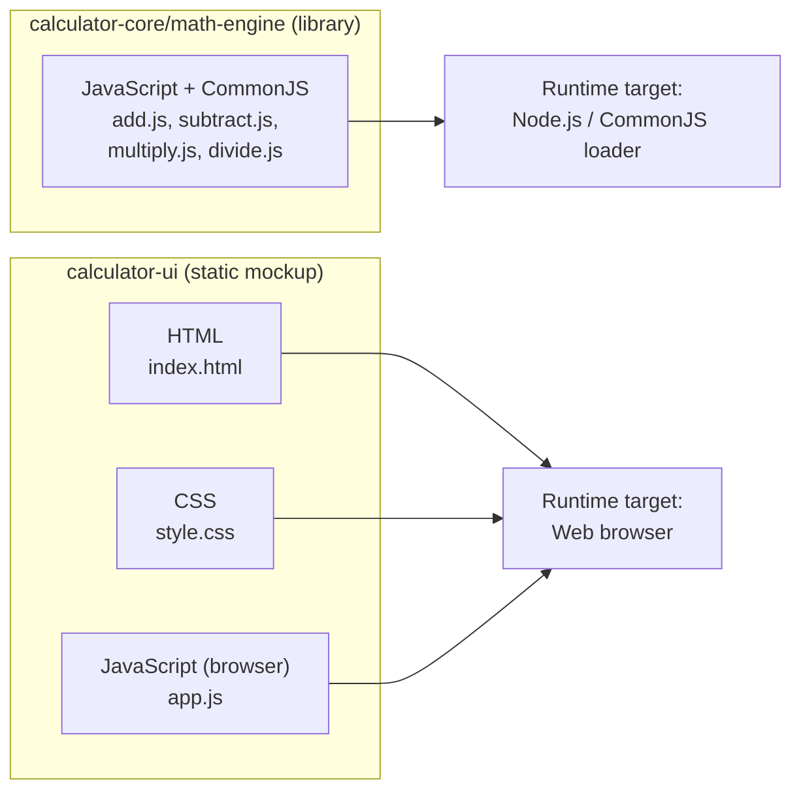
```mermaid
flowchart LR
    subgraph CoreLib["calculator-core/math-engine (library)"]
        CoreJS["JavaScript + CommonJS<br/>add.js, subtract.js,<br/>multiply.js, divide.js"]
    end
    subgraph UILayer["calculator-ui (static mockup)"]
        UIHTML["HTML<br/>index.html"]
        UICSS["CSS<br/>style.css"]
        UIJS["JavaScript (browser)<br/>app.js"]
    end
    NodeRT["Runtime target:<br/>Node.js / CommonJS loader"]
    BrowserRT["Runtime target:<br/>Web browser"]
    CoreJS --> NodeRT
    UIHTML --> BrowserRT
    UICSS --> BrowserRT
    UIJS --> BrowserRT
```

### 3.1.2 Language Versions and Syntax Profile

The repository declares **no version numbers for any language, runtime, or component**. There is no `package.json` (and therefore no `engines` field pinning a Node.js version), no `tsconfig.json`, no `.nvmrc`, no build/transpiler configuration, and no `<!doctype>` declaration to assert an HTML version. In the absence of explicit pins, the table below records the syntax profile that is directly observable in the source; these are observations of the code as written, not version commitments made by the repository.

| Language | Declared Version | Observed Syntax Profile (from source) |
|---|---|---|
| JavaScript | None declared | ES5-compatible constructs only — `function` declarations with untyped positional operands, no `const`/`let`, arrow functions, `class`, template literals, or `import`; core modules add the CommonJS `module.exports` convention |
| HTML | None (`index.html` has no `<!doctype>`) | Bare document — a root `<html>`/`<body>` with `<h2>`, one `<input>`, and four `<button>` elements; no `<head>`, `<script>`, or `<link>` |
| CSS | None | A single global type selector rule (`button { width:50px; height:40px; }`); no version-specific features, variables, or media queries |

A representative CommonJS module illustrates the language profile of the core library:

```javascript
function add(a, b) { return a + b; }
module.exports = add;
```

Because `index.html` omits a doctype, browsers render it in quirks mode; because the JavaScript uses only ES5-era constructs, it does not require transpilation to run in either Node.js or a browser. No `require()` call appears in any module, so the four arithmetic files are mutually independent (no aggregating `index.js`).

### 3.1.3 Selection Criteria and Justification

The repository contains no README, design note, or rationale document, so the selection criteria below are **reconstructed from the observable characteristics of the code** rather than quoted from any artifact. They are presented as the technical rationale that the evidence supports.

| Language Choice | Evidence-Based Justification |
|---|---|
| JavaScript for the arithmetic core | JavaScript is the lowest-friction choice for stateless numeric utilities: the four modules require no compiler, type system, or dependencies, and each is independently `require()`-able. The CommonJS `module.exports` style makes each operation consumable à la carte in a Node.js context (see Assumption A-001 in Section 2.6). |
| HTML + CSS for the UI shell | Plain HTML and CSS render directly in any browser with no build step, which suits a static visual scaffold whose only purpose is to sketch a display field and keypad. |
| JavaScript for the UI script | A single-statement `console.log` bootstrap needs no framework; plain browser JavaScript is sufficient. |

The overarching, evidence-supported criterion is **minimalism with zero external tooling**: every file runs (or renders) with only a stock runtime — Node.js for the library, a browser for the UI — and nothing to install. Notably, the languages in the project's default technology stack that would add tooling burden are **not** used here: there is no TypeScript, and no server-side language such as Python. The code is untyped JavaScript throughout.

### 3.1.4 Language-Level Constraints and Dependencies

- **Cross-runtime interop gap (Constraint C-002).** The core library is written in CommonJS, which is not directly consumable by a browser without a bundler or interop layer. Because the UI runs in the browser and the library targets Node.js, the two languages' runtime targets do not meet without additional tooling that the repository does not provide — one of the reasons the UI and core remain unintegrated (Sections 1.2, 2.3).
- **Untyped operands (Assumption A-002, Constraint C-004).** JavaScript's dynamic typing means the arithmetic functions accept any operand type; there is no validation, and division is unguarded, so results follow native IEEE-754 double-precision arithmetic and JavaScript coercion semantics (Section 2.4.4).
- **Quirks-mode rendering.** The absence of a doctype in `index.html` is an HTML-level constraint that can cause browsers to apply legacy rendering behavior.
- **Runtime dependencies only.** The sole language-level dependencies are a CommonJS-capable runtime (e.g., Node.js) for the library and a web browser for the UI (Section 1.3.1). There are no third-party language dependencies of any kind (detailed in Section 3.3).

## 3.2 Frameworks & Libraries

The repository uses **no application frameworks and no software libraries**. Every file is framework-free: the arithmetic core is plain JavaScript, and the UI is un-bundled, framework-free HTML, CSS, and JavaScript (corroborated in Section 1.2.2: "There is no build step, transpilation, package manager, module bundler, or test harness anywhere in the repository"). The only architectural choices that operate at a "framework level" are the **CommonJS module convention** used by the core and the **native browser platform** relied on by the UI — neither of which is a third-party framework. Because there is no dependency manifest, no framework or library carries a version number in this repository.

### 3.2.1 Application Frameworks and UI Libraries

There are no application frameworks or UI libraries of any kind. To make the definitive absence explicit — and because the project's default technology stack names several frameworks — the table below records the expected candidates against what the repository actually contains.

| Framework / Library Category | Default-Stack Candidate | Present in Repository? | Evidence |
|---|---|---|---|
| Front-end web framework | React (with TypeScript) | No | `index.html`/`app.js` contain no framework markup, JSX, or imports |
| CSS framework | TailwindCSS | No | `style.css` is a single hand-written `button` rule; no utility classes or `@tailwind` directives |
| Back-end web framework | Flask (Python) | No | No Python files, no server code anywhere in the repository |
| AI framework | LangChain | No | No AI/LLM code or imports exist |
| Cross-platform / native | React-Native, Swift, Kotlin, Electron | No | No mobile, native, or desktop-shell projects exist |
| Test / assertion framework | Any | No | No test files or test-runner configuration (Section 2.6, C-001) |

The functionality that exists — four one-line arithmetic functions and a static keypad mockup — is trivial enough to require no framework, which is consistent with the repository's scaffold-stage nature.

### 3.2.2 Module System and Runtime Platforms

In place of frameworks, the repository relies on two platform-level foundations. Neither is an installed dependency; both are conventions/capabilities provided by the target runtimes, and the repository pins no version for either.

| Foundation | Where Used | Role | Declared Version |
|---|---|---|---|
| CommonJS module convention | `calculator-core/math-engine/*.js` | Each module exposes its function via `module.exports`, enabling `require()`-based consumption in a Node.js-style runtime | None declared (no `package.json`) |
| Native browser platform (HTML/DOM + CSS engine) | `calculator-ui/*` | Parses and renders `index.html`, applies `style.css`, and could execute `app.js` if it were referenced | None declared (no `<!doctype>` or target-browser config) |

The core library therefore depends on the ambient module system of its host runtime, and the UI depends only on standard browser capabilities. This is the entirety of the "framework" layer.

### 3.2.3 Compatibility and Integration Requirements

- **Core library compatibility.** The `math-engine` modules require a CommonJS-capable runtime (e.g., Node.js) to be loaded via `require()` (Assumption A-001, Section 2.6). Because the modules use only ES5-compatible syntax, no transpilation or polyfill layer is required.
- **UI compatibility.** `index.html` and `style.css` render in any standards-compliant web browser; `app.js` executes in any browser JavaScript engine. No browser-support matrix, minimum-version target, or vendor prefix is declared.
- **Integration requirement between components (Constraint C-002, C-005).** The core (CommonJS/Node) and the UI (browser) are not compatible without a bridge: to consume the arithmetic modules in the browser, a bundler or a CommonJS-to-browser interop layer would be required, and none exists. Separately, for the UI's own assets to load, `index.html` would need to add a `<script src="app.js">` and a `<link rel="stylesheet" href="style.css">` — both absent today. These missing links are precisely why the system is documented (Sections 1.1, 1.2, 2.3) as an unintegrated scaffold rather than a working calculator.
- **Justification.** The framework-free, library-free approach minimizes footprint and eliminates any install/build burden, which is a reasonable fit for a minimal instructional or scaffold-stage codebase. The trade-off — no componentization, no interop layer, and no test harness — is documented as a maintenance and integration constraint in Sections 2.4.5 and 2.6.

## 3.3 Open Source Dependencies

The repository has **zero third-party or open-source dependencies**. There is no dependency manifest, no lockfile, no installed package tree, and no reference to any package registry or CDN anywhere in the seven tracked files. Every module is fully self-contained: none of the four `math-engine` files performs a `require()`, and none of the UI files references an external script, stylesheet, or font. This is consistent with Constraint C-001 (Section 2.6) — "No third-party dependencies, build, test, or CI tooling exist" — and with Feature F-001's dependency profile in Section 2.1.1 ("No third-party packages, no `package.json`, no installed dependencies exist anywhere in the repository").

### 3.3.1 Dependency Manifests and Registries

Because no package management is used, there are no registries (npm, Yarn, pnpm, or otherwise) in play and no version constraints to record. The table verifies the absence of every dependency indicator.

| Dependency Indicator | Status | Evidence |
|---|---|---|
| `package.json` (declared dependencies) | Absent | No manifest exists anywhere in the repository |
| Lockfile (`package-lock.json`, `yarn.lock`, `pnpm-lock.yaml`) | Absent | No lockfile exists; no pinned dependency graph |
| `node_modules/` (installed packages) | Absent | No installed dependency tree present |
| Package registry references (npm/Yarn/pnpm) | None | No manifest or lockfile references any registry |
| External CDN `<script>` / `<link>` in `index.html` | None | `index.html` contains no `<script>` or `<link>` tags |
| `require()` / `import` of third-party modules | None | No `require`/`import` appears in any `.js` file |

### 3.3.2 Packages, Versions, and Security Implications

- **Packages and versions.** There are no packages and therefore no package versions to enumerate. The repository does not consume, vendor, or publish any open-source library, and it defines no version for itself (no `version` field, since there is no manifest).
- **Security posture (positive).** With no third-party code, the repository has **no open-source supply-chain attack surface** — there are no transitive dependencies to audit, no vulnerable package versions to patch, and no registry compromise vector. This aligns with the system-wide security assessment in Section 2.4.4 that "no feature performs I/O, networking, persistence, authentication, or secret handling."
- **Security posture (trade-off).** The flip side is the absence of any dependency-management or software-composition-analysis capability: there is no manifest to track, no lockfile to guarantee reproducible installs, and no tooling that could flag vulnerabilities were dependencies added later. Consequently, any future adoption of open-source packages would start from a clean slate with no established versioning or auditing discipline.

## 3.4 Third-Party Services

The repository integrates with **no third-party services**. It calls no external APIs, uses no authentication provider, emits to no monitoring or telemetry backend, and provisions no cloud services. Section 1.2.1 states this directly: "The system integrates with nothing external… The repository is entirely self-contained." The `math-engine` modules perform no I/O or networking, and the UI files reference no external resources, CDNs, or APIs.

Because the project's default technology stack names several managed services (AWS, Auth0), the table records each service category against the repository's actual contents.

| Service Category | Default-Stack Candidate | Present in Repository? | Evidence |
|---|---|---|---|
| External APIs / integrations | — | No | No HTTP client, fetch, socket, or network call in any file; no API endpoints or SDKs |
| Authentication service | Auth0 | No | No auth code, tokens, or credentials; Section 1.3.1 confirms "no roles, accounts, or authentication" |
| Monitoring / observability | — | No | No metrics, tracing, or logging backend; Section 1.2.3 confirms "no metrics instrumentation, benchmarks, or monitoring artifacts" |
| Cloud services | AWS | No | No cloud SDK, service client, credentials, or infrastructure configuration anywhere |

**Integration and security implications.** With no outbound integrations, there are no service endpoints to configure, no API keys or client secrets to store, and no external identity or session state to manage. This eliminates an entire class of attack surface — credential leakage, insecure transport, and third-party service compromise — consistent with the minimal-attack-surface finding in Section 2.4.4. The corresponding limitation is that the system provides no runtime observability of its own: nothing beyond the single `console.log` bootstrap message in `app.js` reports on execution, and even that is never emitted in the page because `index.html` does not load the script.

## 3.5 Databases & Storage

The repository uses **no database and no persistent storage of any kind**. It has no primary or secondary database, no data-persistence layer, no caching solution, and no object/blob storage service. Section 1.3.1 characterizes the data domain precisely: "Transient numeric operands and results plus a single text display field; no stored or persisted data." All data handled by the system is ephemeral and in-memory for the duration of a single function call or page render.

| Storage Concern | Default-Stack Candidate | Present in Repository? | Evidence |
|---|---|---|---|
| Primary database | MongoDB | No | No database driver, connection string, schema, or query anywhere |
| Secondary database | — | No | No additional datastore of any type |
| Data persistence | — | No | No filesystem writes, `localStorage`/`sessionStorage`, cookies, or session state |
| Caching solution | — | No | No in-memory or distributed cache layer |
| Object / file / blob storage | — | No | No storage SDK, bucket, or upload/download path |

**Data-handling model (what exists instead).** The only data in the system is transient:

- **Arithmetic operands and results (in-memory, per call).** Each `math-engine` function receives two positional operands `a` and `b` and returns a computed value; nothing is retained between invocations, and the functions are stateless and side-effect-free (Section 2.4.3).
- **A single display field (DOM-resident, transient).** `index.html` declares `<input id="display">`, but because no script reads from or writes to it (the page loads no JavaScript), the field holds no persisted or computed value; it exists only as static markup.

**Implications.** The absence of storage means there is no persistence configuration, no schema migration, no backup/retention concern, and no data-at-rest security surface. It equally means the system cannot retain calculator state, history, or memory across interactions — an unsupported use case explicitly noted in Section 1.3.2.

## 3.6 Development & Deployment

The only development-and-deployment tooling present in the repository is **version control (Git) with source hosting on GitHub**. There is no build system, no containerization, no CI/CD pipeline, no infrastructure-as-code, and no configured linter, formatter, or test runner. The "deployment" model is entirely manual: the library is consumed by `require()` in a runtime, and the UI is viewed by opening a static file in a browser.

### 3.6.1 Version Control and Source Hosting

| Attribute | Value (observed) |
|---|---|
| Version control system | Git |
| Source host | GitHub — `github.com/Sandeep01Kumar/Nested-submodules-SK` |
| Active branch | `main` (only branch; `origin/HEAD` → `origin/main`) |
| Commit history | 7 commits, each titled "Create &lt;file&gt;" |
| Author | Single committer — `Sandeep01Kumar <sandeep@blitzy.com>` |
| Commit dates | All dated 2026-07-20 |
| Tags / releases | None |
| Git submodules | None — despite the repository name "Nested-submodules-SK," there is no `.gitmodules` file and `git submodule status` is empty (Section 1.1) |

Version control is thus the sole automated part of the toolchain, and it is used in its most basic form (single branch, single author, one-file-per-commit, no tags).

### 3.6.2 Build System and Development Tooling

There is no build system and no configured development tooling. The default technology stack names Docker, Terraform, and GitHub Actions; none is present. The table verifies each category.

| Concern | Default-Stack Candidate | Present in Repository? | Evidence |
|---|---|---|---|
| Build / bundling / transpilation | — | No | No `package.json` scripts, bundler (webpack/Vite/Rollup), or transpiler (Babel/tsc) config; Section 1.2.2 confirms no build step exists |
| Containerization | Docker | No | No `Dockerfile`, `.dockerignore`, or `docker-compose` file |
| Infrastructure as Code | Terraform | No | No `*.tf` or other IaC files |
| CI/CD | GitHub Actions | No | No `.github/workflows/` directory or any pipeline configuration |
| Linter / formatter | — | No | No ESLint, Prettier, or `.editorconfig` configuration |
| Test runner | — | No | No test files or test-runner configuration (Constraint C-001) |

Because the code is plain ES5-compatible JavaScript plus static HTML/CSS, it runs directly with no compilation step — so the absence of a build system does not block execution, but it does mean there is no automated regression, quality, or packaging safety net (Section 2.4.5).

### 3.6.3 Runtime and Deployment Model

No packaging, publishing, hosting, or release process is configured. The two components are exercised independently and manually:

- **Library (`calculator-core/math-engine/`).** Consumed by a CommonJS-capable runtime such as Node.js, which `require()`s an individual module and invokes it (Section 1.3.1). There is no library publication to a registry.
- **UI (`calculator-ui/`).** Rendered by opening `index.html` directly in a web browser. There is no web server, no static-site host, and no bundled artifact.

The following diagram depicts the actual development-to-runtime flow and, explicitly, the automation stages that are absent from the repository.

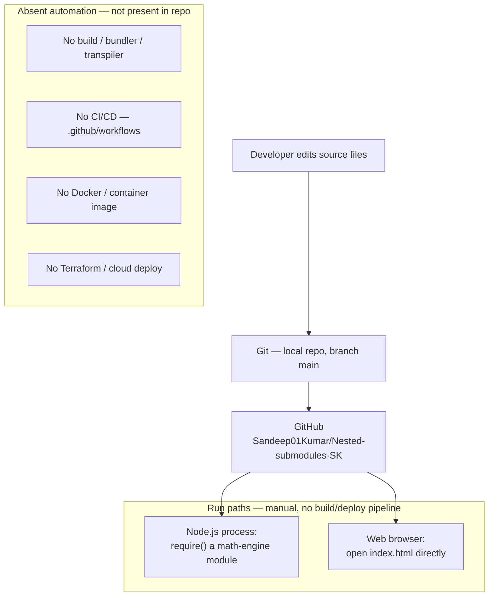
```mermaid
flowchart TB
    Dev["Developer edits source files"]
    Git["Git — local repo, branch main"]
    GitHub["GitHub<br/>Sandeep01Kumar/Nested-submodules-SK"]
    Dev --> Git
    Git --> GitHub
    subgraph RunPaths["Run paths — manual, no build/deploy pipeline"]
        NodePath["Node.js process:<br/>require() a math-engine module"]
        BrowserPath["Web browser:<br/>open index.html directly"]
    end
    GitHub --> NodePath
    GitHub --> BrowserPath
    subgraph AbsentStages["Absent automation — not present in repo"]
        NoBuild["No build / bundler / transpiler"]
        NoCI["No CI/CD — .github/workflows"]
        NoContainer["No Docker / container image"]
        NoIaC["No Terraform / cloud deploy"]
    end
```

**Security and operational implications.** The absence of a build/deploy pipeline removes pipeline-level risks (compromised build steps, leaked CI secrets, insecure artifact registries) but also means there is no automated testing, dependency scanning, or reproducible release process. All quality assurance is manual, by inspection or trivial execution (Section 2.4.5).

## 3.7 References

All claims in this section are grounded in direct inspection of the repository's source files and metadata, cross-checked against previously authored specification sections. No external web sources were required, because the repository declares no third-party dependencies or component versions to verify.

**Repository files examined**

- `calculator-core/math-engine/add.js` — CommonJS addition module (`function add(a,b){return a+b;}` + `module.exports`); established the JavaScript/CommonJS language and module-system profile of the core
- `calculator-core/math-engine/subtract.js` — CommonJS subtraction module; confirmed the uniform one-function-per-file ES5 pattern
- `calculator-core/math-engine/multiply.js` — CommonJS multiplication module; confirmed the same pattern
- `calculator-core/math-engine/divide.js` — CommonJS division module (unguarded `a/b`); confirmed no validation/error handling
- `calculator-ui/index.html` — bare HTML shell with no `<!doctype>`, `<script>`, or `<link>`; established the HTML language profile and the unwired-assets integration gap
- `calculator-ui/app.js` — single `console.log` browser script; established the browser-JavaScript component
- `calculator-ui/style.css` — single global `button` rule; established the CSS component

**Repository folders examined**

- `` (repository root) — confirmed exactly two top-level folders and no root-level files/manifests
- `calculator-core/` and `calculator-core/math-engine/` — contained the four arithmetic library modules
- `calculator-ui/` — contained the static UI mockup files

**Repository metadata inspected (via terminal)**

- Git history and remote configuration — established version control (Git/GitHub), branch `main`, 7 "Create &lt;file&gt;" commits by `Sandeep01Kumar <sandeep@blitzy.com>` dated 2026-07-20, and no tags
- Filesystem-wide search for manifests/build/CI/CD/IaC/tests and `.blitzyignore` — confirmed the definitive absence of `package.json`, lockfiles, `node_modules`, `Dockerfile`, `.github/workflows`, `*.tf`, test files, and any `.blitzyignore`; `.gitmodules` absent and `git submodule status` empty (no submodules)

**Cross-referenced specification sections**

- `1.1 Executive Summary` — repository composition, CommonJS module system, disconnected UI/core, no submodules, git provenance
- `1.2 System Overview` — confirmation that no build step, transpilation, package manager, bundler, or test harness exists; self-contained (no external integration)
- `1.3 Scope` — in-scope components, key technical requirements (CommonJS runtime + browser), out-of-scope tooling/persistence/auth
- `2.1 Feature Catalog` — feature IDs F-001–F-004 and their source-artifact mapping; "no `package.json`, no installed dependencies"
- `2.4 Implementation Considerations` — system-wide security posture (no I/O/network/persistence/auth/secrets) and IEEE-754/coercion arithmetic behavior
- `2.6 Assumptions, Constraints, and Requirement Versioning` — Assumptions A-001/A-002 and Constraints C-001/C-002/C-004/C-005 underpinning the stack's runtime, interop, and tooling limitations

# 4. Process Flowchart

## 4.1 System Workflows

This section documents the executable process flows that exist in the repository as it is actually authored. The codebase is a minimal scaffold of seven source files split across two disconnected system boundaries: the arithmetic library `calculator-core/math-engine/` (Feature **F-001**) and the static interface `calculator-ui/` (Features **F-002**, **F-003**, **F-004**). There is no server, no HTTP layer, no request router, no orchestration code, and no wiring between the two halves. Consequently, the set of documentable workflows is deliberately narrow and is reported here exactly as observed — no workflow, timing target, or recovery path is inferred beyond what the source demonstrates.

Two — and only two — independently executable runtime processes exist:

1. **Arithmetic invocation** — a CommonJS consumer running on a Node.js runtime `require()`s one of the four `calculator-core/math-engine/*.js` modules and calls its exported function synchronously, receiving a numeric (or `NaN`/`Infinity`) result. Each module (`add.js`, `subtract.js`, `multiply.js`, `divide.js`, lines 1-5) is a pure, stateless function that ends with `module.exports = <fn>`.
2. **Static interface rendering** — a web browser opens `calculator-ui/index.html` (lines 1-13) and paints the static DOM: an `<h2>Calculator</h2>` heading, an `<input id="display">` field, and four `<button>` elements labeled `1`, `2`, `+`, `=`.

A third, "composite" journey — pressing a keypad button to compute and display a result — is implied by the artifact names but is **not realized in code**. It is broken at three independent points: `index.html` contains no `<link>` tag (so `style.css` never loads), no `<script>` tag (so `app.js` never loads), and the buttons carry no event handlers; separately, no module bundler or `require()` bridges the browser UI to the CommonJS math engine. These gaps are the load-bearing fact of this section and are drawn explicitly as dashed **ABSENT** edges below, mirroring the dependency-map convention established in section 2.3.

The following high-level diagram uses swim lanes to separate the two human/programmatic actors (the developer/consumer and the end user) from the two system boundaries (the core library and the UI files). Solid edges are realized in code; dashed edges labeled **ABSENT** denote wiring the artifacts imply but do not contain.

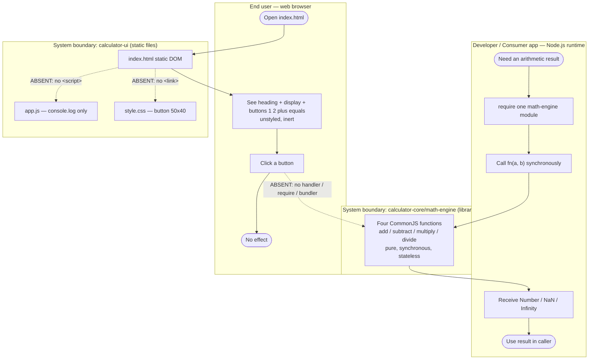
```mermaid
flowchart TB
    subgraph DevLane["Developer / Consumer app — Node.js runtime"]
        DStart([Need an arithmetic result])
        DRequire["require one math-engine module"]
        DInvoke["Call fn(a, b) synchronously"]
        DResult["Receive Number / NaN / Infinity"]
        DEnd([Use result in caller])
    end
    subgraph CoreLane["System boundary: calculator-core/math-engine (library)"]
        Engine["Four CommonJS functions<br/>add / subtract / multiply / divide<br/>pure, synchronous, stateless"]
    end
    subgraph UserLane["End user — web browser"]
        UStart([Open index.html])
        UView["See heading + display + buttons 1 2 plus equals<br/>unstyled, inert"]
        UClick["Click a button"]
        UNoop([No effect])
    end
    subgraph UILane["System boundary: calculator-ui (static files)"]
        HTML["index.html static DOM"]
        AppJS["app.js — console.log only"]
        CSS["style.css — button 50x40"]
    end
    DStart --> DRequire --> DInvoke --> Engine
    Engine --> DResult --> DEnd
    UStart --> HTML --> UView --> UClick --> UNoop
    HTML -. "ABSENT: no &lt;script&gt;" .-> AppJS
    HTML -. "ABSENT: no &lt;link&gt;" .-> CSS
    UClick -. "ABSENT: no handler / require / bundler" .-> Engine
```

Both realized processes execute entirely in-process and synchronously; the repository declares no service-level agreement, latency budget, or throughput target anywhere (consistent with the "no documented performance target" finding recorded for every requirement in section 2.2).

### 4.1.1 Core Business Processes

The repository expresses no business domain beyond elementary arithmetic. The two executable "business processes" and the one unrealized composite journey are summarized below and then detailed.

| Process | Primary actor | Trigger | Realized outcome |
|---|---|---|---|
| P-A Arithmetic invocation | Consumer code on Node.js | `require()` + function call | Numeric / `NaN` / `Infinity` return value |
| P-B Static interface rendering | End user via web browser | Opening `index.html` | Inert, unstyled DOM (heading, display, 4 buttons) |
| P-C End-to-end calculation | End user | (intended) button press | **Not realized** — no handlers, no wiring |

**Process P-A — Arithmetic invocation (system interaction).** A consumer selects one of the four modules and requires it; because each module exposes exactly one function via `module.exports` (requirement **F-001-RQ-005**), the require call yields a callable reference. The consumer then invokes it with two positional operands. The only genuine **decision point** internal to the library is *which module was required* — there is no branching inside any function; `add` returns `a + b` (**F-001-RQ-001**), `subtract` returns `a - b` (**F-001-RQ-002**), `multiply` returns `a * b` (**F-001-RQ-003**), and `divide` returns `a / b` (**F-001-RQ-004**). Two implicit, uncoded decision points arise from the JavaScript runtime rather than from repository logic: whether the operands are numeric (non-numeric operands are coerced or yield `NaN`) and, for `divide.js`, whether the divisor is zero. There is **no error-handling path** in code: `divide.js` (lines 1-5) contains no zero guard, so `divide(a, 0)` returns `Infinity`/`-Infinity` and `divide(0, 0)` returns `NaN` — these are native IEEE-754 outcomes returned to the caller unflagged, not caught exceptions. The end-to-end flow of P-A is drawn in the arithmetic process flow of section 4.2.1 and the error pass-through flow of section 4.3.2.

**Process P-B — Static interface rendering (end-user journey).** An end user opens `index.html` in a browser. Because the document has no `<!doctype>`, the browser renders in quirks mode, then parses the markup and paints the heading (**F-002-RQ-001**), the display input (**F-002-RQ-002**), and the four keypad buttons in the order `1`, `2`, `+`, `=` (**F-002-RQ-003**). The **decision points** in this journey are all resolved negatively by the markup: there is no `<script>` element (so the `console.log("Calculator UI loaded")` in `app.js`, requirement **F-003-RQ-001**, never executes) and no `<link rel="stylesheet">` (so the `button { width:50px; height:40px; }` rule in `style.css`, requirement **F-004-RQ-001**, never applies and buttons keep default sizing). The user may type into the `#display` field, but no script ever reads that value, and clicking any button invokes no handler. The user's journey therefore terminates in an inert page with no computation and no state persisted. This journey is detailed in section 4.2.2.

**Process P-C — End-to-end calculation (unrealized).** The composite journey a working calculator would provide — a user presses digits and an operator, the UI reads `#display`, invokes the appropriate math-engine function, and writes the result back to `#display` — does not exist. Every link in that chain is absent: the UI is unstyled and unscripted, the buttons have no `onclick` handlers, and no bundler or `require()` connects the browser context to the CommonJS modules. P-C is represented in the high-level diagram above solely by dashed ABSENT edges and is treated throughout this section as a documented gap rather than an operating workflow.

### 4.1.2 Integration Workflows

The repository contains **no integrations** in the conventional sense. A targeted keyword sweep across all `*.js`, `*.html`, and `*.css` files found no occurrences of `fetch`, `http`, `express`, `server`, `listen`, `api`, `route`, `socket`, `event`, `addEventListener`, `onclick`, any storage API, any database or cache client, any queue/streaming client, or any scheduler/cron/batch construct. The only integration-relevant token present anywhere is the `module.exports = <fn>` assignment on line 5 of each math-engine module. The four categories requested by the prompt are therefore reported as definitive absences:

| Integration category | Status in repository |
|---|---|
| Data flow between systems | **None** — `calculator-ui` never reads from or writes to `calculator-core`; the two boundaries share no data at runtime |
| API interactions | **None** — no HTTP client/server, no endpoints, no external service calls |
| Event processing flows | **None** — no event listeners, emitters, or message/event bus |
| Batch processing sequences | **None** — no jobs, schedulers, timers, or bulk data pipelines |

The single integration mechanism that *is* present is the **CommonJS module boundary**: a consumer process resolving and loading a math-engine module, then invoking its exported function. The sequence diagram below documents that interaction as it actually occurs — synchronous, in-process, with no I/O and no asynchronous or error path.

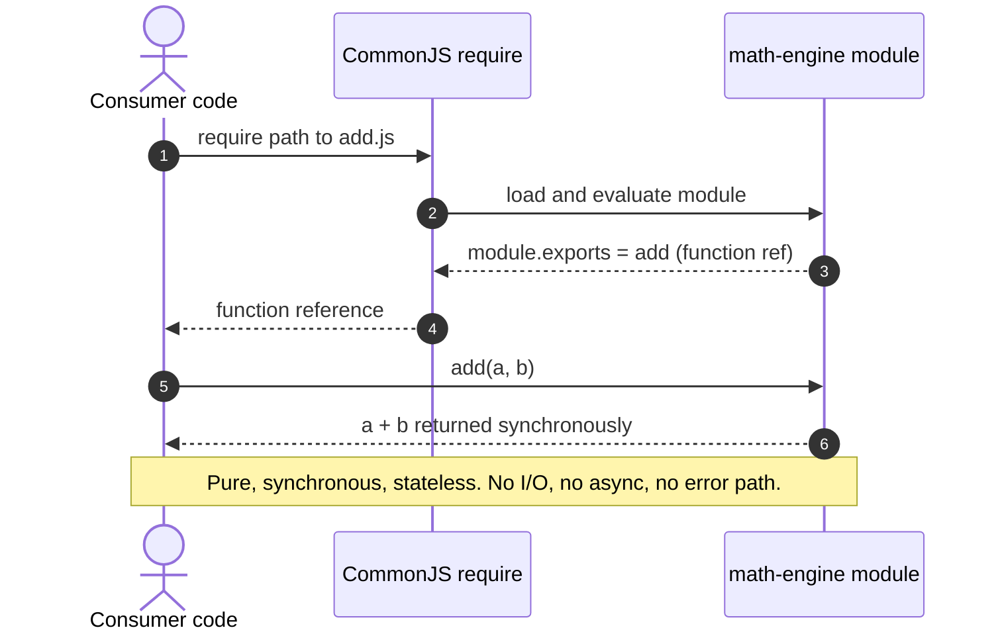
```mermaid
sequenceDiagram
    autonumber
    actor Dev as Consumer code
    participant Req as CommonJS require
    participant Mod as math-engine module
    Dev->>Req: require path to add.js
    Req->>Mod: load and evaluate module
    Mod-->>Req: module.exports = add (function ref)
    Req-->>Dev: function reference
    Dev->>Mod: add(a, b)
    Mod-->>Dev: a + b returned synchronously
    Note over Dev,Mod: Pure, synchronous, stateless. No I/O, no async, no error path.
```

The second sequence diagram documents the browser-side "integration" that the UI files imply but do not perform. It uses the `--x` (failed/absent message) arrow to show that `index.html` never requests `app.js` or `style.css`, because the markup contains neither a `<script>` nor a `<link>` tag.

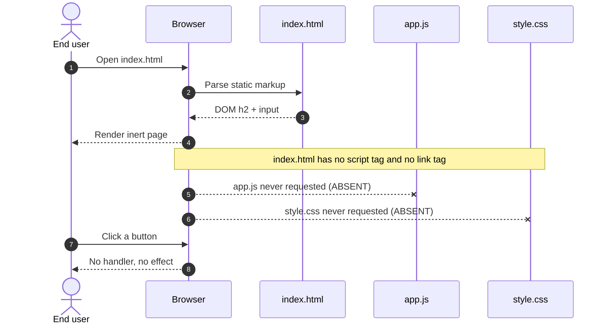
```mermaid
sequenceDiagram
    autonumber
    actor User as End user
    participant Browser
    participant HTML as index.html
    participant AppJS as app.js
    participant CSS as style.css
    User->>Browser: Open index.html
    Browser->>HTML: Parse static markup
    HTML-->>Browser: DOM h2 + input#display + 4 buttons
    Browser-->>User: Render inert page
    Note over Browser,CSS: index.html has no script tag and no link tag
    Browser--xAppJS: app.js never requested (ABSENT)
    Browser--xCSS: style.css never requested (ABSENT)
    User->>Browser: Click a button
    Browser-->>User: No handler, no effect
```

Neither integration involves network transport, serialization, retries, or acknowledgements; both complete deterministically within a single runtime with no documented timing constraint.

## 4.2 Detailed Process Flows and Validation Rules

This section decomposes the two realized processes (P-A and P-B from section 4.1.1) into detailed flowcharts and then documents the validation, authorization, and compliance checkpoints that apply at each step. Each flowchart identifies its start and end points, process steps, decision diamonds, the system boundary it operates within, the user or consumer touchpoint that triggers it, and the outcome of every branch. Because the codebase contains no coded error handling, "error states" appear as data-value outcomes (`NaN`, `Infinity`) rather than as exceptions or recovery paths, and no branch carries a timing or SLA annotation — every operation is synchronous and constant-time, and no performance target is declared anywhere in the repository.

### 4.2.1 Arithmetic Operation Process Flows

Feature **F-001** groups four modules that share an identical control-flow shape: a single synchronous expression with no internal branching. The detailed flowchart below models the process for a consumer that has already required a module. The first decision diamond (*which module was required*) selects the operator; the two subsequent diamonds are runtime-driven rather than code-driven and are labeled explicitly as **not validated / not guarded** to reflect that `add.js`, `subtract.js`, `multiply.js`, and `divide.js` (each lines 1-5) contain no conditional logic. The `divide` path carries the additional divisor-zero diamond because `divide.js` has no zero guard (requirement **F-001-RQ-004**).

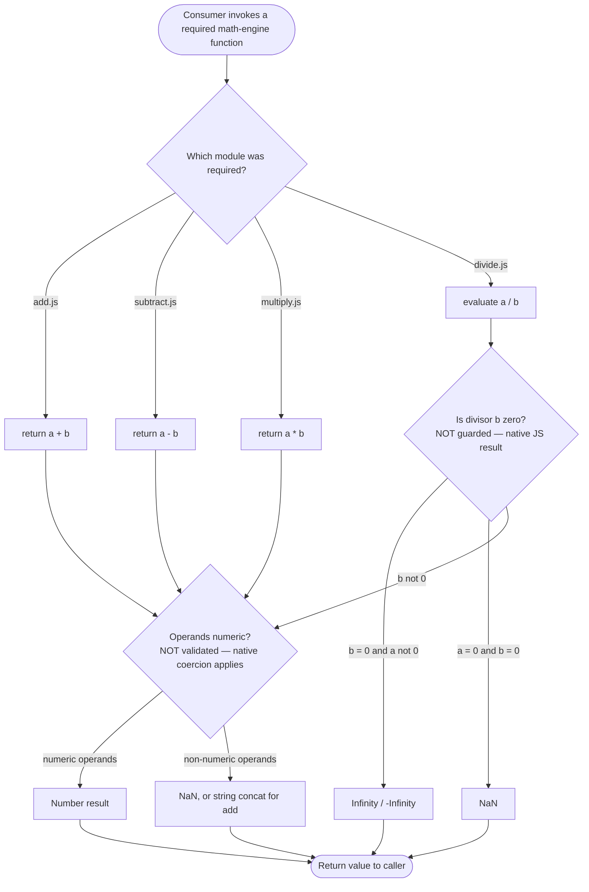
```mermaid
flowchart TB
    Start([Consumer invokes a required math-engine function])
    Sel{"Which module was required?"}
    Coerce{"Operands numeric?<br/>NOT validated — native coercion applies"}
    Start --> Sel
    Sel -->|add.js| Aop["return a + b"]
    Sel -->|subtract.js| Sop["return a - b"]
    Sel -->|multiply.js| Mop["return a * b"]
    Sel -->|divide.js| Dop["evaluate a / b"]
    Aop --> Coerce
    Sop --> Coerce
    Mop --> Coerce
    Dop --> ZeroChk{"Is divisor b zero?<br/>NOT guarded — native JS result"}
    ZeroChk -->|"b = 0 and a not 0"| Inf["Infinity / -Infinity"]
    ZeroChk -->|"a = 0 and b = 0"| NanZ["NaN"]
    ZeroChk -->|"b not 0"| Coerce
    Coerce -->|numeric operands| NumOut["Number result"]
    Coerce -->|non-numeric operands| NanC["NaN, or string concat for add"]
    Inf --> Ret([Return value to caller])
    NanZ --> Ret
    NumOut --> Ret
    NanC --> Ret
```

**Start point:** the consumer's synchronous call `fn(a, b)`. **End point:** the return of a single value to the caller. **System boundary:** the entire flow executes inside `calculator-core/math-engine/` on the consumer's Node.js runtime; there is no crossing into any other process, file, or service. **Timing:** each path is constant-time O(1) and synchronous, with no documented SLA. **Error states:** there are no thrown errors or recovery branches — the `Infinity`/`-Infinity`, `NaN`-from-zero, and `NaN`-from-coercion outcomes are ordinary return values produced by the JavaScript `+`, `-`, `*`, and `/` operators and handed back to the caller without annotation. The `add` path additionally exhibits string concatenation when a string operand is supplied (e.g., `'2' + 3`), which is why its non-numeric branch is labeled distinctly.

### 4.2.2 Static Interface Rendering Process Flow

Process P-B renders `calculator-ui/index.html` (Feature **F-002**). The flowchart below models the browser's parse-and-paint sequence and the two negative decision diamonds that determine whether the sibling assets load. Both diamonds resolve to "No" because the markup contains neither a `<script>` nor a `<link>` element — the definitive cause of Features **F-003** and **F-004** never activating at runtime.

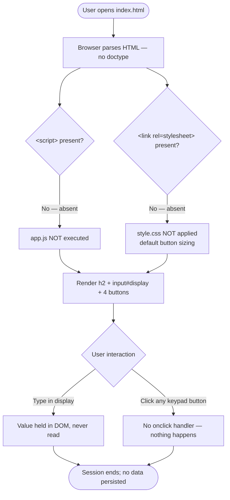
```mermaid
flowchart TB
    UStart([User opens index.html]) --> Parse["Browser parses HTML — no doctype"]
    Parse --> Script{"&lt;script&gt; present?"}
    Parse --> Link{"&lt;link rel=stylesheet&gt; present?"}
    Script -->|No — absent| NoJS["app.js NOT executed"]
    Link -->|No — absent| NoCSS["style.css NOT applied<br/>default button sizing"]
    NoJS --> Render["Render h2 + input#display + 4 buttons"]
    NoCSS --> Render
    Render --> Touch{"User interaction"}
    Touch -->|Type in display| Held["Value held in DOM, never read"]
    Touch -->|Click any keypad button| NoHandler["No onclick handler — nothing happens"]
    Held --> UEnd([Session ends; no data persisted])
    NoHandler --> UEnd
```

**Start point:** the user opening `index.html`. **End point:** the end of the browser session, with no data retained. **System boundary:** the browser rendering the `calculator-ui/` static files; the flow never reaches `calculator-core/`. **User touchpoints:** typing into `#display` and clicking any of the four buttons — both touchpoints are inert because no script observes them. **Error states / recovery:** none apply; there is no operation that can fail and therefore nothing to recover. **Timing:** rendering is a one-shot synchronous paint with no declared performance target.

### 4.2.3 Validation Rules and Authorization / Compliance Checkpoints

The prompt asks for business rules, data-validation requirements, authorization checkpoints, and regulatory-compliance checks at each workflow step. Direct inspection confirms that **none of these controls are implemented anywhere in the repository**, matching the "Validation Rules" columns of section 2.2, which record *None* for every requirement's business, data-validation, security, and compliance entries. The table maps each workflow step to the checkpoints requested and states the observed reality.

| Workflow step | Data validation | Authorization / compliance |
|---|---|---|
| P-A arithmetic call (F-001) | **None** — operands are untyped positional parameters; no type/range/null checks; no divide-by-zero guard | **None** — library performs no auth and touches no regulated data |
| P-B render (F-002) | **None** — static markup performs no input validation on `#display` | **None** — no auth gate, no consent/compliance check |
| P-B interaction (F-003 / F-004) | **None** — no script reads or validates the display value | **None** — no session, identity, or audit concept exists |

The only "business rule" governing behavior is an implicit one: the modules delegate entirely to native JavaScript operator semantics, so results follow IEEE-754 double-precision arithmetic and JavaScript type coercion (for example, `'2' + 3` yields the string `'23'` on the `add` path, and `'a' - 1` yields `NaN` on the `subtract` path). This is a consequence of the one-line implementations rather than an enforced rule, and there are no authorization checkpoints or regulatory-compliance checks because the system has no authentication, no persistence, no network surface, and processes no personal or regulated data.

## 4.3 Technical Implementation

This section covers the state-management and error-handling characteristics that underpin the process flows above. Both are reported as observed: the repository is stateless and contains no coded error handling, so the discussion documents the absence of persistence, caching, transactions, retries, fallbacks, notifications, and recovery procedures rather than describing mechanisms that do not exist.

### 4.3.1 State Management

**State transitions.** Neither system boundary implements an application state machine. Each math-engine function (`calculator-core/math-engine/*.js`, lines 1-5) is pure: it reads its two positional operands, evaluates one arithmetic expression, and returns. No module-level variable, closure, or object field is mutated, so successive calls are fully independent and the result depends only on the current arguments. The only mutable state anywhere is the native value of the `<input id="display">` element in `index.html`, which the browser maintains automatically; because no script (`app.js` is never loaded) reads or writes it, that value participates in no transition the repository controls.

**Data persistence points.** **None.** There is no database, file write, `localStorage`, `sessionStorage`, `indexedDB`, cookie, or any other persistence mechanism in the codebase — a keyword sweep across all source files returned no matches for any storage API. A value returned by a math-engine function lives only on the caller's stack, and the UI session retains nothing after the browser tab closes.

**Caching requirements.** **None.** No memoization, no cache client (e.g., Redis), and no HTTP cache directives are present. Each arithmetic call recomputes its result; there is nothing to cache because computation is O(1) and there is no repeated I/O to amortize.

**Transaction boundaries.** **None.** No operation spans multiple steps that would require atomicity, and there is no commit/rollback, locking, or compensating action anywhere. Every arithmetic call is a single, self-contained synchronous expression, so the concept of a transaction boundary does not arise.

### 4.3.2 Error Handling

The repository contains **no coded error handling**. A keyword sweep confirmed there are no `try`, `catch`, or `throw` statements in any file, and no `Promise`, `async`/`await`, `.catch()`, or error-callback constructs. The four requested mechanisms are therefore documented as definitive absences:

| Mechanism | Status | Evidence |
|---|---|---|
| Retry mechanisms | **None** | No loops, timers, or backoff; operations are single synchronous calls |
| Fallback processes | **None** | No alternate path or default-value substitution on failure |
| Error notification flows | **None** | No logging of errors, no alerting, no user-facing error message |
| Recovery procedures | **None** | No rollback, cleanup, or compensation logic exists |

Instead of raising and handling errors, the math engine lets the JavaScript runtime produce a value for every input. Division by zero, non-numeric operands, and missing arguments all yield `Infinity`, `-Infinity`, or `NaN`, which flow back to the caller unflagged. The flowchart below models this pass-through behavior for both system boundaries: the math engine returns edge-case values without notification, and the static UI has no operation that can fail and therefore nothing to recover.

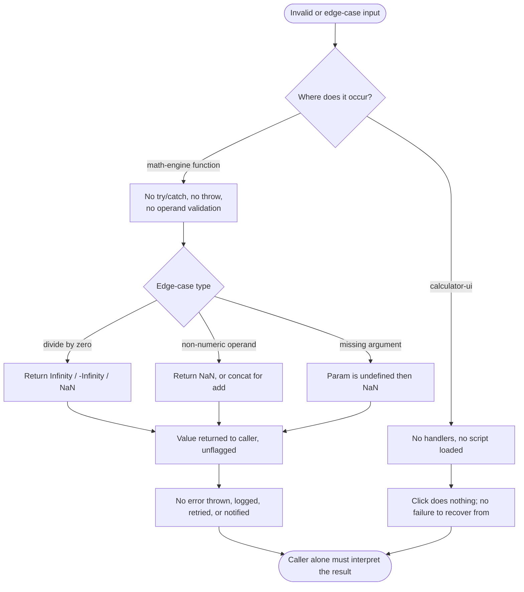
```mermaid
flowchart TB
    In([Invalid or edge-case input]) --> Where{Where does it occur?}
    Where -->|math-engine function| Eng["No try/catch, no throw,<br/>no operand validation"]
    Where -->|calculator-ui| Ui["No handlers, no script loaded"]
    Eng --> Ecase{"Edge-case type"}
    Ecase -->|divide by zero| E1["Return Infinity / -Infinity / NaN"]
    Ecase -->|non-numeric operand| E2["Return NaN, or concat for add"]
    Ecase -->|missing argument| E3["Param is undefined then NaN"]
    E1 --> Prop["Value returned to caller, unflagged"]
    E2 --> Prop
    E3 --> Prop
    Prop --> NoNotify["No error thrown, logged, retried, or notified"]
    Ui --> UiNoop["Click does nothing; no failure to recover from"]
    NoNotify --> Done([Caller alone must interpret the result])
    UiNoop --> Done
```

The practical consequence is that responsibility for detecting anomalous results (for example, testing a returned value with `Number.isNaN` or `Number.isFinite`) rests entirely with the consumer of the `calculator-core` library; the repository itself performs no such checks and provides no signal that an operation produced a degenerate value.

## 4.4 State Transition Diagrams

The prompt requests state-transition diagrams for the system's stateful components. As established in section 4.3.1, the repository has no application state machine, no persisted status fields, and no lifecycle objects. The two diagrams below therefore document the only state that can be observed: the transient, per-call lifecycle of a math-engine function invocation, and the minimal DOM-level state of the static UI. Both are intentionally degenerate — each returns to its origin state with nothing retained — and are included to make that statelessness explicit rather than to imply a richer model than the code contains.

### 4.4.1 Math-Engine Function Invocation Lifecycle

A math-engine module (Feature **F-001**) moves through a require-load-invoke-return cycle and retains no state between calls. The diagram shows the module becoming loadable once `require()` resolves it, transitioning to an executing state only for the duration of a synchronous `fn(a, b)` call, and returning to the idle "loaded" state immediately afterward — the result depends solely on the arguments of the current call.

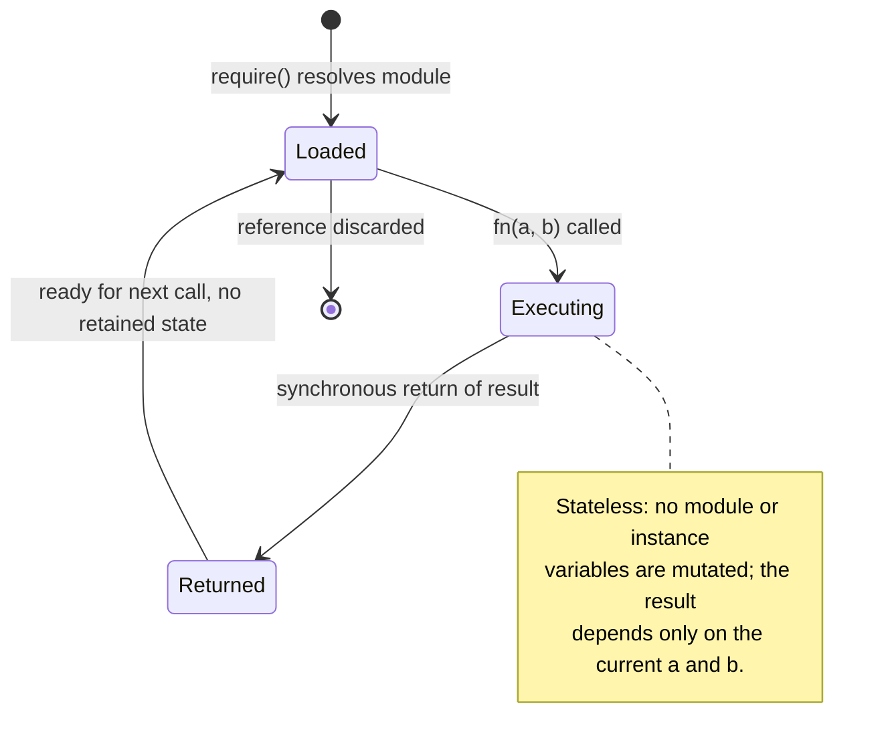
```mermaid
stateDiagram-v2
    [*] --> Loaded: require() resolves module
    Loaded --> Executing: fn(a, b) called
    Executing --> Returned: synchronous return of result
    Returned --> Loaded: ready for next call, no retained state
    Loaded --> [*]: reference discarded
    note right of Executing
        Stateless: no module or instance
        variables are mutated; the result
        depends only on the current a and b.
    end note
```

### 4.4.2 Static UI DOM State

The `calculator-ui` interface (Feature **F-002**) exposes only the native, browser-managed value of the `<input id="display">` element. The diagram shows that once `index.html` is rendered, the sole possible transition is the user editing the display field — a change the browser tracks but that no repository script ever reads — after which the UI is back in its rendered state. Button clicks produce a self-loop with no transition because there is no `onclick` handler, and there is no terminal "result displayed" state because no computation is ever wired in.

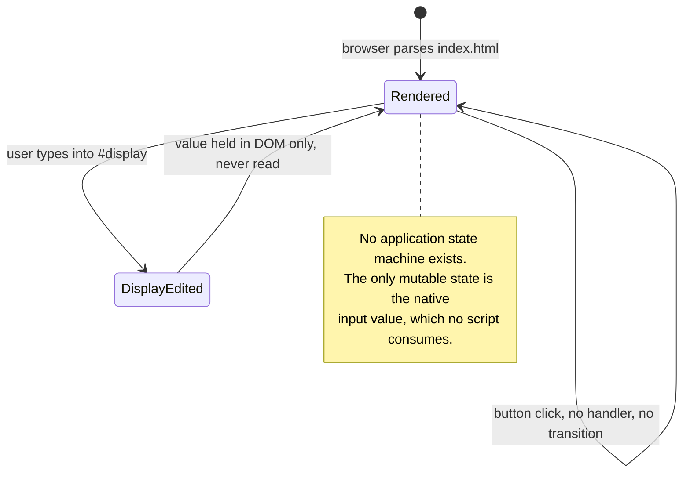
```mermaid
stateDiagram-v2
    [*] --> Rendered: browser parses index.html
    Rendered --> DisplayEdited: user types into #display
    DisplayEdited --> Rendered: value held in DOM only, never read
    Rendered --> Rendered: button click, no handler, no transition
    note right of Rendered
        No application state machine exists.
        The only mutable state is the native
        input value, which no script consumes.
    end note
```

Together, these diagrams confirm that no cross-call, cross-session, or cross-component state is maintained anywhere in the system: the math engine is purely functional, and the UI holds only ephemeral, unread DOM input.

## 4.5 References

The following repository files and folders were inspected directly and cited as evidence for the workflows, diagrams, and absence findings in this section:

- `calculator-core/math-engine/add.js` - established the synchronous `add(a,b) -> a+b` flow and CommonJS export (F-001-RQ-001, F-001-RQ-005)
- `calculator-core/math-engine/subtract.js` - established the `subtract(a,b) -> a-b` flow (F-001-RQ-002)
- `calculator-core/math-engine/multiply.js` - established the `multiply(a,b) -> a*b` flow (F-001-RQ-003)
- `calculator-core/math-engine/divide.js` - established the `divide(a,b) -> a/b` flow with no divide-by-zero guard, source of the `Infinity`/`NaN` edge-case branches (F-001-RQ-004)
- `calculator-ui/index.html` - established the static render flow, the keypad touchpoints, and the absence of `<script>`/`<link>` wiring (F-002-RQ-001..003)
- `calculator-ui/app.js` - established the bootstrap `console.log` that never executes because it is not loaded (F-003-RQ-001)
- `calculator-ui/style.css` - established the button-sizing rule that never applies because it is not linked (F-004-RQ-001)
- `calculator-core/math-engine/` - contained the four stateless arithmetic modules that constitute the core library boundary
- `calculator-core/` - contained only the `math-engine/` subfolder; confirmed no aggregator/entry-point module
- `calculator-ui/` - contained the three disconnected static interface files

The following previously authored Technical Specification sections were retrieved for terminology, identifier, and scope alignment:

- Section 1.2 System Overview - confirmed the two-component structure, the UI/core disconnection, and the absence of documented performance targets
- Section 2.1 Feature Catalog - source of Feature identifiers F-001 (Arithmetic Operations Library), F-002 (Static Calculator Interface Shell), F-003 (UI Bootstrap Logging Script), and F-004 (Button Presentation Stylesheet)
- Section 2.2 Functional Requirements - source of requirement identifiers (F-XXX-RQ-YYY), the "Synchronous, constant-time O(1); no documented performance target" timing characterization, and the *None* validation/security/compliance findings
- Section 2.3 Feature Relationships - source of the dashed **ABSENT**-edge dependency-map convention and the `&lt;script&gt;`/`&lt;link&gt;` HTML-entity labeling mirrored in this section's diagrams

No external web sources were consulted for this section; all findings are grounded in direct repository inspection.

# 5. System Architecture

## 5.1 High-Level Architecture

This section documents the architecture exactly as implemented across the repository's seven tracked source files — four in `calculator-core/math-engine/` and three in `calculator-ui/`. The load-bearing architectural fact — corroborated by Sections 1.2, 2.3, and 4.1 and re-verified by direct inspection — is that the system is **not a single integrated application** but **two independent, decoupled subsystems** that share no runtime coupling. Every statement below is grounded in the source; where the prompt calls for constructs the repository does not contain (external integrations, data stores, caches, SLAs), that absence is reported explicitly rather than inferred.

### 5.1.1 System Overview

**Architecture Style and Rationale**

The repository realizes a **two-part, decoupled architecture** with no orchestration layer binding the parts together:

- **`calculator-core/math-engine/` — a modular arithmetic utility library.** Four independently `require()`-able CommonJS modules, each exposing exactly one pure function through `module.exports`. The organizing style is *one-function-per-file* with a *single default export* per module.
- **`calculator-ui/` — a static, framework-free browser presentation scaffold.** A bare HTML document (`index.html`) plus a one-line script (`app.js`) and a single CSS rule (`style.css`).

The system is therefore best characterized as a **flat, framework-free, zero-dependency scaffold** rather than a layered, service-oriented, or event-driven application. There is no application framework, no build step, no module bundler, and no runtime host that composes the two subsystems (Section 3.2). The rationale the code supports — the repository documents none explicitly — is scaffold-stage minimalism: the delivered functionality (four one-line arithmetic operations and a static keypad mockup) is trivial enough to need no framework, dependency, or toolchain, consistent with the project's early, single-author, one-file-per-commit history (Section 3.6).

**Key Architectural Principles and Patterns (observed)**

- **CommonJS module pattern.** Each `math-engine` module ends with `module.exports = <fn>` (line 5 of `add.js`, `subtract.js`, `multiply.js`, `divide.js`) and is consumed via `require()` — the sole programmatic contract in the codebase.
- **Pure functions and statelessness.** Every arithmetic function reads its two operands, evaluates one expression, and returns; no module-level variable, closure, or object field is mutated, so calls are referentially transparent and independent (Section 4.3.1).
- **Single responsibility at file granularity.** Each file does exactly one thing — one operation, one heading/keypad shell, one log statement, or one styling rule.
- **Separation of logic and presentation.** The arithmetic core and the presentation surface live in separate top-level folders — a nascent separation of concerns that is, however, **not realized as a runtime connection** (Constraints C-002, C-005).
- **Framework-free / zero-dependency.** No third-party frameworks or libraries exist; the only platform foundations are the CommonJS module convention (core) and the native browser platform (UI), written in ES5-compatible syntax (Section 3.2).
- **No aggregation.** There is no `index.js` barrel module, so each operation must be required individually.

**System Boundaries and Major Interfaces**

The architecture has two boundaries and no bridge between them:

| Boundary | Runtime Context | Sole Interface (observed) |
|---|---|---|
| `calculator-core/math-engine/` (F-001) | CommonJS-capable runtime, e.g., Node.js (A-001) | `module.exports` out / `require()` in — a synchronous, in-process function contract |
| `calculator-ui/` (F-002, F-003, F-004) | Web browser | The DOM produced by parsing `index.html` (heading, `<input id="display">`, four buttons) |

- The two boundaries are **not bridged**: `index.html` contains no `<script>` and no `<link>`, so it loads neither `app.js` nor `style.css`; and no bundler or interop layer lets the browser consume the CommonJS modules (Constraints C-002, C-005).
- The system exposes **no network, HTTP, RPC, database, or messaging interface of any kind** — a keyword sweep across every `*.js`/`*.html`/`*.css` file finds no such tokens; the only module-system token present anywhere is `module.exports` (Section 4.1.2).

### 5.1.2 Core Components

The system comprises four discrete components mapped one-to-one onto the tracked source files and to the feature catalog (F-001 through F-004). The table uses four columns; because dependencies and integration points are almost entirely *absent*, they are combined into a single column, with per-component critical considerations in the last column.

| Component (Feature) | Primary Responsibility | Key Dependencies & Integration Points | Critical Considerations |
|---|---|---|---|
| Arithmetic library — `calculator-core/math-engine/` (F-001) | Provide four pure binary operations (`add`, `subtract`, `multiply`, `divide`) as independently importable CommonJS functions | Depends on nothing (no imports). Integration = CommonJS `require()`/`module.exports` only; not required by any file in the repo | No operand validation; unguarded divide-by-zero (C-004); no barrel export, so each module is required individually; not browser-consumable without a bundler (C-002) |
| Interface shell — `calculator-ui/index.html` (F-002) | Render the static calculator surface: heading, display input, and four buttons (`1`, `2`, `+`, `=`) | Depends on the browser only. Integration = none: no `<script>`/`<link>`, so it loads neither `app.js` nor `style.css` (C-005) | No `<!doctype>` (quirks-mode risk); partial keypad (C-003); no event handlers or accessibility attributes; inert |
| Bootstrap log — `calculator-ui/app.js` (F-003) | Emit a single load-time console message, `"Calculator UI loaded"` | Depends on the browser console. Integration = none: never referenced by `index.html` | Dormant in the browser (no `<script>` loads it); emits a fixed literal only |
| Button stylesheet — `calculator-ui/style.css` (F-004) | Size every `<button>` to 50×40 px | Depends on the browser CSS engine. Integration = none: never linked by `index.html` | Unscoped global `button` selector; never applied; no `#display` or layout/responsive rules |

### 5.1.3 Data Flow Description

**Primary data flows between components.** There are **no inter-component data flows at runtime**: the two subsystems never exchange data, and within `calculator-ui/` the three files never reference one another (Sections 2.3, 4.1.2). The only genuine data movement is *intra-call* inside the library — a consumer passes two positional operands (`a`, `b`) as arguments, and a single numeric result (or `NaN`/`Infinity` for degenerate inputs) is returned on the caller's stack (Section 4.3.1). In the UI, no data flows programmatically; the browser holds whatever a user types into `<input id="display">`, but no script ever reads or writes that value (Sections 4.3.1, 4.4.2).

**Integration patterns and protocols.** The single integration mechanism present is the **CommonJS module boundary**: synchronous, in-process module resolution via `require()` followed by a direct function call. There is no network protocol (HTTP, WebSocket, gRPC), no serialization format, no message bus, and no remote procedure call anywhere in the codebase (Section 4.1.2).

**Data transformation points.** Exactly one class of transformation exists — the arithmetic operator applied to the two operands: `a + b`, `a - b`, `a * b`, and `a / b`. No parsing, serialization, schema mapping, encoding, or format conversion occurs. Any numeric coercion (for example, string concatenation when a non-numeric operand is passed to `add`) is native JavaScript behavior inherited from the runtime, not a coded transformation (Section 2.4.4).

**Key data stores and caches.** **None.** There is no database, file write, `localStorage`, `sessionStorage`, `indexedDB`, or cookie; there is no cache of any kind — no memoization, no cache client, and no HTTP cache directives (Section 4.3.1). Computation is O(1) and recomputed on every call, and the only mutable state in the entire system is the ephemeral, browser-managed value of the display input, which is neither persisted nor read.

### 5.1.4 External Integration Points

The system has **no external integration points**. No `math-engine` module performs I/O, networking, or persistence, and the UI files reference no external resources, CDNs, or APIs (Section 1.2.1). Consequently there are no third-party systems, no wire protocols, and no data-exchange patterns; and because nothing external is contacted, **no SLA requirements are defined or applicable anywhere in the repository** (Section 1.2.3). The table below records the candidate external-integration categories against what the repository actually contains.

| Candidate External Integration | Expected Integration Type | Status | Evidence |
|---|---|---|---|
| HTTP / REST service (client or server) | Request/response over HTTP | Absent | No `fetch`/`http`/`express`/`listen` tokens in any file |
| Database / persistent store | Connection + queries | Absent | No database client or storage API (Section 4.3.1) |
| Message queue / event bus / streaming | Asynchronous messaging | Absent | No queue/streaming client; no event listeners (Section 4.1.2) |
| Third-party / SaaS API or SDK | API/SDK calls | Absent | No dependency manifest, no SDK imports (Sections 3.3, 3.4) |
| CDN / remote asset | Remote `<script>`/`<link>` reference | Absent | `index.html` references no external resources (Section 1.2.1) |

Because there are no external systems, the *Data Exchange Pattern*, *Protocol/Format*, and *SLA Requirements* dimensions requested by the prompt are uniformly not applicable; they are reported as absent rather than populated with fabricated values.

## 5.2 Component Details

This section documents each of the four components (features) that make up the system. Because the repository is a scaffold-stage codebase of seven source files with no runtime service, no data stores, and no network surface, the persistence and scaling attributes below are documented honestly as *not applicable* rather than being inflated with capabilities the code does not exhibit. Component identifiers (F-001 through F-004) are carried forward from Section 2.1 for consistency. The three diagrams at the end of this section (5.2.5–5.2.7) present an architecture-level view that complements — rather than repeats — the flowcharts in Sections 1.2.2, 2.3.1, and 4.x.

### 5.2.1 F-001 — Arithmetic Operations Library (`calculator-core/math-engine/`)

**Purpose and responsibilities.** F-001 provides the four elementary binary arithmetic operations — addition, subtraction, multiplication, and division — as four independent CommonJS modules under `calculator-core/math-engine/`. Each module carries a single responsibility: `add.js` returns `a + b`, `subtract.js` returns `a - b`, `multiply.js` returns `a * b`, and `divide.js` returns `a / b`. There is no aggregator/index module, so each operation is required and consumed in isolation. This is the only component in the repository that contains executable business logic.

**Technologies and frameworks.** The modules are written in plain JavaScript using ES5-compatible syntax (function declarations, no arrow functions, no type annotations) and the CommonJS module convention (`module.exports = <fn>`). No framework, transpiler, bundler, or third-party dependency is present (C-001); the modules are designed to be loaded by a CommonJS-capable runtime such as Node.js (A-001).

**Key interfaces and APIs.** Each file exposes exactly one default export — a pure function taking two positional operands `(a, b)` and returning a single numeric result. Consumption is via `require('./math-engine/<operation>')`. There are no named exports, no options objects, and no callbacks. The four-function surface is summarized below.

| Module | Exported symbol | Operation (return) | Key characteristic |
| --- | --- | --- | --- |
| `add.js` | `add` | `a + b` | Pure, synchronous, ES5 default export |
| `subtract.js` | `subtract` | `a - b` | Pure, synchronous, ES5 default export |
| `multiply.js` | `multiply` | `a * b` | Pure, synchronous, ES5 default export |
| `divide.js` | `divide` | `a / b` | No zero-divisor guard → `Infinity`/`-Infinity`/`NaN` per IEEE-754 (C-004) |

**Data persistence requirements.** None. The functions are pure and stateless — they read no module-level or instance variables, mutate nothing, and perform no I/O. There is no database, cache, file, or transaction associated with this component (see 5.1.3 and Section 4.3.1).

**Scaling considerations.** Each call executes in O(1) time, synchronously and in-process, on IEEE-754 double-precision operands (A-002). Because the functions hold no shared state, they are inherently safe to invoke concurrently and to replicate across as many host processes as the consuming application runs. Traditional service-scaling concerns (load balancing, connection pools, autoscaling) do not apply, as F-001 is an in-process library rather than a networked service.

### 5.2.2 F-002 — Interface Shell (`calculator-ui/index.html`)

**Purpose and responsibilities.** F-002 is the static HTML document that presents the calculator's visual scaffold. Its 13 lines render an `<h2>Calculator</h2>` heading, a single `<input id="display">` field, and four `<button>` elements labeled `1`, `2`, `+`, and `=`. It defines the presentation shell only; it carries no behavior and provides a deliberately partial keypad (C-003).

**Technologies and frameworks.** Native HTML rendered by any web browser. The document has no `<!doctype>` declaration and uses no framework or templating engine. Critically, it contains neither a `<script>` tag nor a `<link>` tag, so it does not load the sibling `app.js` or `style.css` files (C-005).

**Key interfaces and APIs.** The interface is the browser DOM. The only script-addressable element is `<input id="display">` (via its `id`). There are no `onclick`/event-handler attributes, no `<form>`, and no accessibility attributes, so the buttons are inert. Because the asset-linking tags are absent, F-002 exposes no integration point to F-003 or F-004 in the shipped page.

**Data persistence requirements.** The only mutable state is the transient, browser-managed `value` of `<input id="display">`, which a user could type into but which no script ever reads or persists. There is no client-side storage (`localStorage`, cookies, IndexedDB) and no server-side persistence.

**Scaling considerations.** F-002 is a static document that can be served from any static file host or CDN; it has no server-side logic, session, or per-user state, so it scales as a cacheable static asset with no coordination requirements.

### 5.2.3 F-003 — Bootstrap Log (`calculator-ui/app.js`)

**Purpose and responsibilities.** F-003 is the client-side bootstrap script intended to eventually hold the UI's interactive behavior (A-003). In its current form its sole responsibility is to emit a single load-time confirmation message: `console.log("Calculator UI loaded")`. It defines no functions, variables, exports, or event wiring.

**Technologies and frameworks.** Plain browser JavaScript using the console API. No framework and no module system are used (it neither imports nor exports).

**Key interfaces and APIs.** F-003 exposes no API. It is designed to run only if included by a `<script>` element, but `index.html` contains no such element (C-005); consequently the script never executes in the shipped page and produces no observable effect (A-004). Its intended interface — DOM manipulation of the `<input id="display">` and button elements — is not yet implemented.

**Data persistence requirements.** None. The script performs no storage and holds no state.

**Scaling considerations.** Not applicable. F-003 is a static asset with no runtime footprint in the current build; it neither consumes resources nor imposes coordination requirements.

### 5.2.4 F-004 — Button Stylesheet (`calculator-ui/style.css`)

**Purpose and responsibilities.** F-004 is the presentation stylesheet. It contains a single rule — `button { width:50px; height:40px; }` — that sizes the calculator's buttons. It provides no layout, theming, responsive rules, or a selector for the `#display` field.

**Technologies and frameworks.** Plain CSS interpreted by the browser rendering engine. No preprocessor (Sass/Less) or CSS framework is used.

**Key interfaces and APIs.** The stylesheet's "interface" is its CSS selector surface — a single element selector, `button`. It is designed to be applied via a `<link>` element, but `index.html` contains no `<link>` (C-005); therefore the rule is not applied to the shipped page and the buttons render with default browser styling (A-004).

**Data persistence requirements.** None.

**Scaling considerations.** Not applicable. Like F-002 and F-003, F-004 is a cacheable static asset with no runtime or coordination concerns.

### 5.2.5 Component Interaction Diagram

The diagram below presents an architecture-level container view of the two runtime contexts in which the components live. The upper subgraph is the realized path — a CommonJS consumer requiring and invoking the F-001 modules inside a Node.js runtime. The lower subgraph is the browser runtime, in which F-002 renders but the dashed edges mark the asset links that are absent. The cross-context dashed edge records the missing bridge: the browser cannot act as a CommonJS consumer of F-001 without a bundler/interop layer (C-002, C-005).

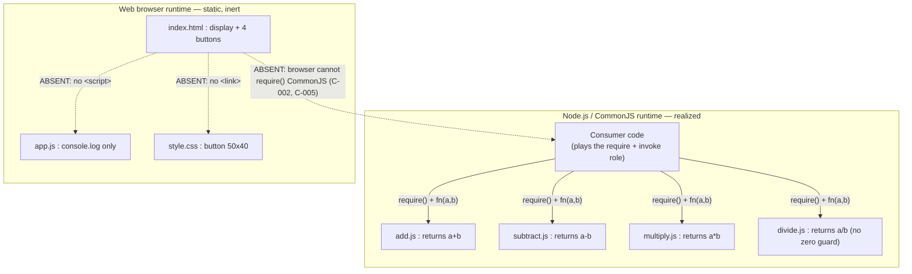
```mermaid
flowchart TB
    subgraph NodeRT["Node.js / CommonJS runtime — realized"]
        Consumer["Consumer code<br/>(plays the require + invoke role)"]
        Add["add.js : returns a+b"]
        Sub["subtract.js : returns a-b"]
        Mul["multiply.js : returns a*b"]
        Div["divide.js : returns a/b (no zero guard)"]
        Consumer -->|"require() + fn(a,b)"| Add
        Consumer -->|"require() + fn(a,b)"| Sub
        Consumer -->|"require() + fn(a,b)"| Mul
        Consumer -->|"require() + fn(a,b)"| Div
    end
    subgraph BrowserRT["Web browser runtime — static, inert"]
        HTML["index.html : display + 4 buttons"]
        JS["app.js : console.log only"]
        CSS["style.css : button 50x40"]
        HTML -. "ABSENT: no &lt;script&gt;" .-> JS
        HTML -. "ABSENT: no &lt;link&gt;" .-> CSS
    end
    HTML -. "ABSENT: browser cannot require() CommonJS (C-002, C-005)" .-> Consumer
```

### 5.2.6 State Transition Diagram

At the architecture level, the only component with a meaningful runtime lifecycle is the F-001 library module. The state diagram below captures that lifecycle from resolution through invocation and back, and explicitly annotates the statelessness that makes the library free of persistence, cache, or transaction concerns. (The finer-grained function-execution and UI-DOM state machines appear in Sections 4.4.1 and 4.4.2; this view emphasizes the architectural property of purity.)

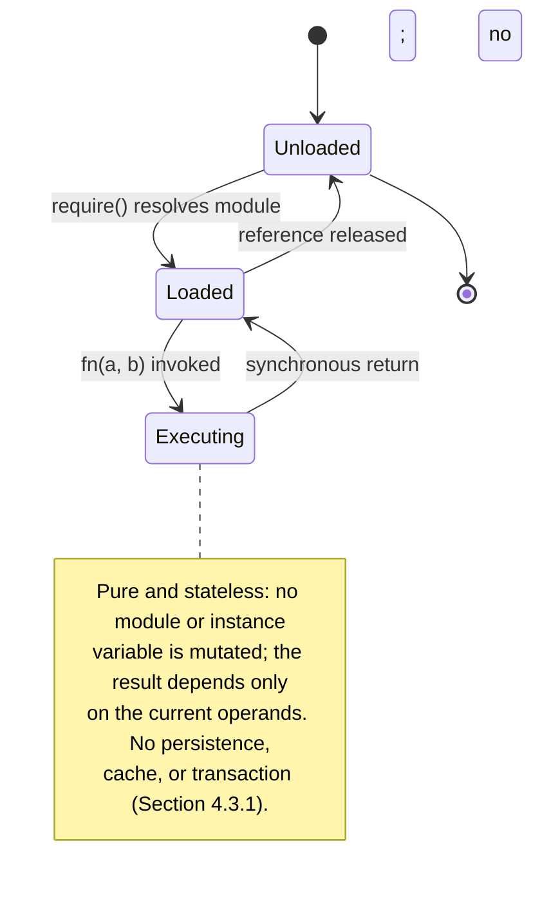
```mermaid
stateDiagram-v2
    [*] --> Unloaded
    Unloaded --> Loaded: require() resolves module
    Loaded --> Executing: fn(a, b) invoked
    Executing --> Loaded: synchronous return; no state retained
    Loaded --> Unloaded: reference released
    Unloaded --> [*]
    note right of Executing
        Pure and stateless: no module or instance
        variable is mutated; the result depends only
        on the current operands. No persistence,
        cache, or transaction (Section 4.3.1).
    end note
```

### 5.2.7 Key-Flow Sequence Diagram

The sequence below traces the single realized end-to-end flow — a consumer resolving and invoking F-001 modules — and includes the divide-by-zero edge case to make the architectural consequence of the missing guard explicit: the runtime returns `Infinity` (or `NaN`) synchronously and unflagged, deferring all error detection to the caller (C-004). This complements the require/invoke sequence in Section 4.1 by foregrounding the unguarded-result behavior.

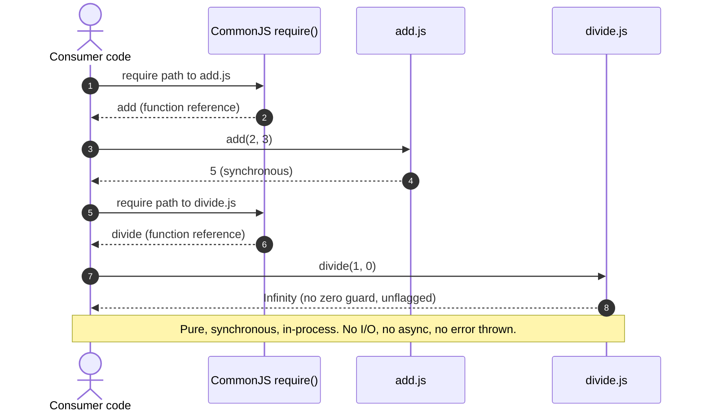
```mermaid
sequenceDiagram
    autonumber
    actor Consumer as Consumer code
    participant Req as CommonJS require()
    participant Add as add.js
    participant Div as divide.js
    Consumer->>Req: require path to add.js
    Req-->>Consumer: add (function reference)
    Consumer->>Add: add(2, 3)
    Add-->>Consumer: 5 (synchronous)
    Consumer->>Req: require path to divide.js
    Req-->>Consumer: divide (function reference)
    Consumer->>Div: divide(1, 0)
    Div-->>Consumer: Infinity (no zero guard, unflagged)
    Note over Consumer,Div: Pure, synchronous, in-process. No I/O, no async, no error thrown.
```

## 5.3 Technical Decisions

This section documents the architecturally significant decisions that are *evidenced by the code as written*, together with their rationale and tradeoffs. Because the repository is a scaffold, several of these decisions are decisions "by omission" — the code demonstrably does not adopt persistence, caching, security, or a communication layer. Where that is the case, the tables and Architecture Decision Records below record the decision as *implicit* or *deferred* rather than presenting it as a mature, intentional design with guarantees the code does not provide. No SLA, throughput target, or security control is asserted that is not present in the source (Section 2.6).

### 5.3.1 Architecture Style and Communication Pattern Decisions

The system adopts a **two-part decoupled, file-modular architecture**: a CommonJS arithmetic library (`calculator-core/math-engine/`) and a static browser UI scaffold (`calculator-ui/`), with no runtime linkage between them (Section 5.1.1). Within the library, the decisive stylistic choice is **one pure function per module** — four separate files rather than a single aggregated module or a calculator class. The **communication pattern** that the code supports is the simplest possible: in-process, synchronous invocation via CommonJS `require()` followed by a direct function call; there is no inter-process, HTTP, or message-based communication anywhere in the repository.

The table below records each decision, its rationale, and its principal tradeoff.

| Decision Area | Choice Observed In Code | Rationale | Principal Tradeoff / Consequence |
| --- | --- | --- | --- |
| Overall style | Two decoupled top-level modules (core vs. UI) | Clean separation of computation from presentation | No integration path exists yet; UI cannot reach core (C-005) |
| Module granularity | One pure function per CommonJS file (F-001) | Maximal single-responsibility and isolation | No unified API; each operation must be required separately |
| Dependency posture | Framework-free, zero third-party deps (C-001) | Minimal footprint; no build or supply-chain burden | No tooling; CommonJS core not browser-consumable (C-002) |
| Communication | In-process synchronous `require()` + call | Zero latency, trivially simple, no infrastructure | No distribution, no network, no async concurrency model |

### 5.3.2 Data Storage, Caching, and Security Decisions

The library components are **pure and stateless**, which drives three linked "by-omission" decisions: there is **no data store**, **no cache**, and **no security control** anywhere in the repository. These are honest observations of the code, not gaps to be papered over: pure arithmetic functions have nothing to persist, nothing worth caching (an O(1) computation is cheaper than cache bookkeeping), and — because there is no network surface or trust boundary crossed at runtime — no authentication, authorization, or input-validation layer is present. The one nuance is error handling: `divide.js` performs no zero-divisor check, so division by zero yields `Infinity`/`-Infinity`/`NaN` per IEEE-754 and defers all detection to the caller (C-004).

| Concern | Choice Observed In Code | Rationale | Consequence |
| --- | --- | --- | --- |
| Data storage | None (stateless pure functions) | Nothing to persist between calls | No DB/file/transaction; no durability guarantees |
| Caching | None | O(1) recomputation cheaper than cache management | No memoization; no invalidation logic to maintain |
| Input validation | None (untyped operands, no guards) | Deferred at scaffold stage | Non-numeric input or `÷0` produces `NaN`/`Infinity` unflagged (C-004) |
| Security (authN/authZ) | None | No runtime network/trust boundary to protect | Acceptable only pre-deployment; must be revisited before exposure |

### 5.3.3 Technology Selection Decision Tree

The decision tree below reconstructs the choices — inferred directly from the code as written — that lead from the scaffold requirement to each observed technology outcome. Solid edges are the branches actually taken; dashed edges mark representative alternatives that the code did **not** adopt. The tree deliberately terminates in the same "by-omission" outcomes (no datastore/cache, no security) recorded in 5.3.1–5.3.2.

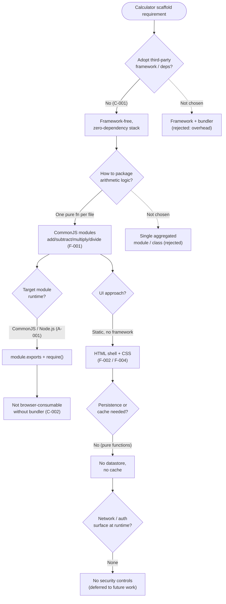
```mermaid
flowchart TD
    Start(["Calculator scaffold requirement"]) --> Q1{"Adopt third-party<br/>framework / deps?"}
    Q1 -->|"No (C-001)"| DepChoice["Framework-free,<br/>zero-dependency stack"]
    Q1 -.->|"Not chosen"| DepAlt["Framework + bundler<br/>(rejected: overhead)"]
    DepChoice --> Q2{"How to package<br/>arithmetic logic?"}
    Q2 -->|"One pure fn per file"| CoreChoice["CommonJS modules<br/>add/subtract/multiply/divide (F-001)"]
    Q2 -.->|"Not chosen"| CoreAlt["Single aggregated<br/>module / class (rejected)"]
    CoreChoice --> Q3{"Target module<br/>runtime?"}
    Q3 -->|"CommonJS / Node.js (A-001)"| RtChoice["module.exports + require()"]
    RtChoice --> Note1["Not browser-consumable<br/>without bundler (C-002)"]
    CoreChoice --> Q4{"UI approach?"}
    Q4 -->|"Static, no framework"| UiChoice["HTML shell + CSS<br/>(F-002 / F-004)"]
    UiChoice --> Q5{"Persistence or<br/>cache needed?"}
    Q5 -->|"No (pure functions)"| StoreChoice["No datastore,<br/>no cache"]
    StoreChoice --> Q6{"Network / auth<br/>surface at runtime?"}
    Q6 -->|"None"| SecChoice["No security controls<br/>(deferred to future work)"]
```

### 5.3.4 Architecture Decision Records (ADRs)

The following ADRs capture the significant decisions in a lightweight, tabular form. Because tables are constrained to four columns, each ADR is summarized in the table (decision, status, key consequence) and its context is given in the note that follows. A status of **Accepted** means the decision is realized in code; **Implicit** means it holds by omission but is a conscious scaffold-stage posture; **Deferred** means the concern is intentionally left for future work.

| ADR — Title | Decision | Status | Key Consequence / Tradeoff |
| --- | --- | --- | --- |
| ADR-01 Decoupled two-part architecture | Separate `calculator-core` and `calculator-ui` | Accepted | Clean boundary, but no runtime integration (C-005) |
| ADR-02 One function per module | Four single-purpose CommonJS files (F-001) | Accepted | Strong isolation; no aggregated API surface |
| ADR-03 Framework-free stack | No third-party deps, no build tooling (C-001) | Accepted | Minimal footprint; core not browser-ready (C-002) |
| ADR-04 In-process synchronous calls | `require()` + direct function call | Accepted | Zero latency; no network/distribution model |
| ADR-05 Stateless, no persistence/cache | No datastore, no memoization | Implicit | Nothing to store or invalidate |
| ADR-06 No input validation / error handling | Unguarded operations incl. `÷0` | Implicit | `NaN`/`Infinity` returned unflagged (C-004) |
| ADR-07 No security controls | No authN/authZ/validation layer | Deferred | Safe only pre-deployment; revisit before exposure |

- **ADR-01 context** — The repository top level is split into a computation module and a presentation module; this records the separation-of-concerns intent even though no bridge yet connects them (Sections 5.1.1, 5.2.5).
- **ADR-02 context** — Each arithmetic operation lives in its own five-line file exporting a single default function, maximizing single-responsibility and independent reuse at the cost of a consolidated entry point.
- **ADR-03 context** — There is no `package.json`, lockfile, bundler, or framework anywhere in the tree (Section 3), yielding a zero-supply-chain, zero-build posture with the tradeoff that the CommonJS core cannot be loaded directly by a browser.
- **ADR-04 context** — The only supported interaction is a consumer calling a required function synchronously and in-process; no IPC, HTTP, or queue is present.
- **ADR-05 context** — The functions are pure, so persistence and caching are unnecessary; results are recomputed on each call in O(1) time (Section 5.4.4).
- **ADR-06 context** — No `try`/`catch`/`throw`, no type checks, and no zero-divisor guard exist; error detection is delegated to the caller (Section 5.4.2).
- **ADR-07 context** — With no network endpoint or trust boundary crossed at runtime, no security mechanism is implemented; this is acceptable only while the code remains a local scaffold and must be reconsidered before any deployment (Section 5.4.3).


## 5.4 Cross-Cutting Concerns

Cross-cutting concerns — observability, error handling, security, performance, and disaster recovery — are documented here strictly against the evidence in the seven source files. For a scaffold of this size the honest finding is that most of these concerns are **not implemented**; documenting their absence, the reason it is currently acceptable, and where a control would need to be introduced is the substantive work product. No SLA, metric, alert, or recovery objective is asserted that is not present in the repository (Section 2.6).

### 5.4.1 Monitoring, Observability, Logging, and Tracing

The repository contains **no monitoring or observability infrastructure** — no metrics, no application performance monitoring, no health checks, no distributed tracing, and no log aggregation. The only logging statement in the entire codebase is F-003's single line, `console.log("Calculator UI loaded")` in `calculator-ui/app.js`, which is a one-time browser-console message emitted at script load. Even that emits nothing in practice, because `index.html` includes no `<script>` element and therefore never loads `app.js` (C-005, A-004). The F-001 library modules produce no logs, emit no events, and expose no instrumentation hooks.

- Metrics / APM: none present.
- Structured or file logging: none; the sole statement writes to the browser console only.
- Tracing / correlation IDs: none (no async operations or service hops to trace).
- Health / readiness endpoints: none (no server process exists).

Any future observability would need to be introduced from scratch — for the library, by wrapping or instrumenting the consumer that invokes it; for the UI, by first wiring `app.js` into `index.html`.

### 5.4.2 Error Handling Patterns

There is **no error-handling implementation** in the repository: no `try`/`catch`/`throw`, no `Promise` rejections, no `async`/`await`, and no validation of operand type or range. The library modules apply the raw JavaScript arithmetic operators directly and return the result synchronously. The architecturally significant case is `divide.js`, which contains no zero-divisor guard; division by zero therefore returns `Infinity`, `-Infinity`, or `NaN` per IEEE-754 semantics, unflagged (C-004). Because no error boundary exists inside the library, the responsibility for detecting and interpreting anomalous results (`NaN`, non-finite values, or the effects of non-numeric input) falls entirely to the consuming code (A-002). This complements the passthrough view in Section 4.3.2 by emphasizing, at the architecture level, the *absence of an error boundary* and the point at which one would have to be inserted.

The flow below traces an invocation from entry through the (missing) validation and error-boundary points to the caller.

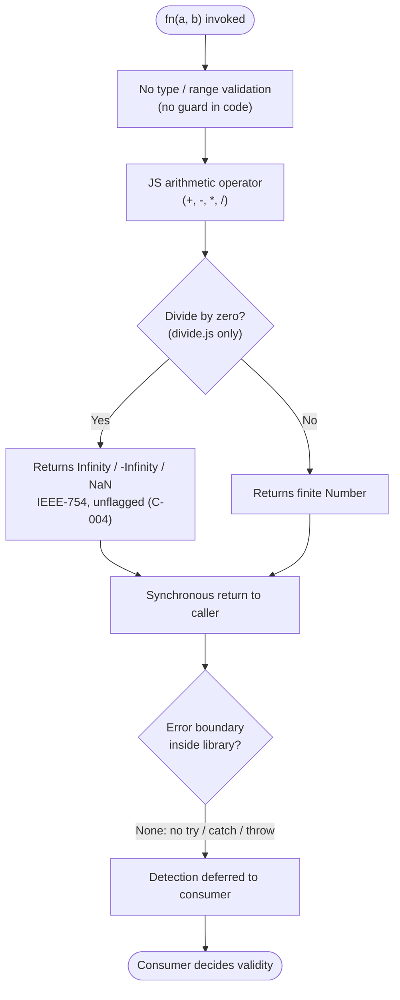
```mermaid
flowchart TD
    In(["fn(a, b) invoked"]) --> NoValidate["No type / range validation<br/>(no guard in code)"]
    NoValidate --> Compute["JS arithmetic operator<br/>(+, -, *, /)"]
    Compute --> Z{"Divide by zero?<br/>(divide.js only)"}
    Z -->|"Yes"| Special["Returns Infinity / -Infinity / NaN<br/>IEEE-754, unflagged (C-004)"]
    Z -->|"No"| Normal["Returns finite Number"]
    Special --> Ret["Synchronous return to caller"]
    Normal --> Ret
    Ret --> Boundary{"Error boundary<br/>inside library?"}
    Boundary -->|"None: no try / catch / throw"| Caller["Detection deferred to consumer"]
    Caller --> Done(["Consumer decides validity"])
```

### 5.4.3 Authentication and Authorization

No authentication or authorization framework is present, and none is applicable to the code as written. There are **no users, sessions, tokens, roles, permissions, or credentials** anywhere in the repository, and there is no network endpoint or server process that would constitute a protected resource. The F-001 library executes in-process on operands supplied directly by the caller, and the F-002 UI is a static document with no backend. Consequently there is no trust boundary crossed at runtime to enforce access control against. This posture is acceptable only while the project remains a local scaffold; introducing any networked entry point (an API for the library or a backend for the UI) would require adding authentication and authorization before exposure (Section 5.3.4, ADR-07).

### 5.4.4 Performance Requirements and SLAs

The repository defines **no explicit performance requirements and no SLAs** — there is no documented latency, throughput, availability, or capacity target anywhere in the source or its history (Section 2.6). The observable performance characteristics of the code are nonetheless simple to state: each F-001 operation is a single synchronous arithmetic expression evaluated in constant, O(1) time on IEEE-754 double-precision operands, with no I/O, allocation-heavy work, or blocking. Because the functions are pure and stateless, throughput is bounded only by the host process and scales linearly with the number of processes a consumer runs (Section 5.2.1). The static UI assets impose only the trivial cost of transferring a few hundred bytes.

| Aspect | Observed Characteristic | Note |
| --- | --- | --- |
| Compute cost | O(1) per operation, synchronous | Single arithmetic expression per module |
| Numeric model | IEEE-754 double precision | Standard JavaScript `Number` semantics |
| Concurrency safety | Inherently safe (stateless, pure) | No shared/mutable state to contend on |
| Documented SLA / targets | None | No latency/throughput/availability defined (Section 2.6) |

### 5.4.5 Disaster Recovery

No runtime disaster-recovery procedures are defined, and — given the architecture — none apply to a running system: there is **no server, no persistent data, and no runtime state** to back up, replicate, or fail over (Sections 5.2, 5.4.1). No backup schedule, replication strategy, failover mechanism, or recovery objective (RTO/RPO) exists in the repository. The only durable asset is the source code itself, whose recovery mechanism is its **Git version history hosted on GitHub** (`Sandeep01Kumar/Nested-submodules-SK`, `main` branch, seven "Create <file>" commits) — a single remote from which the working tree can be re-cloned. There is no secondary mirror, tag, or release artifact. Any future disaster-recovery planning would begin only once the project introduces a runtime service or persistent data.


## 5.5 References

The following repository artifacts and previously authored specification sections were examined as direct evidence for Section 5. No external web sources were consulted for this section.

**Repository folders**

- `calculator-core/` — Top-level module containing the arithmetic library; established the computation half of the two-part decoupled architecture (5.1.1, 5.3.1).
- `calculator-core/math-engine/` — Directory holding the four CommonJS operation modules (F-001); confirmed the one-function-per-file granularity and the absence of an aggregator/index module (5.2.1, 5.3.4 ADR-02).
- `calculator-ui/` — Top-level module containing the static UI scaffold; established the presentation half and its lack of runtime linkage to the core (5.1.1, 5.2.2, C-005).

**Repository files**

- `calculator-core/math-engine/add.js` — Pure `add(a, b)` returning `a + b`; CommonJS default export (5.2.1).
- `calculator-core/math-engine/subtract.js` — Pure `subtract(a, b)` returning `a - b`; CommonJS default export (5.2.1).
- `calculator-core/math-engine/multiply.js` — Pure `multiply(a, b)` returning `a * b`; CommonJS default export (5.2.1).
- `calculator-core/math-engine/divide.js` — Pure `divide(a, b)` returning `a / b` with no zero-divisor guard; basis for the unguarded-error findings (5.2.1, 5.4.2, C-004).
- `calculator-ui/index.html` — Static shell (heading, `<input id="display">`, four buttons) with no `<script>`/`<link>`; basis for F-002, the partial keypad (C-003), and the unwired-asset findings (5.2.2, 5.2.5, C-005).
- `calculator-ui/app.js` — Single `console.log` bootstrap (F-003); sole logging artifact, never executed because it is not included by `index.html` (5.2.3, 5.4.1).
- `calculator-ui/style.css` — Single `button { width:50px; height:40px; }` rule (F-004); never applied because no `<link>` references it (5.2.4).
- Repository Git metadata (remote `Sandeep01Kumar/Nested-submodules-SK`, `main` branch, seven "Create <file>" commits) — basis for the disaster-recovery finding that the source history is the only durable asset (5.4.5).

**Cross-referenced specification sections**

- `1.2 System Overview` — Confirmed the overall system framing and component naming for consistency (5.1.1).
- `2.1 Feature Catalog` — Source of the F-001–F-004 feature identifiers used throughout Section 5.
- `2.3 Feature Relationships` — Confirmed the absent-edge convention (no `require`/`<script>`/`<link>` linkage) reflected in the 5.2.5 interaction diagram.
- `2.6 Assumptions, Constraints, and Requirement Versioning` — Source of the constraints (C-001–C-005) and assumptions (A-001–A-004) and confirmation that no SLA/targets are defined (5.3, 5.4.4).
- `3.2 Frameworks & Libraries` and `3.6 Development & Deployment` — Confirmed the framework-free, zero-dependency stack and the Git/GitHub-only delivery path (5.3.1, 5.3.4 ADR-03, 5.4.5).
- `4.1 System Workflows` — Confirmed the realized require/invoke flow that the 5.2.7 sequence diagram extends with the divide-by-zero edge case.
- `4.3 Technical Implementation` — Confirmed the stateless/no-persistence property (4.3.1) and the error-passthrough behavior (4.3.2) referenced in 5.2.6 and 5.4.2.
- `4.4 State Transition Diagrams` — Confirmed the function-lifecycle and UI-DOM state machines that the 5.2.6 architecture-level state diagram complements.


# 6. SYSTEM COMPONENTS DESIGN

## 6.1 Core Services Architecture

### 6.1.1 Applicability Determination

The system documented in this specification is a minimal, non-distributed calculator scaffold. Before evaluating any service-oriented concern, this sub-section records the applicability determination that governs the remainder of Section 6.1.

**Core Services Architecture is not applicable for this system.**

The repository (`Sandeep01Kumar/Nested-submodules-SK`, branch `main`) contains no services, no server processes, no inter-process or network communication, and no orchestration or distribution mechanisms. It comprises two independent, decoupled subsystems (Section 5.1.1): `calculator-core/math-engine/`, an in-process CommonJS arithmetic library of four pure functions (F-001), and `calculator-ui/`, a static browser mockup (F-002, F-003, F-004). Neither subsystem is a deployable service, and the two are not wired to one another. As established in Section 5.3.1, all invocation is in-process, synchronous invocation via CommonJS `require()` followed by a direct function call, with no inter-process, HTTP, or message-based communication anywhere in the repository.

A Core Services Architecture presupposes a set of independently deployable, communicating service components. None of the structural hallmarks of such an architecture are present in the repository, as summarized below.

**Table 6.1.1-1: Distributed-Architecture Hallmarks vs. Observed Repository**

| Hallmark of a Core Services Architecture | Present? | Evidence in Repository |
| --- | --- | --- |
| Independently deployable service processes | No | Only seven static source files exist; nothing binds a port, listens on a socket, or serves requests (repository-wide inspection) |
| Inter-service communication (HTTP / gRPC / queues) | No | No network clients, no `createServer`/`listen`, no message brokers; a grep across every file matched only `module.exports` (Section 5.3.1) |
| Service manifests or orchestration | No | No `package.json`, Dockerfile, compose, Kubernetes/Helm/Nomad/Terraform, or CI/CD present (C-001) |
| Distinct, wired service boundaries | No | `calculator-core` is an embeddable library, `calculator-ui` is static files, and `index.html` loads neither `app.js` nor `style.css` (C-005) |
| Scaling or resilience infrastructure | No | No load balancer, auto-scaler, circuit breaker, retry, or failover component of any kind |

Consequently, the concerns enumerated in the Section 6.1 prompt — service discovery, load balancing, circuit breakers, auto-scaling, failover, disaster recovery, and related patterns — have no corresponding implementation to document. Sub-sections 6.1.2 through 6.1.4 nonetheless walk through each required area (Service Components, Scalability Design, and Resilience Patterns) to confirm, with evidence, that each area is not applicable, and to describe the actual in-process model that stands in place of a distributed one. Sub-section 6.1.5 lists all cited evidence.

The actual topology is shown below. `calculator-core` executes inside whatever CommonJS host process a consumer runs (for example Node.js, per assumption A-001); `calculator-ui` renders in a web browser. There is no network boundary, no service tier, and no link between the two subsystems.

**Diagram 6.1.1-1: Actual (Non-Distributed) Repository Topology**

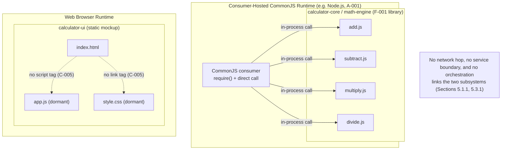
```mermaid
flowchart TB
    Note["No network hop, no service boundary, and no orchestration<br/>links the two subsystems (Sections 5.1.1, 5.3.1)"]
    subgraph CoreCtx["Consumer-Hosted CommonJS Runtime (e.g. Node.js, A-001)"]
        Consumer["CommonJS consumer<br/>require() + direct call"]
        subgraph Lib["calculator-core / math-engine (F-001 library)"]
            AddM["add.js"]
            SubM["subtract.js"]
            MulM["multiply.js"]
            DivM["divide.js"]
        end
        Consumer -->|"in-process call"| AddM
        Consumer -->|"in-process call"| SubM
        Consumer -->|"in-process call"| MulM
        Consumer -->|"in-process call"| DivM
    end
    subgraph BrowserCtx["Web Browser Runtime"]
        subgraph UIsub["calculator-ui (static mockup)"]
            HTML["index.html"]
            JS["app.js (dormant)"]
            CSS["style.css (dormant)"]
        end
        HTML -. "no script tag (C-005)" .-> JS
        HTML -. "no link tag (C-005)" .-> CSS
    end
```


### 6.1.2 Service Components Assessment

Because the system contains no services (Section 6.1.1), every concern in the prompt's SERVICE COMPONENTS group is not applicable. This sub-section records each concern, its status, and the actual in-process model that exists in its place, so the absence is documented rather than merely asserted.

**Table 6.1.2-1: Service Component Concerns — Status and Basis**

| Service Component Concern | Status | Actual Model / Evidence |
| --- | --- | --- |
| Service boundaries and responsibilities | Not applicable | Boundaries are module/file boundaries inside one process, not service boundaries: `calculator-core/math-engine/` exposes four pure functions (F-001) and `calculator-ui/` is static presentation (F-002–F-004); no deployable service exists (Section 5.1.1) |
| Inter-service communication patterns | Not applicable | The only mechanism is in-process CommonJS `require()` plus a direct synchronous call; there is no HTTP, gRPC, or message-based path (Section 5.3.1, ADR-04) |
| Service discovery mechanisms | Not applicable | There are no services to discover; module resolution is a static filesystem lookup performed by the CommonJS loader at `require()` time |
| Load balancing strategy | Not applicable | No service tier and no multiple instances sit behind an entry point; a single embedded library call has nothing to balance |
| Circuit breaker patterns | Not applicable | There is no remote or network dependency to protect; all calls are local and synchronous with no failure channel (Section 5.4.2) |
| Retry and fallback mechanisms | Not applicable | The functions are pure and deterministic, returning in O(1); there is no transient-failure surface, and no `try`/`catch`/`throw` or fallback path exists (C-004, Section 5.4.2) |

The only interaction pattern present is a consumer acquiring a function reference through `require()` and calling it directly within the same operating-system process. The four `math-engine` modules are stateless and each export exactly one function via `module.exports`; they perform no I/O and hold no shared state, so concurrent use is inherently safe (Section 5.4.4). The `calculator-ui` subsystem does not invoke the library at all — `index.html` loads neither `app.js` nor `style.css` (C-005) — so no interaction crosses the boundary between the two subsystems. The sequence below depicts this in-process model, which is the sole "service interaction" the repository contains.

**Diagram 6.1.2-1: In-Process Invocation Model (the only "service interaction" present)**

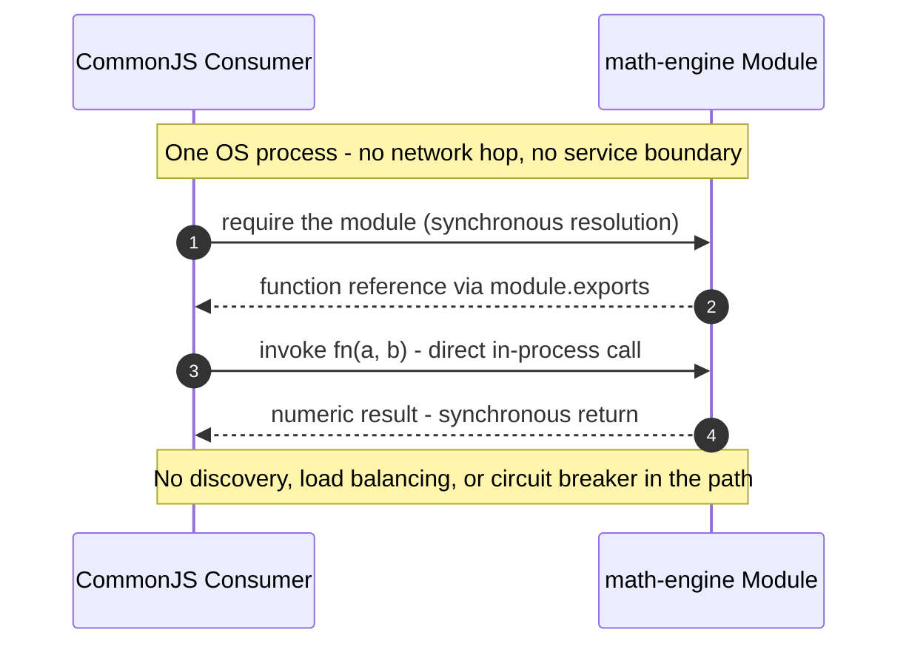
```mermaid
sequenceDiagram
    autonumber
    participant C as CommonJS Consumer
    participant M as math-engine Module
    Note over C,M: One OS process - no network hop, no service boundary
    C->>M: require the module (synchronous resolution)
    M-->>C: function reference via module.exports
    C->>M: invoke fn(a, b) - direct in-process call
    M-->>C: numeric result - synchronous return
    Note over C,M: No discovery, load balancing, or circuit breaker in the path
```


### 6.1.3 Scalability Design Assessment

With no service tier, deployment unit, or runtime process of its own (Section 6.1.1), the prompt's SCALABILITY DESIGN concerns are not applicable to the repository. The only scalability-relevant property present is that the arithmetic library, being stateless and pure, is embedded into a consumer's process and therefore scales with the number of consumer processes rather than through any mechanism the repository itself owns (Sections 5.2.1, 5.4.4).

**Table 6.1.3-1: Scalability Design Concerns — Status and Basis**

| Scalability Concern | Status | Basis / Evidence |
| --- | --- | --- |
| Horizontal / vertical scaling approach | Not applicable | No standalone service exists to scale; `math-engine` is embedded in the consumer's process, so effective throughput scales linearly with the number of consumer processes a host runs (Sections 5.2.1, 5.4.4) |
| Auto-scaling triggers and rules | Not applicable | No runtime, orchestrator, or metrics source exists to trigger scaling; there is no `package.json`, Docker, Kubernetes, or CI (C-001) |
| Resource allocation strategy | Not applicable | Functions are stateless and O(1), using only the caller's stack and CPU for a single arithmetic operation; no memory pools, threads, connections, or quotas are allocated (Section 5.4.4) |
| Performance optimization techniques | Not applicable | Each operation is one native IEEE-754 expression (`a+b`, `a-b`, `a*b`, `a/b`) returning in O(1); there is no hot path, cache, batching, or async pipeline to optimize (Section 5.4.4) |
| Capacity planning guidelines | Not applicable | No SLA, latency, or throughput target is defined anywhere (Sections 5.1.4, 5.4.4); with no service and no persisted state there is no capacity dimension to plan |

The repository ships source code only; it has no deployment unit, no server, and no persistent state (Section 5.4.5). Any "scaling" is consequently a property of the consuming application that embeds the library, not of the library itself: because the four functions are pure and hold no shared state (Section 5.4.4), a consumer may replicate its own process freely, and each embedded copy runs independently with no coordination, shared cache, or contention. The diagram below illustrates this embedded-library model, in which capacity grows only by adding consumer processes.

**Diagram 6.1.3-1: Embedded-Library Scaling Model (scaling is a property of the consumer, not the repository)**

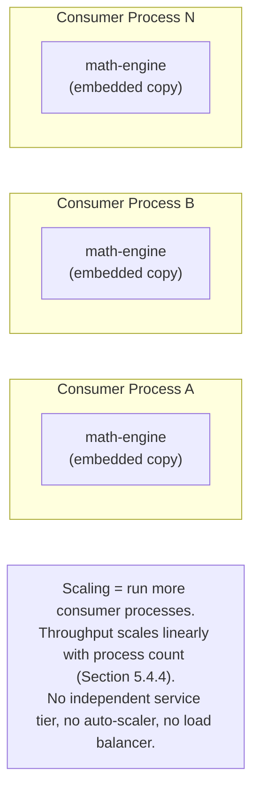
```mermaid
flowchart LR
    subgraph HostA["Consumer Process A"]
        LibA["math-engine<br/>(embedded copy)"]
    end
    subgraph HostB["Consumer Process B"]
        LibB["math-engine<br/>(embedded copy)"]
    end
    subgraph HostN["Consumer Process N"]
        LibN["math-engine<br/>(embedded copy)"]
    end
    Cap["Scaling = run more consumer processes.<br/>Throughput scales linearly with process count (Section 5.4.4).<br/>No independent service tier, no auto-scaler, no load balancer."]
```


### 6.1.4 Resilience Patterns Assessment

Resilience patterns presuppose failure domains — remote calls, redundant instances, or persisted state — that can fail independently and then be recovered. The repository has none of these (Section 6.1.1), so the prompt's RESILIENCE PATTERNS concerns are not applicable. What does exist is an unguarded error posture in which any arithmetic edge case is passed straight through to the caller (Section 5.4.2).

**Table 6.1.4-1: Resilience Pattern Concerns — Status and Basis**

| Resilience Concern | Status | Basis / Evidence |
| --- | --- | --- |
| Fault tolerance mechanisms | Not applicable | No `try`/`catch`/`throw` and no validation exist; divide-by-zero is unguarded and returns `Infinity`/`-Infinity`/`NaN` unflagged per IEEE-754 (C-004, Section 5.4.2); there is no cross-boundary fault to tolerate |
| Disaster recovery procedures | Not applicable | No server, persistent data, or runtime state exists to back up, replicate, or fail over, and no RTO/RPO is defined; the only durable asset is source code, recoverable via Git history on GitHub (Section 5.4.5) |
| Data redundancy approach | Not applicable | No database, cache, file store, or runtime state exists to make redundant; the functions are stateless (Sections 5.4.4, 5.4.5) |
| Failover configurations | Not applicable | No redundant instances, standby, or health-checked entry point exists to fail over to; there is a single embedded code path |
| Service degradation policies | Not applicable | There is no service, health signal, or degraded mode; a call either returns synchronously or the host process itself faults (Section 5.4.2) |

Because every call is a local, synchronous invocation of a pure function, the only "failure" surface is a mathematically undefined or non-finite result — most notably divide-by-zero, which `divide.js` does not guard (C-004). Rather than being caught, retried, or replaced by a fallback, such a result is produced by the JavaScript runtime as `Infinity`, `-Infinity`, or `NaN` and returned directly to the caller; detection is deferred to the consumer, which is assumed to supply valid numeric operands (A-002, Section 5.4.2). The diagram below traces this pass-through posture and confirms the absence of any resilience pattern in the call path.

**Diagram 6.1.4-1: Failure Pass-Through Model (no resilience pattern in the call path)**

```mermaid
flowchart LR
    Call["divide(a, 0) invoked"] --> NoCB{"Circuit breaker<br/>in path?"}
    NoCB -->|"None present"| NoRetry{"Retry / backoff<br/>configured?"}
    NoRetry -->|"None present"| NoFallback{"Fallback or<br/>failover path?"}
    NoFallback -->|"None present"| Compute["a / b evaluated directly"]
    Compute --> Result["Returns Infinity / -Infinity / NaN<br/>unflagged, IEEE-754 (C-004)"]
    Result --> Caller["Propagated synchronously to caller<br/>detection deferred to consumer (A-002)"]
```


### 6.1.5 References

The following repository artifacts and previously authored specification sections were examined as evidence for the applicability determination and assessments in Section 6.1.

**Files Examined**

- `calculator-core/math-engine/add.js` — Confirmed a single stateless, in-process CommonJS function (`module.exports = add`) with no imports, networking, or error handling (F-001).
- `calculator-core/math-engine/subtract.js` — Same stateless in-process pattern for subtraction (F-001).
- `calculator-core/math-engine/multiply.js` — Same stateless in-process pattern for multiplication (F-001).
- `calculator-core/math-engine/divide.js` — Same pattern for division with no divide-by-zero guard, establishing the unguarded failure posture (C-004, F-001).
- `calculator-ui/index.html` — Established the static UI shell that loads neither `app.js` nor `style.css`, confirming no wiring between UI and library (C-005, F-002).
- `calculator-ui/app.js` — Established a dormant bootstrap `console.log` with no imports, exports, or invocation of the library (F-003).
- `calculator-ui/style.css` — Established a single dormant button styling rule, not linked by `index.html` (F-004).

**Folders Examined**

- `` (repository root) — Confirmed exactly two subsystem folders and no root-level manifests, Dockerfiles, orchestration, or CI/CD (C-001).
- `calculator-core/` — Contained the `math-engine` library subsystem only; no service entry point or server.
- `calculator-core/math-engine/` — Contained the four independent arithmetic modules and no aggregator, network client, or resilience code.
- `calculator-ui/` — Contained the three static presentation files with no build tooling or server.

**Cross-Referenced Specification Sections**

- Section 5.1.1 System Overview — Two independent, decoupled subsystems; no orchestration layer.
- Section 5.1.4 External Integration Points — No external integrations and no SLA requirements defined anywhere.
- Section 5.2.1 — Library throughput scales linearly with the number of consumer processes (embedded-in-host model).
- Section 5.3.1 Architecture Style & Communication (ADR-04) — In-process, synchronous invocation via CommonJS `require()`; no inter-process, HTTP, or message-based communication.
- Section 5.4.2 — Error handling pass-through with no error boundary; edge cases returned to the consumer.
- Section 5.4.4 Performance & SLAs — O(1), stateless, concurrency-safe operation with no documented SLA.
- Section 5.4.5 Disaster Recovery — No runtime disaster-recovery procedures; source code recoverable via Git history on GitHub.

**Repository Metadata**

- Repository `Sandeep01Kumar/Nested-submodules-SK`, branch `main` — Confirmed the seven tracked source files, the absence of a `.gitmodules` file (no git submodules despite the repository name), and the absence of build, container, and CI/CD configuration.


## 6.2 Database Design

### 6.2.1 Applicability Determination

**Database Design is not applicable to this system.**

The repository is a minimal, four-function arithmetic scaffold consisting of exactly seven tracked source files, and it contains **no database, no persistent storage, and no data-access tier of any kind**. There is no relational or NoSQL datastore, no object-relational mapper (ORM) or query builder, no schema or migration tooling, no caching layer, and no backup, replication, or partitioning infrastructure. Every value the system handles is transient and in-memory: the `calculator-core/math-engine` functions receive two positional operands, compute a result synchronously, and return it — nothing is written anywhere — while the `calculator-ui` page exposes a single `<input id="display">` field that no script ever reads from or writes to.

This determination is the product of a complete inspection of all seven tracked files (`calculator-core/math-engine/add.js`, `subtract.js`, `multiply.js`, `divide.js`; `calculator-ui/index.html`, `app.js`, `style.css`) and an exhaustive keyword sweep of the entire tree, which returned zero matches for database, persistence, caching, indexing, or constraint constructs. It is independently corroborated by the previously documented sections of this specification — most directly **Section 3.5 Databases & Storage**, which states the system uses "no database and no persistent storage of any kind," and **Section 1.3.1 In-Scope Elements**, which characterizes the data domain as "Transient numeric operands and results plus a single text display field; no stored or persisted data."

**Evidence of absence.** The following table enumerates every persistence-related artifact that a database design would require and records its verified absence.

| Persistence Artifact | Searched For | Present? | Evidence |
|---|---|---|---|
| Relational / NoSQL database | Driver, connection string, query, DDL | No | No driver or connection anywhere; no manifest declaring one |
| ORM / query builder | Prisma, Sequelize, TypeORM, Knex, models | No | No `package.json`, no dependencies, no model or entity files |
| Client-side storage | `localStorage`, `sessionStorage`, IndexedDB, cookies | No | `app.js` is a single `console.log`; `index.html` loads no script |
| Filesystem persistence | `fs` reads/writes, file-based stores | No | `math-engine` modules perform no I/O of any kind |
| Schema / DDL / migrations | `.sql` files, migration directories, `CREATE TABLE` | No | No such files exist in the repository tree |
| Caching layer | Redis, Memcached, in-process cache, TTL logic | No | No cache dependency, client, or code path |
| Backup / replication / partitioning | Dumps, replica config, sharding, WAL/oplog | No | No infrastructure files (Docker, Compose, K8s, Terraform) |

**What exists instead — a transient, in-memory data lifecycle.** Because the system persists nothing, its "data flow" is a short-lived, per-invocation lifecycle. Operands enter a pure arithmetic function, are combined by a single JavaScript operator, and the result is returned to the caller and then becomes unreachable (eligible for garbage collection). The UI's display field is held only in the browser DOM and is never populated, because `index.html` includes no `<script>` element to drive it. There is no write path from either surface to any durable store.

```mermaid
flowchart LR
    subgraph LibPath["Library path (calculator-core/math-engine)"]
        Caller["Consumer supplies<br/>operands a, b"]
        Fn["Pure function computes<br/>a (+ - * /) b in-memory"]
        Result["Result returned<br/>to caller"]
        GC["Operands and result<br/>garbage-collected"]
        Caller --> Fn --> Result --> GC
    end
    subgraph UIPath["UI path (calculator-ui)"]
        Field["input#display value<br/>held only in the DOM"]
        NoRead["Never read or written<br/>(page loads no script)"]
        Field --> NoRead
    end
    GC -.->|"no write path"| Sink["Persistent store<br/>(NONE EXISTS)"]
    NoRead -.->|"no write path"| Sink
```

*Figure 6.2.1-1 — Transient data lifecycle. All data is in-memory and per-invocation; no write path reaches any persistent store because none exists.*

**Why this posture is coherent for the codebase.** The system has no runtime server, no long-lived process, and no user, session, or account model that would need to own or retain state (Sections 5.4.3 and 5.4.5). Its single genuinely functional workflow — `require()` a module and call it with two operands — is stateless and side-effect-free, so there is no data to model, no schema to normalize, no query to optimize, and no data at rest to protect. As Section 3.5 summarizes, the absence of storage means "there is no persistence configuration, no schema migration, no backup/retention concern, and no data-at-rest security surface."

**How the remainder of this section is organized.** Although no database exists, the section prompt enumerates four database-design areas (schema design, data management, compliance considerations, and performance optimization). For completeness and traceability, sub-sections **6.2.2 through 6.2.5** address each area in turn, documenting the specific concern set for that area and recording — with evidence — that each concern is Not Applicable to the current codebase, together with the condition under which it would first become relevant. Sub-section **6.2.6** lists all cited sources. The required schema (ERD) and replication-architecture diagrams are presented in 6.2.2, framed honestly against the transient, non-persistent nature of the system's only data.

### 6.2.2 Schema Design Assessment

Schema design governs how persistent entities, their attributes, relationships, indexes, and physical placement are organized in a datastore. Because the system has no datastore (Section 6.2.1), there is neither a logical nor a physical schema to design. The table below records each schema-design concern from the section prompt as Not Applicable, with the evidence for that determination. The required schema (ERD) and replication diagrams follow, framed honestly against the system's only data, which is transient and in-memory.

| Schema Design Concern | Applicable? | Rationale (Evidence) |
|---|---|---|
| Entity relationships | No | No persisted entities exist; only a conceptual, per-call input-to-result transformation (Figure 6.2.2-1) |
| Data models / structures | No (transient only) | The sole data are an in-memory operand pair, a numeric result, and a DOM display field; none is stored |
| Indexing strategy | No | No tables or collections exist to index; zero indexes are defined (see 6.2.2.3) |
| Partitioning approach | No | No dataset exists to partition or shard; execution is a single in-process function call |
| Replication configuration | No | No stateful node exists to replicate; there is no primary/replica topology (Figure 6.2.2-2) |
| Backup architecture | No | No data at rest exists to back up; the only durable asset is the Git source history (Section 5.4.5) |

#### 6.2.2.1 Entity Relationships and Conceptual Data Model

The repository defines no persistent entities, tables, or collections. The only data structures that exist at all are transient: the two positional operands and the numeric result handled in-memory by each `calculator-core/math-engine` function, and the text value of the `<input id="display">` element that lives only in the browser DOM. To satisfy the section's ERD requirement while representing the system accurately, the diagram below models these structures as a **conceptual, in-memory data model — explicitly not a persisted database schema**. No entity carries a primary key, foreign key, index, or constraint, because nothing is ever written to a store; the single relationship shown is a per-invocation computation, not a stored referential link.

```mermaid
erDiagram
    OPERATION_INPUT ||--|| OPERATION_RESULT : "computes (transient, in-memory)"
    OPERATION_INPUT {
        Number operandA "positional arg a; not persisted; no key"
        Number operandB "positional arg b; not persisted; no key"
    }
    OPERATION_RESULT {
        Number value "a op b; returned then discarded; no key"
    }
    DISPLAY_FIELD {
        String value "DOM input#display; never read or written by script"
    }
```

*Figure 6.2.2-1 — Conceptual (transient, in-memory) data model. These are ephemeral runtime values, not tables; there are no keys, indexes, or constraints, and `DISPLAY_FIELD` has no relationship to the compute path because no script connects them.*

#### 6.2.2.2 Indexing, Partitioning, Replication, and Backup

Each of these physical-design concerns presupposes stored data, and therefore none applies:

- **Indexing** — there are no tables or collections, so no index structures (B-tree, hash, composite, full-text) exist or are needed. Retrieval is not a query against stored rows but a direct return of a computed value.
- **Partitioning / sharding** — there is no dataset whose volume or access pattern would justify horizontal or vertical partitioning; a single arithmetic call operates on two scalar operands.
- **Replication** — there is no stateful node to replicate. There is no primary/replica or leader/follower topology, no write-ahead log or oplog, and no replication stream. The diagram below contrasts the actual stateless, single-process runtime with the persistence/replication tier that a database design would introduce but that is entirely absent here.
- **Backup** — there is no data at rest to snapshot, dump, or schedule for backup. As Section 5.4.5 records, the only durable asset is the source code itself, recoverable from its Git history on GitHub (`Sandeep01Kumar/Nested-submodules-SK`, `main` branch); no data backup, mirror, or point-in-time recovery mechanism exists.

```mermaid
flowchart LR
    subgraph Runtime["Actual runtime: stateless, single in-process execution"]
        Caller["Consumer process<br/>(Node.js require)"]
        Fn["math-engine function<br/>pure, stateless, in-memory"]
        Ret["Result returned then discarded"]
        Caller --> Fn --> Ret
    end
    subgraph Absent["Persistence / replication tier - NOT PRESENT"]
        Primary["Primary DB node<br/>(does not exist)"]
        Replica["Replica node<br/>(does not exist)"]
        Primary -.->|"no WAL / oplog stream"| Replica
    end
    Ret -.->|"no stateful node to replicate;<br/>nothing persisted"| Primary
```

*Figure 6.2.2-2 — Replication architecture. The system runs as a single stateless in-process computation; the primary/replica tier is shown only to illustrate what does not exist.*

#### 6.2.2.3 Documented Indexes and Constraints

The output-format requirement to "document all indexes and constraints" is satisfied by the following complete enumeration: the system defines **zero indexes and zero constraints**. This is a definitive property of the codebase rather than an omission — with no schema there are no primary-key, foreign-key, unique, check, or not-null constraints, and no index objects. The table lists the only data structures present and confirms the absence of both for each.

| Data Structure | Indexes | Constraints |
|---|---|---|
| `OPERATION_INPUT` (operands `a`, `b`) | None | None — operands are untyped positional arguments; no type or range validation (C-004) |
| `OPERATION_RESULT` (returned value) | None | None — raw operator output, including `Infinity`/`-Infinity`/`NaN`, is returned unflagged |
| `DISPLAY_FIELD` (`input#display`) | None | None — a plain DOM value with no validation, and it is never read or written by any script |

Notably, `calculator-core/math-engine/divide.js` applies `a / b` with no zero-divisor guard, so there is not even an application-level equivalent of a check constraint enforcing a non-zero divisor; the behavior falls through to IEEE-754 semantics (`Infinity`/`NaN`).

### 6.2.3 Data Management Assessment

Data management covers how data is migrated, versioned, archived, stored, retrieved, and cached over its lifetime. Every one of these concerns presupposes durable data, which the system does not have (Section 6.2.1). The assessment below records each concern as Not Applicable and describes the transient model that operates in its place.

| Data Management Concern | Applicable? | Rationale (Evidence) |
|---|---|---|
| Migration procedures | No | No schema or datastore exists to migrate; no migration tool, directory, or `.sql` script is present |
| Versioning strategy | No (for data) | No schema or stored data to version; only the source code is versioned, via Git (`main`, seven commits) |
| Archival policies | No | Nothing is retained beyond a single call, so there are no records to archive, tier, or expire |
| Data storage & retrieval | Transient only | "Storage" is the in-memory operand binding during a call; "retrieval" is the direct function return value |
| Caching policies | No | No cache layer, no memoization; each invocation recomputes and stores nothing |

**Storage and retrieval mechanism.** The system's only storage-and-retrieval mechanism is ordinary function-call semantics. When a consumer invokes one of the `calculator-core/math-engine` modules — for example `add(a, b)` — the two operands are bound in memory for the duration of the synchronous call, the single arithmetic expression is evaluated, and the value is "retrieved" by being returned to the caller. There is no query language, no data-access object or repository layer, no connection to any engine, and no read path against stored records. On the UI side, the `<input id="display">` element is the only field that could hold a value, but because `index.html` loads no script it is never written to or read from (Section 1.2, C-005).

**Migration and versioning.** With no schema, there is nothing to migrate between versions and no data model to evolve; consequently there are no forward/rollback migrations, no seed data, and no schema-version table. The only versioning present in the project is **source-code versioning** through Git — the repository has seven "Create &lt;file&gt;" commits on the `main` branch — which tracks changes to code, not to any dataset. This is deliberately distinguished from data or schema versioning, which does not exist.

**Archival and caching.** Because operands and results are discarded immediately after each call (Figure 6.2.1-1), there is no accumulating data to archive, tier to cold storage, or subject to a retention/expiry schedule. Likewise, there is no caching policy: the functions are pure and are not wrapped by any memoization or cache client, so identical calls recompute from scratch and persist nothing between invocations. Caching is revisited from a performance standpoint in Section 6.2.4, where it is likewise found Not Applicable.

### 6.2.4 Compliance Considerations Assessment

Database compliance considerations concern how stored data is retained, protected, kept private, audited, and access-controlled. These obligations attach to data at rest and to the systems that manage it; since the system stores no data and exposes no data-management surface (Section 6.2.1), each consideration is Not Applicable. The repository additionally declares no regulatory or compliance regime anywhere in its source or history.

| Compliance Concern | Applicable? | Rationale (Evidence) |
|---|---|---|
| Data retention rules | No | No stored data exists, so there is nothing to retain, expire, or purge on a schedule |
| Backup & fault tolerance | No (for data) | No persistent data or runtime state to back up or fail over (Section 5.4.5) |
| Privacy controls | No | No personal data or PII is collected, processed, or stored; no data-at-rest surface (Section 3.5) |
| Audit mechanisms | No | No audit trail exists; there are no data mutations to record (Section 5.4.1) |
| Access controls | No | No users, roles, permissions, or credentials, and no protected data resource (Section 5.4.3) |

**Data retention and privacy.** The only data the system handles are transient numeric operands and results, characterized in Section 1.3.1 as "no stored or persisted data." No personally identifiable information, account data, or user-generated content is collected, transmitted, or stored anywhere, so no data-protection obligations (retention windows, right-to-erasure, consent tracking, data-residency) are engaged, and none are documented in the repository. Section 3.5 confirms there is "no data-at-rest security surface" to govern.

**Backup and fault tolerance.** As established in Section 5.4.5, there is "no server, no persistent data, and no runtime state to back up, replicate, or fail over," and no backup schedule, replication strategy, failover mechanism, or recovery objective (RTO/RPO) exists. From a data-durability standpoint the only durable asset is the source code, recoverable by re-cloning the Git repository (`Sandeep01Kumar/Nested-submodules-SK`, `main`); there is no data backup because there is no data.

**Audit mechanisms.** There is no audit logging of data access or modification, because there are no records to create, read, update, or delete. Section 5.4.1 notes that the entire codebase contains a single logging statement — `console.log("Calculator UI loaded")` in `calculator-ui/app.js` — and even that never executes, because `index.html` includes no `<script>` element. No tamper-evident log, change history table, or access journal exists.

**Access controls.** Database access control (authentication to the engine, role/grant management, row- or column-level security) is moot because there is no engine and no protected data resource. Section 5.4.3 confirms there are "no users, sessions, tokens, roles, permissions, or credentials" anywhere and no runtime trust boundary to enforce. The `calculator-core/math-engine` functions execute in-process on operands the caller already possesses, so there is no privilege boundary at which access to data could be granted or denied.

### 6.2.5 Performance Optimization Assessment

Database performance optimization targets the cost of querying stored data and moving it through a storage tier — via query tuning, caching, pooled connections, read/write routing, and batching. With no storage tier, query engine, or connections in the system (Section 6.2.1), none of these techniques applies. The table records each as Not Applicable; the narrative summarizes the system's actual, compute-only performance profile.

| Optimization Technique | Applicable? | Rationale (Evidence) |
|---|---|---|
| Query optimization patterns | No | No queries, no query planner, and no indexes; results are computed and returned directly |
| Caching strategy | No | No cache layer and no memoization; pure functions recompute and store nothing (Section 6.2.3) |
| Connection pooling | No | No database connections exist to pool; there is no driver or engine to connect to |
| Read/write splitting | No | No reads or writes against a store, and no primary/replica to route between (Figure 6.2.2-2) |
| Batch processing | No | No bulk datasets or batch jobs; each call processes two scalar operands synchronously |

**Actual performance profile (compute-only).** Because there is no data tier, the system's performance is governed entirely by in-process computation rather than by data access. As documented in Section 5.4.4, each `calculator-core/math-engine` operation is "a single synchronous arithmetic expression evaluated in constant, O(1) time," the functions are pure and stateless (hence inherently concurrency-safe with no shared state to contend on), and the repository defines "no explicit performance requirements and no SLAs." There is no query to profile, no slow-query log, no index to tune, no connection lifecycle to manage, no replica lag to account for, and no batch window to schedule. Consequently, the database-oriented optimizations enumerated above have no surface to act upon; any future need for them would arise only if the system were extended to read from or write to a persistent store — a change that is out of scope for the current codebase (Section 1.3.2).

### 6.2.6 References

The determinations in this section were grounded in a complete inspection of the repository (all seven tracked files) and corroborated by previously documented specification sections. No web sources were consulted; all external default-stack technologies (databases, ORMs, caches) were confirmed absent from the codebase.

**Repository source files examined**

- `calculator-core/math-engine/add.js` — confirmed a stateless, in-memory arithmetic function (`a + b`) with no I/O or persistence.
- `calculator-core/math-engine/subtract.js` — confirmed a stateless arithmetic function (`a - b`); no data access.
- `calculator-core/math-engine/multiply.js` — confirmed a stateless arithmetic function (`a * b`); no data access.
- `calculator-core/math-engine/divide.js` — confirmed a stateless arithmetic function (`a / b`) with no zero-divisor guard and no constraint enforcement.
- `calculator-ui/index.html` — confirmed the only data-bearing element is `<input id="display">`, which loads no script and is never populated.
- `calculator-ui/app.js` — confirmed a single `console.log` statement; no storage, cache, or persistence logic.
- `calculator-ui/style.css` — confirmed presentation-only rules; no data relevance.

**Repository folders examined**

- `calculator-core/` — contains only the `math-engine/` subfolder; no data, config, or migration artifacts.
- `calculator-core/math-engine/` — the four CommonJS arithmetic modules; no models, entities, or schema files.
- `calculator-ui/` — the three static UI assets; no client-side storage usage.

**Cross-referenced specification sections**

- `1.2 System Overview` — established the two-component, dependency-free composition and stateless functions.
- `1.3 Scope` — Section 1.3.1 defined the data domain as transient with "no stored or persisted data"; Section 1.3.2 placed databases/persistence, caching, and messaging out of scope.
- `3.5 Databases & Storage` — established "no database and no persistent storage of any kind" and "no persistence configuration, no schema migration, no backup/retention concern, and no data-at-rest security surface."
- `5.4 Cross-Cutting Concerns` — Section 5.4.1 (sole log statement, never executed), 5.4.3 (no users/roles/credentials/trust boundary), 5.4.4 (O(1) synchronous, no SLAs), and 5.4.5 (no persistent data or runtime state to back up/replicate/fail over; source recoverable via Git).

**Repository metadata**

- Git repository `Sandeep01Kumar/Nested-submodules-SK`, branch `main` — seven "Create &lt;file&gt;" commits; the source history is the only durable recovery asset. (Remote URL intentionally omitted as it embeds a credential.)

## 6.3 Integration Architecture

### 6.3.1 Applicability Determination

The system documented in this specification is a minimal, self-contained calculator scaffold. Before evaluating any integration concern, this sub-section records the applicability determination that governs the remainder of Section 6.3.

**Integration Architecture is not applicable for this system.**

The repository (`Sandeep01Kumar/Nested-submodules-SK`, branch `main`) contains no external systems, services, or interfaces to integrate with. It comprises exactly seven static source files across two decoupled subsystems (Section 5.1.1): `calculator-core/math-engine/`, an in-process CommonJS arithmetic library of four pure functions (F-001), and `calculator-ui/`, a static browser mockup (F-002, F-003, F-004). There is no HTTP or API server, no message broker or queue, no database or external datastore, no third-party SDK or SaaS client, and no API gateway anywhere in the codebase. As established in Section 5.1.4, the system has no external integration points; as established in Section 3.4, it integrates with no third-party services; and as established in Section 3.3, it declares zero open-source dependencies.

An Integration Architecture presupposes boundaries across which a system exchanges data with other systems — over a network protocol, a message channel, or a shared datastore. None of the structural hallmarks of such an architecture are present in the repository, as summarized below.

**Table 6.3.1-1: Integration Hallmarks vs. Observed Repository**

| Hallmark of an Integration Architecture | Present? | Evidence in Repository |
| --- | --- | --- |
| Network API surface (REST / GraphQL / gRPC) | No | No process binds a port or listens on a socket; a repository-wide grep matched only `module.exports` (Section 5.1.4) |
| Message / event infrastructure | No | No broker, queue, topic, or stream client (Kafka / RabbitMQ / SQS / Redis) appears in any file |
| External service / third-party integration | No | No SDK, HTTP client, or SaaS credential exists; zero third-party services (Section 3.4) and zero open-source dependencies (Section 3.3) |
| API gateway / authentication / rate limiting | No | No gateway, identity provider, token, or throttling configuration is present anywhere in the repository |
| Persisted or shared data domain | No | Only transient numeric operands and a single display field exist; no database, cache, or file store (Section 1.3.1) |

Consequently, the concerns enumerated in the Section 6.3 prompt — API design, message processing, and external-system integration — have no corresponding implementation to document. Sub-sections 6.3.2 through 6.3.4 nonetheless walk through each required area to confirm, with evidence, that each is not applicable, and to describe the sole real interface the repository exposes: an in-process CommonJS module contract (Section 5.3.1, ADR-04). Sub-section 6.3.5 lists all cited evidence.

The actual topology is shown below. The only interface present is the CommonJS `require()` / `module.exports` boundary between a consumer and the arithmetic library, executing inside a single host process (assumption A-001). There is no external system on any side, and the two subsystems are not wired to each other: `index.html` loads neither `app.js` nor `style.css` (C-005), and nothing bundles the CommonJS modules for browser consumption (C-002).

**Diagram 6.3.1-1: Actual (Non-Integrated) Repository Topology**

```mermaid
flowchart TB
    subgraph Repo["Repository (self-contained scaffold, 7 files)"]
        subgraph UISub["calculator-ui (static mockup)"]
            HTML["index.html<br/>display + buttons 1,2,+,="]
            JS["app.js<br/>console.log only"]
            CSS["style.css<br/>button sizing"]
        end
        subgraph CoreSub["calculator-core / math-engine (F-001 library)"]
            Add["add.js"]
            Sub["subtract.js"]
            Mul["multiply.js"]
            Div["divide.js"]
        end
    end
    subgraph ExternalSub["External Systems & Services"]
        Ext["HTTP/REST APIs, databases, message brokers,<br/>third-party SDKs, identity providers<br/>&mdash; NONE PRESENT &mdash;"]
    end
    HTML -. "no &lt;script&gt; tag (C-005)" .-> JS
    HTML -. "no &lt;link&gt; tag (C-005)" .-> CSS
    HTML -. "no require()/bundler (C-002)" .-> Add
    Add -. "no outbound network call" .-> Ext
    JS -. "no fetch / XHR / WebSocket" .-> Ext
```

### 6.3.2 API Design Assessment

Because the system exposes no network-accessible API (Section 6.3.1), every concern in the prompt's API DESIGN group is not applicable. This sub-section records each concern, its status, and — where one exists — the actual in-process mechanism that stands in its place, so the absence is documented with evidence rather than merely asserted.

The only programmatic interface in the repository is the CommonJS module contract of the `math-engine` library: each of the four modules exports exactly one function via `module.exports`, and a consumer acquires it with `require()` and calls it directly (Section 5.3.1, ADR-04). This is an in-process, language-level contract, not a networked API; it has no wire protocol, endpoint, or transport, so none of the design concerns that apply to a service API — authentication, authorization, rate limiting, versioning, or published documentation standards — attach to it.

**Table 6.3.2-1: API Design Concerns — Status and Basis**

| API Design Concern | Status | Basis / Evidence |
| --- | --- | --- |
| Protocol specifications | Not applicable | No wire protocol exists; the sole contract is the in-process CommonJS `require()` / `module.exports` call convention, not HTTP/REST, GraphQL, or gRPC (Section 5.3.1) |
| Authentication methods | Not applicable | No server, session, credential, or identity provider exists; a local function call has no remote caller to authenticate (Section 3.4) |
| Authorization framework | Not applicable | No roles, scopes, permissions, or access-control checks appear in any file; the functions are unconditionally callable in-process |
| Rate limiting strategy | Not applicable | No entry point, throttle, quota, or gateway exists to rate-limit; call volume is bounded only by the consumer's own process (Section 6.3.1) |
| Versioning approach | Not applicable | No API version, `package.json` version field, route prefix, or content-type version is declared; there is no manifest at all (C-001) |
| Documentation standards | Not applicable | No OpenAPI / Swagger, GraphQL schema, `.proto`, JSDoc, or README is present; the contract is defined only by the four module signatures (C-001) |

The contract that does exist is narrow and untyped: each function accepts two positional operands `(a, b)` and returns a single value synchronously, with no schema, serialization, or content negotiation, and consumers are assumed to supply valid numeric operands (A-002). The API architecture below shows this CommonJS surface as the only interface present, alongside the network API layers that are explicitly absent.

**Diagram 6.3.2-1: API Architecture — CommonJS Module Contract as the Only Interface**

```mermaid
flowchart LR
    Consumer["CommonJS consumer<br/>(Node.js host, A-001)"]
    subgraph APILayerSub["Programmatic API surface (the ONLY interface present)"]
        Req["require('./add')<br/>synchronous module resolution"]
        Exp["module.exports = fn<br/>one default export per module"]
    end
    subgraph AbsentSub["Absent network API layers"]
        NoHTTP["No HTTP / REST endpoints"]
        NoGQL["No GraphQL schema"]
        NoGRPC["No gRPC service"]
        NoGW["No API gateway / versioning /<br/>rate limiting / auth"]
    end
    Consumer -->|"in-process call"| Req
    Req --> Exp
    Exp -->|"returns fn reference"| Consumer
    Consumer -. "not exposed over any<br/>network protocol" .-> NoHTTP
    NoHTTP -.- NoGQL
    NoGQL -.- NoGRPC
    NoGRPC -.- NoGW
```

The invocation contract is exercised entirely within a single process. The sequence below traces the one key flow the repository supports — a consumer resolving a module and invoking a function — and highlights that no gateway, authentication handshake, versioning, rate-limit, retry, or serialization step exists anywhere in the path.

**Diagram 6.3.2-2: In-Process Invocation Sequence (the only API flow present)**

```mermaid
sequenceDiagram
    autonumber
    participant C as CommonJS Consumer
    participant R as CommonJS Loader
    participant M as math-engine module
    Note over C,M: Single OS process - no network hop, no API gateway, no auth handshake
    C->>R: require('.../math-engine/divide')
    R-->>C: module.exports (function reference)
    C->>M: divide(a, b) - direct synchronous call
    M-->>C: numeric result (or Infinity / -Infinity / NaN, C-004)
    Note over C,M: No serialization, versioning, rate limit, or retry in the path
```

### 6.3.3 Message Processing Assessment

The system contains no messaging or event infrastructure of any kind (Section 6.3.1), so every concern in the prompt's MESSAGE PROCESSING group is not applicable. There is no broker, queue, topic, stream, scheduler, or event emitter in any of the seven source files; the only data movement in the repository is the synchronous passing of two operands into a pure function and the return of a single numeric result on the caller's stack (Section 5.3.1).

**Table 6.3.3-1: Message Processing Concerns — Status and Basis**

| Message Processing Concern | Status | Basis / Evidence |
| --- | --- | --- |
| Event processing patterns | Not applicable | No event emitter, listener, callback, or pub/sub mechanism exists; the four functions return synchronously with no event surface (Section 5.3.1) |
| Message queue architecture | Not applicable | No broker or queue (Kafka / RabbitMQ / SQS / Redis) is imported, configured, or referenced anywhere in the repository (C-001) |
| Stream processing design | Not applicable | No stream, pipe, observable, or windowed/continuous processor exists; each operation is a single discrete call |
| Batch processing flows | Not applicable | No scheduler, cron, job runner, or bulk-input path exists; each function processes exactly one operand pair per invocation (Section 5.4.4) |
| Error handling strategy | Not applicable (as a messaging concern) | No message, retry, dead-letter, or acknowledgement channel exists; errors are passed through unguarded — divide-by-zero returns `Infinity` / `-Infinity` / `NaN` per IEEE-754 (C-004, Section 5.4.2) |

The sole data-movement pattern is synchronous and in-process: a caller places two operands on the stack, a pure function computes one native IEEE-754 expression, and the result is returned immediately (Section 5.4.4). There is no asynchronous handoff, no serialization, and no intermediary. The error posture follows directly from this model — because there is no message channel or error boundary, any arithmetic edge case (most notably the unguarded divide-by-zero in `divide.js`) is produced by the runtime and returned straight to the caller, with detection deferred to the consumer (A-002, C-004). The diagram below contrasts this actual synchronous movement with the asynchronous message-processing infrastructure that is entirely absent.

**Diagram 6.3.3-1: Message Flow — Synchronous In-Process Movement vs. Absent Async Messaging**

```mermaid
flowchart LR
    subgraph SyncSub["Actual data movement (synchronous, in-process)"]
        In["Operands a, b<br/>on caller stack"]
        Fn["Pure arithmetic function<br/>add / subtract / multiply / divide"]
        Out["Numeric result<br/>returned synchronously"]
    end
    subgraph AsyncSub["Absent message-processing infrastructure"]
        Q["No message queue<br/>(Kafka / RabbitMQ / SQS)"]
        T["No event bus / pub-sub topic"]
        S["No stream processor"]
        B["No batch / scheduled job"]
    end
    In --> Fn
    Fn --> Out
    Out -. "no publish / enqueue step" .-> Q
    Q -.- T
    T -.- S
    S -.- B
```

### 6.3.4 External Systems Assessment

The repository integrates with no external systems (Section 6.3.1), so every concern in the prompt's EXTERNAL SYSTEMS group is not applicable. There are no third-party services (Section 3.4), no open-source dependencies (Section 3.3), no cloud or SaaS clients, no legacy-system adapters, and no API gateway anywhere in the code. Notably, despite the repository name "Nested-submodules-SK", there are no git submodules — no `.gitmodules` file exists — so there is not even a source-level linkage to an external repository.

**Table 6.3.4-1: External Systems Concerns — Status and Basis**

| External Systems Concern | Status | Basis / Evidence |
| --- | --- | --- |
| Third-party integration patterns | Not applicable | No SDK, HTTP client, or SaaS credential is imported or configured; zero third-party services (Section 3.4) and zero open-source dependencies (Section 3.3) |
| Legacy system interfaces | Not applicable | No adapter, connector, file drop, FTP, SOAP, or database link to any legacy system exists; no predecessor system is referenced and the repository is entirely self-contained (Section 1.2) |
| API gateway configuration | Not applicable | No gateway, reverse proxy, ingress, route table, or edge configuration is present; nothing is exposed over a network (Section 6.3.1) |
| External service contracts | Not applicable | No service contract, SLA, WSDL, or interface definition with an external party exists anywhere in the repository (Section 5.1.4) |

Because "document all external dependencies" is an explicit output requirement of this section, the complete external-dependency inventory is recorded below. The inventory is empty: every candidate integration category is absent from the repository, corroborating the external-integration analysis in Section 5.1.4.

**Table 6.3.4-2: Complete External Dependency Inventory**

| Candidate External Dependency | Present? | Evidence |
| --- | --- | --- |
| HTTP / REST / GraphQL / gRPC endpoint or client | Absent | No process binds a port and no outbound network client exists (Section 5.1.4) |
| Database or external datastore | Absent | No database driver, connection string, or datastore reference; only transient numeric data (Section 1.3.1) |
| Message queue / event bus / stream | Absent | No broker or messaging client of any kind (Section 6.3.3) |
| Third-party / SaaS API or SDK | Absent | No third-party service integration and no SaaS client or credential (Section 3.4) |
| CDN or remote asset | Absent | `index.html` loads no remote script or stylesheet reference; no CDN dependency (C-005, Section 3.3) |
| Open-source package dependency | Absent | No `package.json`, lockfile, or `node_modules`; zero declared dependencies (Section 3.3, C-001) |
| Git submodule / external repository link | Absent | No `.gitmodules` file and an empty `git submodule status`, despite the repository name |

The repository is therefore entirely self-contained (Section 1.2): all code executes within a single consumer-hosted process, and no runtime, build-time, or source-level dependency reaches outside the seven tracked files. There is consequently no external contract to version, monitor, secure, or fail over.

### 6.3.5 References

The following repository artifacts and previously authored specification sections were examined as evidence for the applicability determination and assessments in Section 6.3.

**Files Examined**

- `calculator-core/math-engine/add.js` — Confirmed a single stateless, in-process CommonJS function (`module.exports = add`) with no imports, networking, or API surface (F-001).
- `calculator-core/math-engine/subtract.js` — Same in-process, non-networked pattern for subtraction (F-001).
- `calculator-core/math-engine/multiply.js` — Same in-process, non-networked pattern for multiplication (F-001).
- `calculator-core/math-engine/divide.js` — Same pattern for division with no divide-by-zero guard, establishing the unguarded error pass-through described in 6.3.3 (C-004, F-001).
- `calculator-ui/index.html` — Established the static UI shell that loads no remote or local script/stylesheet, confirming no CDN or network asset and no wiring to the library (C-005, F-002).
- `calculator-ui/app.js` — Established a dormant bootstrap `console.log` with no imports, exports, network calls, or message handling (F-003).
- `calculator-ui/style.css` — Established a single dormant button styling rule with no external references (F-004).

**Folders Examined**

- `` (repository root) — Confirmed exactly two subsystem folders and no root-level manifests, gateway configuration, or dependency declarations (C-001).
- `calculator-core/` — Contained the `math-engine` library subsystem only; no network client, service entry point, or integration adapter.
- `calculator-core/math-engine/` — Contained the four independent arithmetic modules and no HTTP client, message broker, or external-service code.
- `calculator-ui/` — Contained the three static presentation files with no API client or build tooling.

**Cross-Referenced Specification Sections**

- Section 1.2 System Overview — The system integrates with nothing external and is entirely self-contained.
- Section 1.3.1 In-Scope — No integrations are in scope; the data domain is transient numeric operands and results only.
- Section 3.3 Open Source Dependencies — Zero third-party or open-source dependencies; no manifest, lockfile, or CDN reference.
- Section 3.4 Third-Party Services — The repository integrates with no third-party services.
- Section 5.1.1 System Overview — Two independent, decoupled subsystems with no orchestration layer.
- Section 5.1.4 External Integration Points — No external integration points; all candidate integration categories are absent.
- Section 5.3.1 Architecture Style & Communication (ADR-04) — In-process, synchronous invocation via CommonJS `require()`; no HTTP or message-based communication.
- Section 5.4.2 — Error-handling pass-through with no error boundary; edge cases returned to the consumer.
- Section 5.4.4 Performance & SLAs — O(1), stateless, synchronous operation with no documented SLA.
- Section 6.1 Core Services Architecture — Core Services Architecture is not applicable, corroborating the in-process, non-distributed model.

**Repository Metadata**

- Repository `Sandeep01Kumar/Nested-submodules-SK`, branch `main` — Confirmed the seven tracked source files, the absence of a `.gitmodules` file (no git submodules despite the repository name), and the absence of any API server, message broker, gateway, or external-service configuration.

## 6.4 Security Architecture

### 6.4.1 Applicability Determination

The system documented in this specification is a minimal, self-contained calculator scaffold. Before evaluating any authentication, authorization, or data-protection concern, this sub-section records the applicability determination that governs the remainder of Section 6.4.

**Detailed Security Architecture is not applicable for this system.**

The repository (`Sandeep01Kumar/Nested-submodules-SK`, branch `main`) contains no security-relevant constructs of any kind. It comprises exactly seven static source files across two decoupled subsystems (Section 5.1.1): `calculator-core/math-engine/`, an in-process CommonJS arithmetic library of four pure functions (F-001), and `calculator-ui/`, a static browser mockup (F-002, F-003, F-004). A repository-wide search across every `.js`, `.html`, and `.css` file for authentication, authorization, session, token, password, cryptographic, secret, network, and transport-security constructs returned zero matches. There is no user or identity concept, no server or network endpoint, no datastore, no credential or key material, and no third-party dependency (Section 3.3) or service (Section 3.4) anywhere in the codebase. This corroborates Section 5.4.3, which records that no authentication or authorization framework is present and none is applicable to the code as written.

A Security Architecture — an authentication framework, an authorization system, and a data-protection regime — presupposes protected resources, identifiable principals, and data or communication channels that require confidentiality, integrity, or availability guarantees. None of these preconditions exist in the repository, as summarized below.

**Table 6.4.1-1: Security-Architecture Hallmarks vs. Observed Repository**

| Hallmark of a Security Architecture | Present? | Evidence in Repository |
| --- | --- | --- |
| Identifiable principals (users / accounts / services) | No | No user, account, role, or identity concept in any file; a grep for `auth` / `login` / `user` matched nothing (Section 5.4.3) |
| Protected resource behind an access boundary | No | No server, endpoint, or datastore; the four functions are unconditionally callable in-process (ADR-04) |
| Credential, secret, or key material | No | No password, token, API key, certificate, `.env`, or `process.env` reference exists in any tracked file (C-001) |
| Sensitive or regulated data | No | Only transient numeric operands and one display field; no personal, financial, or health data (Section 1.3.1) |
| Network / transport channel to secure | No | No process binds a port and no `fetch` / XHR / HTTP client exists; nothing crosses a network boundary (Section 6.3.1) |

Consequently, the three concern groups enumerated in the Section 6.4 prompt — Authentication Framework, Authorization System, and Data Protection — have no corresponding implementation to document. Sub-sections 6.4.2 through 6.4.4 nonetheless walk through each required area to confirm, with evidence, that each is not applicable; sub-section 6.4.5 records the standard, baseline security practices that remain relevant to a source-only scaffold of this kind and the controls that would be required before any networked exposure; and sub-section 6.4.6 lists all cited evidence.

The security zones that do and do not exist are shown below. The repository presents two independent, self-contained trust zones — a Node.js host process that may `require()` the arithmetic library (A-001, ADR-04), and an end-user browser that may open the static UI — with no runtime link between them (`index.html` loads neither `app.js` nor `style.css`, C-005; nothing bundles the modules for the browser, C-002). No network boundary, server tier, datastore, secret vault, or identity provider exists on any side.

**Diagram 6.4.1-1: Security Zone / Trust-Boundary Topology**

```mermaid
flowchart TB
    subgraph ZoneA["Trust Zone A: Consumer-Controlled Node.js Host Process"]
        Consumer["CommonJS consumer code<br/>(hypothetical caller, A-001)"]
        subgraph Lib["calculator-core / math-engine (F-001)"]
            Fns["add / subtract / multiply / divide<br/>pure - stateless - in-process"]
        end
        Consumer -->|"require() + direct call (ADR-04)"| Fns
    end
    subgraph ZoneB["Trust Zone B: End-User Web Browser"]
        Page["calculator-ui/index.html (F-002)<br/>display field + buttons 1,2,+,="]
        InertJS["app.js console.log - never loaded (C-005, A-004)"]
        CSSFile["style.css - never linked (C-005)"]
    end
    subgraph Absent["Absent Security Infrastructure (no implementation present)"]
        NoNet["No network boundary / DMZ / firewall"]
        NoSrv["No server or API tier"]
        NoData["No datastore / key store / secret vault"]
        NoIdp["No identity provider / auth gateway"]
    end
    Fns -. "no network egress" .-> NoNet
    Page -. "no fetch / XHR - no backend" .-> NoSrv
    Consumer -. "no credential or key material" .-> NoData
    Page -. "no login or token exchange" .-> NoIdp
    ZoneA -. "no runtime link between UI and core" .- ZoneB
```

### 6.4.2 Authentication Framework Assessment

Because the system has no notion of a principal and no protected resource (Section 6.4.1), every concern in the prompt's AUTHENTICATION FRAMEWORK group is not applicable. There is no login flow, no identity store, no session, no token issuance or validation, and no password handling anywhere in the seven source files; a repository-wide grep for `password`, `login`, `session`, `token`, `jwt`, `cookie`, `oauth`, `saml`, and `ldap` returned zero matches (Section 5.4.3).

**Table 6.4.2-1: Authentication Framework Concerns — Status and Basis**

| Authentication Concern | Status | Basis / Evidence |
| --- | --- | --- |
| Identity management | Not applicable | No user, account, directory, or identity store exists; the arithmetic functions have no caller identity (Section 5.4.3) |
| Multi-factor authentication | Not applicable | No primary authentication exists to augment; no MFA, OTP, or authenticator integration is present (C-001) |
| Session management | Not applicable | No session, cookie, or server-side state; each function call is stateless and independent (Section 5.4.4) |
| Token handling | Not applicable | No JWT, bearer, refresh, or API token is issued, stored, or validated anywhere in the repository |
| Password policies | Not applicable | No password field, hash, salt, or credential store exists; there is nothing against which to set complexity, rotation, or lockout rules (Section 5.4.3) |

The authentication flow that actually occurs is a null flow: an invocation — whether a Node consumer calling a function or a user opening the static page — proceeds directly to execution with no identity check, because no authentication layer exists to interpose one. The diagram below traces this observed path and marks, as a dashed would-be branch, the identity-establishment steps that would have to be introduced before any networked entry point is exposed (Section 5.3.4, ADR-07).

**Diagram 6.4.2-1: Authentication Flow — Observed Null Flow vs. Would-Be Controls**

```mermaid
flowchart TB
    Start(["Invocation attempt"]) --> Kind{"Entry point type?"}
    Kind -->|"Node consumer (A-001)"| CoreReq["require('.../add') then call add(a,b)"]
    Kind -->|"Browser user"| UIOpen["Open calculator-ui/index.html (F-002)"]
    CoreReq --> AuthnGate{"Authentication layer<br/>present in repo?"}
    UIOpen --> AuthnGate
    AuthnGate -->|"No - grep found 0 matches:<br/>no identity, MFA, session, token, password"| NoGate["No identity check performed"]
    NoGate --> Exec["Operation runs immediately<br/>(pure function result or inert UI, C-005)"]
    Exec --> Done(["Result returned - no principal established"])
    AuthnGate -.->|"Would-be path before any networked exposure<br/>(Section 5.3.4, ADR-07)"| Future["Add IdP / MFA / session / token issuance"]
    Future -.-> Done
```

No implemented authentication controls exist to tabulate as policies; the enforceable authentication policy set is therefore empty by construction. Section 6.4.5 records the baseline authentication control that would apply — and become mandatory — the moment a networked entry point is introduced.

### 6.4.3 Authorization System Assessment

Authorization presupposes an authenticated principal and a protected resource, neither of which exists (Sections 6.4.1, 6.4.2), so every concern in the prompt's AUTHORIZATION SYSTEM group is not applicable. No role, permission, scope, access-control list, guard, or middleware appears in any file, and there is no audit or access log — the only logging statement in the repository is the dormant `console.log` in `app.js`, which never executes because `index.html` includes no `<script>` tag (C-005, A-004, Section 5.4.1).

**Table 6.4.3-1: Authorization System Concerns — Status and Basis**

| Authorization Concern | Status | Basis / Evidence |
| --- | --- | --- |
| Role-based access control | Not applicable | No role, group, or RBAC model exists; the functions are unconditionally callable in-process (ADR-04) |
| Permission management | Not applicable | No permission, scope, grant, or ACL is defined or checked anywhere in the repository |
| Resource authorization | Not applicable | No protected resource exists to authorize; there is no server, endpoint, or datastore (Section 6.3.1) |
| Policy enforcement points | Not applicable | No guard, middleware, interceptor, or decision/enforcement point is present in any call path |
| Audit logging | Not applicable | No audit, access, or security log; the sole `console.log` (F-003) is inert and never runs (C-005, A-004, Section 5.4.1) |

The authorization flow that actually occurs is likewise a null flow: because no principal is established (Section 6.4.2) and no policy enforcement point exists, any request reaches the resource — a pure function result or the static HTML — unconditionally, with no policy evaluated. The diagram below traces this path and marks the policy-decision and enforcement components that would be required before networked exposure (ADR-07).

**Diagram 6.4.3-1: Authorization Flow — Observed Null Flow vs. Would-Be Controls**

```mermaid
flowchart TB
    Req(["Caller requests an operation"]) --> Ident{"Authenticated principal exists?"}
    Ident -->|"No principal - authN absent (5.4.3)"| NoSubject["No subject / role / claim to evaluate"]
    NoSubject --> PEP{"Policy Enforcement Point<br/>present in repo?"}
    PEP -->|"No - no RBAC, permissions,<br/>guards, or middleware"| NoPEP["No authorization decision made"]
    NoPEP --> Resource["Resource accessed unconditionally<br/>(math function or static HTML)"]
    Resource --> Ok(["Operation completes - no policy evaluated"])
    PEP -.->|"Would-be path before networked exposure<br/>(ADR-07)"| FutureAZ["Add PDP / PEP / role and permission model / audit log"]
    FutureAZ -.-> Ok
```

As with authentication, there are no implemented authorization or audit-logging policies to tabulate; the access-control policy set and the audit-log configuration are both empty by construction. The forward-looking authorization and audit-logging controls are recorded in the security control matrix in Section 6.4.5.

### 6.4.4 Data Protection Assessment

The repository processes no persistent, personal, or sensitive data and opens no communication channel (Sections 6.4.1, 6.3.1), so every concern in the prompt's DATA PROTECTION group is not applicable. The only data in the system are two transient numeric operands and a single display value that exist for the duration of one function call or one page view; there is no datastore, no file persistence, no cryptography, and no network transport to protect (Section 1.3.1, Section 5.4.5).

**Table 6.4.4-1: Data Protection Concerns — Status and Basis**

| Data Protection Concern | Status | Basis / Evidence |
| --- | --- | --- |
| Encryption standards (at rest / in transit) | Not applicable | No data is persisted or transmitted; no `crypto` import, cipher, or algorithm configuration exists (C-001) |
| Key management | Not applicable | No key, secret, certificate, `.env`, or `process.env` reference; nothing to generate, store, or rotate (Section 5.4.3) |
| Data masking rules | Not applicable | No sensitive fields exist to mask; the only values are arbitrary numeric operands (Section 1.3.1) |
| Secure communication | Not applicable | No network channel; no HTTP client/server, TLS/SSL, or transport configuration is present (Section 6.3.1) |
| Compliance controls | Not applicable | No regulated data category is present; no compliance framework applies (see Table 6.4.4-2) |

Because "document compliance requirements" is an explicit output requirement of this section, the applicable-compliance determination is recorded below. Each candidate regime is evaluated against the actual data domain; none applies, because the system collects, stores, and transmits no personal, cardholder, or health information.

**Table 6.4.4-2: Compliance Requirements Determination**

| Compliance Regime | Applicable? | Basis in the Repository |
| --- | --- | --- |
| GDPR / CCPA (personal data) | No | No personal or user data is collected, stored, or processed; there is no user concept (Section 5.4.3) |
| PCI DSS (cardholder data) | No | No payment, cardholder, or financial data path exists anywhere in the code |
| HIPAA (protected health information) | No | No health or patient data is present; the data domain is numeric operands only (Section 1.3.1) |
| SOC 2 (service trust criteria) | No | No hosted service, tenant, or customer data exists; the repository is a self-contained scaffold (Section 1.2) |

Because no data crosses a persistence or transport boundary, there is no data-protection policy to enforce and no encryption, masking, or key-rotation rule to tabulate. Should the scaffold evolve to collect or transmit real data, the applicable regime would be determined by the data category introduced, and the corresponding at-rest / in-transit encryption, key-management, and masking controls would need to be designed at that time (Section 6.4.5).

### 6.4.5 Standard Security Practices and Security Control Matrix

Although a dedicated Security Architecture is not applicable (Section 6.4.1), a set of standard, baseline security practices remains relevant to a source-only scaffold of this kind. This sub-section records those practices, distinguishing what the repository's current state already satisfies from the controls that would become mandatory the moment the scaffold acquires a networked entry point, a datastore, or real data. These are described as recommended baselines, not as implemented commitments, because no security controls exist in the code today.

**Baseline practices applicable to the current scaffold**

- **Source-control hygiene.** The repository's sole durable asset is its Git history on GitHub (Section 5.4.5); provider-side branch protection, reviewed commits, and repository access controls are the appropriate safeguards for a source-only artifact.
- **No committed secrets.** A repository-wide scan found no password, token, API key, certificate, or `.env` file in any tracked source file (Section 5.4.3); keeping credentials out of version control is the relevant control and is currently satisfied.
- **Minimal supply-chain surface.** The repository declares zero open-source dependencies and no manifest or lockfile (Section 3.3, C-001), so there is no third-party package attack surface to patch or audit today.
- **Secure delivery of static assets.** If `calculator-ui/index.html` is ever hosted, serving it over HTTPS with a restrictive Content-Security-Policy is the standard baseline; this is a hosting-time concern, as the file itself references no remote or local script or stylesheet (C-005).
- **Input-validation posture.** The arithmetic library performs no operand validation and leaves divide-by-zero unguarded (C-004, A-002); adding operand validation is the standard robustness and denial-of-service hardening step if untrusted input is ever routed to these functions.

The control matrix below summarizes each standard control domain, its state in the current repository, and the recommended baseline action. It is a forward-looking baseline rather than a record of implemented controls.

**Table 6.4.5-1: Security Control Matrix (Baseline)**

| Security Control Domain | Current State in Repository | Recommended Baseline Action |
| --- | --- | --- |
| Authentication | Absent — no principals or login (Section 6.4.2) | Introduce an identity / authN layer before any networked entry point (ADR-07) |
| Authorization | Absent — no roles or PEP (Section 6.4.3) | Add a policy decision / enforcement point once a protected resource exists (ADR-07) |
| Data encryption | Absent — no data at rest or in transit (Section 6.4.4) | Apply TLS in transit and at-rest encryption if real data is introduced |
| Secrets & key management | None committed (Section 5.4.3) | Use an external secret manager; never commit credentials |
| Input validation | Unguarded operands (C-004, A-002) | Validate and sanitize operands if untrusted input is accepted |
| Audit logging | Absent; inert `console.log` (Section 5.4.1) | Add access / audit logging when a request boundary is created |
| Supply-chain / dependencies | Zero dependencies (Section 3.3) | Add lockfile pinning and vulnerability scanning when dependencies are introduced |
| Transport / secure delivery | No network channel (Section 6.3.1) | Serve any hosted UI over HTTPS with CSP headers |

**Controls required before networked exposure**

Sections 5.3.4 and 5.4.3 (ADR-07) establish that introducing any networked entry point — for example, wrapping the `math-engine` in an HTTP API or serving the UI as an authenticated application — would require adding authentication and authorization before exposure. At that point the full complement of controls in Table 6.4.5-1 would move from "recommended baseline" to mandatory, and a compliance determination (Table 6.4.4-2) would need to be re-performed against whatever data category the networked system introduces. Until such a change is made, the system's minimal attack surface is a direct consequence of its architecture: no network, no data, no dependencies, and no identity (Sections 6.1, 6.3).

### 6.4.6 References

The following repository artifacts and previously authored specification sections were examined as evidence for the applicability determination and assessments in Section 6.4.

**Files Examined**

- `calculator-core/math-engine/add.js` — Confirmed a stateless in-process function with no authentication, authorization, or data-handling logic (F-001).
- `calculator-core/math-engine/subtract.js` — Same non-security-bearing pattern for subtraction (F-001).
- `calculator-core/math-engine/multiply.js` — Same non-security-bearing pattern for multiplication (F-001).
- `calculator-core/math-engine/divide.js` — Same pattern for division with no divide-by-zero guard and no input validation, establishing the input-validation posture in 6.4.5 (C-004, F-001).
- `calculator-ui/index.html` — Established a static UI shell with no `<script>` or `<link>`, no login form, and no remote asset, confirming no client-side authentication and no network channel (C-005, F-002).
- `calculator-ui/app.js` — Established the sole logging statement (`console.log`), which is inert because it is never loaded, confirming the absence of audit logging (F-003, A-004).
- `calculator-ui/style.css` — Established a dormant button styling rule with no security relevance (F-004).

**Folders Examined**

- `` (repository root) — Confirmed exactly two subsystem folders and no root-level manifest, secret file, or security configuration (C-001).
- `calculator-core/` — Contained the `math-engine` library only; no credential store, guard, or access-control code.
- `calculator-core/math-engine/` — Contained the four arithmetic modules with no authentication, authorization, or cryptographic code.
- `calculator-ui/` — Contained the three static presentation files with no authentication, session, or secure-transport code.

**Cross-Referenced Specification Sections**

- Section 1.2 System Overview — Self-contained calculator scaffold; corroborates the absence of external, security-bearing components.
- Section 1.3.1 In-Scope — Data domain is transient numeric operands only; no regulated data.
- Section 3.3 Open Source Dependencies — Zero dependencies; no supply-chain surface.
- Section 3.4 Third-Party Services — No third-party services, including no identity provider or security SaaS.
- Section 5.3.4 / ADR-07 — A networked entry point would require adding authentication and authorization before exposure.
- Section 5.4.1 Monitoring and Observability — No logging or audit infrastructure; the sole `console.log` never executes.
- Section 5.4.2 Error Handling — No validation or error boundary; divide-by-zero pass-through (C-004).
- Section 5.4.3 Authentication and Authorization — No authentication or authorization framework is present or applicable.
- Section 5.4.4 Performance & SLAs — Stateless, independent function calls with no session or server-side state.
- Section 5.4.5 Disaster Recovery — No persistent data or state; Git history is the only durable asset.
- Section 6.1 Core Services Architecture — Not applicable; in-process, non-distributed model with no service boundary to secure.
- Section 6.3 Integration Architecture — Not applicable; no network API, external system, or gateway, hence no exposed attack surface.

**Repository Metadata**

- Repository `Sandeep01Kumar/Nested-submodules-SK`, branch `main` — Confirmed the seven tracked source files, a repository-wide grep yielding zero authentication / authorization / cryptography / network matches, the absence of any secret or `.env` file in tracked files, and the absence of a `.gitmodules` file (no git submodules despite the repository name).

## 6.5 Monitoring and Observability

### 6.5.1 Applicability Determination

This sub-section records the applicability determination that governs the whole of Section 6.5, following the evidence-based posture established for cross-cutting concerns in Section 5.4.1 and for service architecture in Section 6.1.1.

**Detailed Monitoring Architecture is not applicable for this system.**

The repository (`Sandeep01Kumar/Nested-submodules-SK`, branch `main`) is a minimal calculator scaffold of seven tracked source files with no runtime service, no build or deployment pipeline, and no third-party dependencies (Sections 1.2, 3.6; Constraint C-001). Monitoring and observability presuppose a continuously running system that emits signals — a process that binds a port, serves requests, persists state, or calls other services. None of these exists here: a repository-wide search for server, HTTP, logging, metrics, tracing, alerting, and dashboard constructs matched only the four `module.exports` statements and the single `console.log("Calculator UI loaded")` line in `calculator-ui/app.js` (F-003). As established in Section 5.4.1, the codebase contains no metrics, no application-performance monitoring, no health checks, no distributed tracing, and no log aggregation; and that lone log line never even executes, because `index.html` includes no `<script>` element to load `app.js` (Constraint C-005).

Consequently, the concerns enumerated in the Section 6.5 prompt — metrics collection, log aggregation, distributed tracing, alert management, dashboard design, health checks, performance/business/SLA/capacity monitoring, and incident response — have no corresponding implementation to document. Sub-sections 6.5.2 through 6.5.4 nonetheless walk through each required area to confirm, with evidence, that it is not applicable and to describe the basic, manual practices that stand in place of an observability stack; Sub-section 6.5.5 lists all cited evidence.

**Table 6.5.1-1: Monitoring & Observability Capability Presence**

| Capability | Present? | Evidence |
| --- | --- | --- |
| Metrics collection (e.g. Prometheus / StatsD) | No | No dependency manifest and no instrumentation in any file (C-001, Section 5.4.1) |
| Log aggregation (e.g. ELK / Loki / CloudWatch) | No | Only one dormant `console.log`; no logging framework or log shipper (F-003, Section 5.4.1) |
| Distributed tracing (e.g. OpenTelemetry / Jaeger) | No | Single synchronous in-process call path; no spans or correlation IDs (Sections 5.4.1, 6.1.2) |
| Alerting (e.g. Alertmanager / PagerDuty) | No | No metrics or log source and no rules to evaluate |
| Dashboards (e.g. Grafana / Kibana) | No | No telemetry backend to visualize and no dashboard configuration |
| Health / readiness endpoints | No | No server process exists to expose one (Sections 5.4.1, 6.1.1) |
| Defined SLA / SLO / KPI targets | No | None defined anywhere in the repository (Sections 1.2.3, 5.4.4) |

**Basic monitoring practices in place instead.** Given the scaffold's nature, the observability surface is limited to a few manual, developer-driven signals:

- **Console logging** — the single `console.log` in `app.js` (F-003) is the only built-in log statement; it surfaces in the browser DevTools console only after a `<script>` tag is added to `index.html`, and is therefore currently dormant (C-005).
- **Return-value inspection** — the four pure `math-engine` functions return their results synchronously, verifiable interactively in a REPL or by trivial execution; no automated test harness exists to assert them (C-001, Section 3.6.2).
- **Visual / manual verification** — the static UI shell is checked by opening `index.html` directly in a web browser (Section 3.6.3).
- **Source integrity** — the only durable asset, the source code, is versioned in Git and hosted on GitHub; its practical "recovery objective" is a re-clone of the `main` branch (Sections 3.6.1, 5.4.5).

The diagram below depicts this actual observable-signal surface — the minimal "monitoring architecture" the repository contains — and, explicitly, the telemetry backend that is absent.

**Diagram 6.5.1-1: Actual Observable-Signal Surface (Minimal Monitoring Architecture)**

```mermaid
flowchart TB
    Dev(["Developer<br/>(manual inspection only)"])
    subgraph LibRuntime["Consumer CommonJS Runtime (Node.js, A-001)"]
        Consumer["Consumer:<br/>require() + fn(a,b)"]
        LibMod["math-engine module<br/>add / subtract / multiply / divide"]
        RetVal["Synchronous return value<br/>(sole library signal)"]
        Consumer -->|"in-process call"| LibMod
        LibMod -->|"returns Number"| RetVal
    end
    subgraph BrowserRuntime["Web Browser Runtime"]
        HTML["index.html<br/>(renders static shell)"]
        AppJS["app.js console.log<br/>(dormant - no script tag, C-005)"]
        Console["Browser DevTools console"]
        HTML -. "no &lt;script&gt; (C-005)" .-> AppJS
        AppJS -. "would log only if wired" .-> Console
    end
    subgraph Absent["Absent Telemetry Backend (not present in repo)"]
        NoMetrics["No metrics / APM"]
        NoLogs["No log aggregation"]
        NoTrace["No distributed tracing"]
        NoAlertDash["No alerting / dashboards"]
    end
    RetVal -.->|"REPL / stdout"| Dev
    Console -.->|"visual check"| Dev
```

### 6.5.2 Monitoring Infrastructure

The MONITORING INFRASTRUCTURE concerns — metrics collection, log aggregation, distributed tracing, alert management, and dashboard design — are not applicable to this repository, because there is no runtime component that produces telemetry (Section 6.5.1). This sub-section records each concern, its status, and the actual signal (if any) that exists in its place, so the absence is documented rather than merely asserted.

**Table 6.5.2-1: Monitoring Infrastructure Concerns — Status and Basis**

| Infrastructure Concern | Status | Actual Model / Evidence |
| --- | --- | --- |
| Metrics collection | Not applicable | No metrics library or instrumentation exists; no counters, gauges, histograms, or timers in any file, and no `package.json` through which to add one (C-001, Section 5.4.1) |
| Log aggregation | Not applicable | The sole log statement is `console.log("Calculator UI loaded")` in `app.js` (F-003); it is dormant (C-005), targets only the browser console, and there is no logging framework, formatter, shipper, or sink (Section 5.4.1) |
| Distributed tracing | Not applicable | The only execution path is a single synchronous in-process function call; there are no async operations, service hops, spans, or correlation IDs to trace (Sections 5.4.1, 6.1.2) |
| Alert management | Not applicable | With no metrics or log source there is no signal to evaluate, no rules engine (e.g. Alertmanager), and no notifier (e.g. PagerDuty / email / chat) |
| Dashboard design | Not applicable | There is no telemetry backend to visualize and no dashboard configuration (e.g. Grafana / Kibana) or embedded chart anywhere in the repository |

Although no metric is collected, it is useful to enumerate the few raw signals the system can emit, since these are what a developer actually inspects. The table below defines them; none is captured, retained, or aggregated by any tooling.

**Table 6.5.2-2: Observable Signals (Metric Definitions)**

| Observable Signal | Source | Signal Type | Collection Method |
| --- | --- | --- | --- |
| Function return value | `math-engine` modules (F-001) | Synchronous numeric result | Manual — REPL / stdout inspection |
| `"Calculator UI loaded"` message | `app.js` (F-003) | Browser console log (one-shot) | Manual — DevTools console, only if a `<script>` tag is added (C-005) |
| Rendered UI shell | `index.html` (F-002) | Visual DOM state | Manual — open the file in a browser |
| Commit history | Git / GitHub | Version-control metadata | `git log` — 7 `Create <file>` commits (Section 3.6.1) |

In place of dashboards, the only "panels" available are the developer's own inspection surfaces — a terminal or REPL for the library's return values, the browser viewport and DevTools console for the UI, and `git log` for source-change history. The diagram below lays out these surfaces and contrasts them with the dashboard tier that is absent.

**Diagram 6.5.2-1: Dashboard Layout — Actual Inspection Surfaces vs. Absent Dashboards**

```mermaid
flowchart LR
    subgraph Actual["Actual Inspection Surfaces (no dashboard system present)"]
        Term["Terminal / REPL<br/>library return values"]
        DevTools["Browser DevTools console<br/>app.js message (if wired, C-005)"]
        Viewport["Browser viewport<br/>index.html shell (visual)"]
        GitLog["git log<br/>7 commits (source history)"]
    end
    subgraph AbsentDash["Absent Dashboard Tier (not present in repo)"]
        NoPanels["No Grafana / Kibana panels"]
        NoCharts["No time-series charts or gauges"]
        NoSLO["No SLO / error-budget board"]
    end
```

### 6.5.3 Observability Patterns

The OBSERVABILITY PATTERNS concerns — health checks, performance metrics, business metrics, SLA monitoring, and capacity tracking — presuppose a running system whose health, throughput, and business outcomes can be measured over time. The repository has no such runtime (Section 6.5.1), so each pattern is not applicable; the table records the status and the observed characteristic that stands in its place.

**Table 6.5.3-1: Observability Pattern Concerns — Status and Basis**

| Observability Concern | Status | Basis / Evidence |
| --- | --- | --- |
| Health checks | Not applicable | No server, daemon, or long-running process exists to probe; there is no `/health` or readiness endpoint (Sections 5.4.1, 6.1.1) |
| Performance metrics | Not applicable (characteristics known) | Each operation is a single O(1) synchronous IEEE-754 expression; latency and throughput are neither instrumented nor recorded (Section 5.4.4) |
| Business metrics | Not applicable | The domain is a generic four-function calculator with no transactions, funnels, or business KPIs; no such metric is defined anywhere (Sections 1.2.1, 1.2.3) |
| SLA monitoring | Not applicable | No SLA or SLO is defined against which to monitor (Sections 1.2.3, 5.4.4); see 6.5.3.1 |
| Capacity tracking | Not applicable | No runtime tier or resource pool is owned by the repository; effective throughput scales with the number of consumer processes, a property of the consumer (Sections 5.4.4, 6.1.3) |

The only performance-relevant facts that can be stated from evidence are inherent to the code rather than observed at runtime: the four `math-engine` functions are pure, stateless, and complete in constant time on IEEE-754 double-precision operands, with no I/O or blocking (Section 5.4.4). Because they hold no shared state they are inherently concurrency-safe, and "capacity" is bounded only by the host process a consumer runs (Section 6.1.3). The static UI assets impose only the trivial one-time cost of transferring a few hundred bytes.

#### 6.5.3.1 SLA and SLO Requirements

No service-level agreement (SLA), service-level objective (SLO), or key performance indicator (KPI) is defined anywhere in the repository (Sections 1.2.3, 5.4.4). There is no availability, latency, throughput, error-rate, or recovery target in the source or its history, and none is fabricated here. The matrix below documents each conventional SLA dimension, the target defined for it (uniformly "None defined"), and the observed characteristic that would inform such a target if one were ever established.

**Table 6.5.3.1-1: SLA / SLO Dimensions — Defined Targets vs. Observed Characteristics**

| SLA / SLO Dimension | Defined Target | Observed Characteristic |
| --- | --- | --- |
| Availability | None defined | No always-on service; the library and UI are invoked on demand (Section 5.4.4) |
| Latency / response time | None defined | O(1) synchronous arithmetic per call (Section 5.4.4) |
| Throughput | None defined | Bounded by the host process; scales linearly with consumer process count (Sections 5.4.4, 6.1.3) |
| Error rate | None defined | No error boundary; divide-by-zero returns Infinity / -Infinity / NaN unflagged (C-004, Section 5.4.2) |
| Recovery objective (RTO / RPO) | None defined | No runtime state to recover; source recoverable via Git re-clone (Section 5.4.5) |

Any future SLA or SLO would become meaningful only once the project introduces a runtime service (for example, an HTTP wrapper around the library or a backend for the UI); at that point availability and latency targets, together with the metrics needed to measure them, would have to be defined and instrumented from scratch.

### 6.5.4 Incident Response

Incident response presupposes production incidents that are detected by monitoring or alerting and then routed, triaged, and resolved through a defined process. Because no telemetry, alerting, or running service exists (Sections 6.5.1, 6.5.2), the INCIDENT RESPONSE concerns are not applicable. The de facto "incident" process for this scaffold is ordinary source correction: a developer notices an anomaly by manual inspection and fixes it with a commit to Git / GitHub (Section 3.6.1).

**Table 6.5.4-1: Incident Response Concerns — Status and Basis**

| Incident Response Concern | Status | Basis / Evidence |
| --- | --- | --- |
| Alert routing | Not applicable | No alerts are generated (no metrics or log source, Section 6.5.2); there is nothing to route to a channel or receiver |
| Escalation procedures | Not applicable | No on-call rotation, severity tiers, or ownership beyond the single committer exist (Section 3.6.1) |
| Runbooks | Not applicable | No operational procedures are documented; there is no README or ops guide in the repository (Section 1.2.1) |
| Post-mortem process | Not applicable | No incident history or post-mortem template exists; defects would be addressed ad hoc through commits |
| Improvement tracking | Not applicable | No issue tracker, backlog, milestone, or release tag is present; history is single-branch, one-file-per-commit (Section 3.6.1) |

The only "failure" surface the code presents is a mathematically undefined or non-finite result — most notably the unguarded divide-by-zero in `divide.js`, which returns Infinity, -Infinity, or NaN per IEEE-754 rather than raising an error (C-004, Section 5.4.2). Such a result is not detected, routed, or escalated by any mechanism; it is simply returned to the caller, and detection is deferred to the consumer (A-002). The diagram below traces the resulting manual anomaly-to-correction flow, which is the only "incident" pathway present, and confirms the absence of any automated alerting stage.

**Diagram 6.5.4-1: Manual Anomaly-to-Correction Flow (No Automated Alerting Present)**

```mermaid
flowchart LR
    Start(["Anomaly noticed manually<br/>(wrong result, NaN, or Infinity)"])
    Q1{"Automated alert<br/>configured?"}
    Manual["Developer observes via<br/>REPL / DevTools / visual check"]
    Edit["Edit source file<br/>(e.g. add a guard in divide.js)"]
    Commit["git commit + push to GitHub"]
    Done(["Change propagated via re-clone / require()"])
    NoOps["No Alertmanager / PagerDuty /<br/>on-call / escalation"]
    Start --> Q1
    Q1 -->|"No - no metrics or log source"| Manual
    Q1 -. "routing and escalation absent" .-> NoOps
    Manual --> Edit
    Edit --> Commit
    Commit --> Done
```

Because no monitoring produces thresholds to breach, there is no configured alerting to tabulate. The matrix below instead documents the conditions that would conventionally warrant an alert, records that no threshold is configured for any of them, and states the manual detection and response that applies today.

**Table 6.5.4-2: Alert Threshold Matrix**

| Condition of Interest | Configured Threshold | Detection & Response |
| --- | --- | --- |
| Divide-by-zero result (Infinity / NaN) | None configured | No guard in `divide.js`; noticed only by manual inspection, then fixed by commit (C-004) |
| Non-numeric operand producing NaN | None configured | No operand validation; surfaced only when a consumer checks the result (Section 5.4.2, A-002) |
| UI fails to render in browser | None configured | Manual visual check when opening `index.html` (Section 3.6.3) |
| Source loss or corruption | None configured | Recover by re-cloning the `main` branch from GitHub (Section 5.4.5) |

Post-mortems and improvement tracking are correspondingly informal: with no issue tracker, labels, or release tags in the repository (Section 3.6.1), any change — including a future divide-by-zero guard or the wiring of `app.js` into `index.html` (C-005) — is recorded only as a Git commit on the `main` branch. Should the project mature into a running service, incident response would need to be established from scratch, beginning with a health-check endpoint, an alert source, and a routing/escalation target.

### 6.5.5 References

The following repository artifacts and previously authored specification sections were examined as evidence for the applicability determination and assessments in Section 6.5.

**Files Examined**

- `calculator-core/math-engine/add.js` — Confirmed a pure, stateless CommonJS function with no logging, metrics, or instrumentation hooks (F-001).
- `calculator-core/math-engine/subtract.js` — Same pattern; no telemetry, health, or error-reporting surface (F-001).
- `calculator-core/math-engine/multiply.js` — Same pattern; no telemetry, health, or error-reporting surface (F-001).
- `calculator-core/math-engine/divide.js` — Established the sole "failure" surface: an unguarded divide-by-zero that returns Infinity / -Infinity / NaN and is detected by no monitor (C-004, F-001).
- `calculator-ui/app.js` — Established the only log statement in the entire codebase, `console.log("Calculator UI loaded")`, which is dormant because it is never loaded (F-003, C-005).
- `calculator-ui/index.html` — Confirmed a static shell with no `<script>` or `<link>` element, no health endpoint, and no telemetry — the reason `app.js` never emits its log (F-002, C-005).
- `calculator-ui/style.css` — Confirmed a single button-sizing rule with no monitoring relevance (F-004).

**Folders Examined**

- `` (repository root) — Confirmed exactly two subsystem folders and no root-level manifests, CI/CD, container, or monitoring configuration (C-001).
- `calculator-core/` — Contained the arithmetic library subsystem only; no instrumentation or server process.
- `calculator-core/math-engine/` — Contained the four uninstrumented arithmetic modules and no aggregator or telemetry code.
- `calculator-ui/` — Contained the three static UI files; no telemetry, dashboard, or health-check assets.

**Cross-Referenced Specification Sections**

- Section 1.2 System Overview — No metrics instrumentation, benchmarks, or monitoring artifacts; no KPIs/SLAs; `app.js` logs a single load-time message; UI is inert.
- Section 3.6 Development & Deployment — Git/GitHub is the only tooling; no build system, CI/CD, container, IaC, linter, or test runner; verification is manual.
- Section 5.4.1 Monitoring, Observability, Logging, and Tracing — No metrics/APM, health checks, distributed tracing, or log aggregation; the lone `console.log` is dormant.
- Section 5.4.2 Error Handling Patterns — No error boundary; divide-by-zero passes through; detection is deferred to the consumer.
- Section 5.4.4 Performance Requirements and SLAs — O(1) synchronous operations; no SLA, latency, throughput, or availability target defined.
- Section 5.4.5 Disaster Recovery — No runtime disaster-recovery procedures; source code recoverable via Git history on GitHub.
- Section 6.1.1–6.1.3 Core Services Architecture — Not-applicable framing, the in-process invocation model, and the embedded-library scaling model (no repository-owned service tier or capacity dimension).

**Repository Metadata**

- Repository `Sandeep01Kumar/Nested-submodules-SK`, branch `main` — Confirmed 7 tracked source files across 7 `Create <file>` commits with no tags or releases. Terminal inspection confirmed the absence of a `.gitmodules` file / git submodules, of a `.github` CI/CD directory, and of any dependency manifest; a repository-wide grep for server, HTTP, logging, metrics, tracing, alerting, and dashboard terms matched only the four `module.exports` statements and the single `console.log`, corroborating the non-applicability of a detailed monitoring architecture.

## 6.6 Testing Strategy

### 6.6.1 Testing Strategy Applicability

This sub-section records the applicability determination that governs the remainder of Section 6.6. As with the other Section 6 concerns (see Section 6.1.1), the determination is made first, from repository evidence, before any testing sub-area is elaborated.

**A detailed Testing Strategy is not applicable for this system.**

The repository (`Sandeep01Kumar/Nested-submodules-SK`, branch `main`) is a minimal, dependency-free JavaScript scaffold comprising exactly seven tracked source files: four independent CommonJS arithmetic functions in `calculator-core/math-engine/` (feature F-001) and three static, unwired UI files in `calculator-ui/` (features F-002, F-003, F-004). A repository-wide inspection confirms there is **no existing test suite, no test runner or assertion framework, no dependency manifest, no coverage tooling, and no CI/CD pipeline** of any kind. This absence is already documented as constraint C-001 ("No third-party dependencies, build, test, or CI tooling exist") in Section 2.6.2, and corroborated by Section 3.2.1 ("No test files or test-runner configuration") and Section 3.6.2 (no test runner, no `.github/workflows/`).

A *comprehensive* testing strategy — with distinct unit, integration, and end-to-end tiers; service/API/database test harnesses; UI automation; performance and cross-browser suites; automated CI gates; and quality metrics enforced by tooling — presupposes a system whose components communicate, persist state, expose services, or render interactive behavior. None of those structural preconditions exist here: all invocation is in-process, synchronous CommonJS `require()` plus a direct function call (ADR-04, Section 6.1.1); there is no server, network boundary, database, or external service (Section 6.1.1); and the UI loads neither its script nor its stylesheet and wires no event handlers (constraint C-005, feature F-002). Consequently, most of the concerns enumerated in the Section 6.6 prompt have no corresponding implementation to test.

What *is* both applicable and valuable is a **basic unit-testing approach for the four pure arithmetic functions** (F-001). These functions are deterministic, synchronous, side-effect-free, and O(1) (Section 5.4.4), which makes them ideally suited to lightweight unit testing. Section 6.6.2.1 therefore documents that basic approach in full. The remaining sub-areas (integration, end-to-end, and — where no infrastructure exists — automation and enforced quality gates) are recorded with evidence as *not applicable to the current codebase*, and any forward-looking guidance is explicitly labeled as a **recommendation** that would only take effect if tests were introduced. Nothing in this section should be read as asserting that a test, pipeline, coverage threshold, or SLA exists today — none does.

#### 6.6.1.1 Prerequisites Assessment

The table below records each structural prerequisite for a detailed testing strategy against what the repository actually contains, so the determination is documented with evidence rather than merely asserted.

**Table 6.6.1-1: Detailed-Testing Prerequisites vs. Observed Repository**

| Prerequisite for a Detailed Testing Strategy | Present? | Evidence in Repository |
| --- | --- | --- |
| Existing test files / test suite | No | No `*.test.*` or `*.spec.*` files and no `test/`, `tests/`, or `__tests__/` directory anywhere (repository-wide inspection; C-001) |
| Configured test runner / assertion framework | No | No Jest, Mocha, Vitest, or other runner configuration; no `package.json` scripts (Section 3.2.1, C-001) |
| Dependency manifest to declare test tooling | No | No `package.json` at any depth; the project pins no dependencies (Section 3.3, C-001) |
| CI/CD pipeline to execute tests | No | No `.github/workflows/`, `.gitlab-ci.yml`, or any pipeline configuration (Section 3.6.2) |
| Coverage instrumentation / configuration | No | No `.nycrc`, `c8`, or coverage reporter configuration present |
| Service / API / database surface to integration-test | No | In-process synchronous `require()` only; no server, HTTP, message bus, or datastore (ADR-04, Section 6.1.1) |
| Interactive UI behavior to end-to-end test | No | `index.html` loads neither `app.js` nor `style.css` and wires no event handlers (C-005, F-002) |

#### 6.6.1.2 Actual Testable Surface

Although a detailed strategy is not applicable, the repository does contain a small, well-defined surface for which lightweight testing is meaningful. The table distinguishes what is genuinely testable from what reduces to static validation or manual inspection.

**Table 6.6.1-2: Testable Surface by Artifact**

| Artifact (Feature) | Testability | Basis |
| --- | --- | --- |
| `calculator-core/math-engine/*.js` (F-001) | Unit-testable (primary target) | Four pure, deterministic, synchronous functions returning a numeric result from two operands; no state, I/O, or dependencies (Section 5.4.4) |
| `calculator-ui/app.js` (F-003) | Marginal | Sole observable behavior is a `console.log` side effect; assertable but of low value |
| `calculator-ui/index.html` (F-002) | Static validation only | Declarative markup with no behavior; "testing" reduces to markup/structure inspection (C-005) |
| `calculator-ui/style.css` (F-004) | Static validation only | A single declarative `button` rule; no behavior to exercise |

#### 6.6.1.3 Test Environment Architecture

Because no dedicated test environment is configured, the only environment in which the code can be exercised is a **local developer workstation**. The recommended (currently absent) unit-testing environment uses the Node.js runtime already assumed by the core library (assumption A-001) together with Node's built-in test tooling, which requires no third-party installation and therefore stays consistent with constraint C-001. The static UI is verified only by opening `index.html` in a browser and inspecting it manually. The diagram makes explicit both the minimal real environment and the test infrastructure that is deliberately absent.

**Diagram 6.6.1-1: Test Environment Architecture (minimal local environment; absent tiers shown explicitly)**

```mermaid
flowchart TB
    subgraph Local["Local Developer Workstation — the only available environment"]
        subgraph NodeEnv["Node.js runtime (CommonJS host, A-001)"]
            Runner["node:test runner + node:assert<br/>(built-in, zero third-party deps)"]
            subgraph SUT["Under test: calculator-core / math-engine (F-001)"]
                AddM["add.js"]
                SubM["subtract.js"]
                MulM["multiply.js"]
                DivM["divide.js"]
            end
            Runner -->|"require() + assert result"| AddM
            Runner -->|"require() + assert result"| SubM
            Runner -->|"require() + assert result"| MulM
            Runner -->|"require() + assert result"| DivM
        end
        subgraph BrowserEnv["Web browser — manual inspection only"]
            HTMLr["index.html static render<br/>(app.js / style.css not loaded, C-005)"]
        end
    end
    subgraph Absent["Test infrastructure NOT present today (C-001, Section 3.6.2)"]
        NoCI["No CI test runner / .github/workflows"]
        NoStage["No staging / integration environment"]
        NoDouble["No database / network / external-service test doubles"]
    end
```

Sub-sections 6.6.2 through 6.6.4 elaborate the basic unit-testing approach and, for every area that has no implementation to test, confirm the non-applicability with evidence and label any guidance as a recommendation. Sub-section 6.6.5 lists all cited evidence.

### 6.6.2 Testing Approach

The testing approach is deliberately scoped to what the codebase can meaningfully support. Only **unit testing of the four pure arithmetic functions (F-001)** is applicable today; integration and end-to-end testing have no implementation to exercise and are recorded as not applicable with evidence. All framework, coverage, and tooling references in this sub-section describe a **recommended** approach that is not currently present in the repository (constraint C-001), except where a fact is explicitly stated as observed.

#### 6.6.2.1 Unit Testing

The `calculator-core/math-engine/` modules are the one part of the system for which unit testing is both applicable and worthwhile. Each module exports a single pure, synchronous function of two operands with no state, no I/O, and no collaborators (Sections 5.4.4 and 6.1.2), which makes unit tests trivial to write and fully deterministic.

##### 6.6.2.1.1 Frameworks and Tools

Because constraint C-001 requires the project to remain free of third-party dependencies and no `package.json` exists, the recommended runner is Node.js's **built-in test runner (`node:test`) with the built-in assertion module (`node:assert`)**. Both ship with the runtime, add zero dependencies, and align with the CommonJS/Node.js host already assumed for the library (assumption A-001). The built-in runner (`node:test`) was verified as available in the environment used to exercise the modules and is a stable core module in current Node.js LTS lines (Node.js 20 and later). Conventional third-party runners are listed only to note the trade-off they would impose.

**Table 6.6.2-1: Unit-Test Framework Options**

| Option | Dependency Footprint | Consistency with Constraints | Recommendation |
| --- | --- | --- | --- |
| `node:test` + `node:assert` (built-in) | Zero (ships with Node.js) | Preserves C-001 zero-dependency posture; uses A-001 runtime | Recommended default |
| Jest | Adds a dev-dependency tree + `package.json` | Would break the current zero-dependency posture (C-001) | Only if a manifest is introduced |
| Mocha + Chai / Node `assert` | Adds runner + assertion deps | Would break C-001; more configuration | Not preferred for this scale |

##### 6.6.2.1.2 Test Organization Structure

The `math-engine` folder is flat, with one function per file; the recommended test layout mirrors it one-to-one so that each module has a single dedicated test file. With no `package.json`, tests are discovered and run by invoking `node --test`, which auto-discovers files matching the `*.test.js` pattern.

| Module Under Test | Recommended Test File | Scope |
| --- | --- | --- |
| `calculator-core/math-engine/add.js` | `add.test.js` | Addition, including string-concatenation coercion |
| `calculator-core/math-engine/subtract.js` | `subtract.test.js` | Subtraction and sign handling |
| `calculator-core/math-engine/multiply.js` | `multiply.test.js` | Multiplication and numeric coercion |
| `calculator-core/math-engine/divide.js` | `divide.test.js` | Division, including unguarded divide-by-zero (C-004) |

##### 6.6.2.1.3 Mocking Strategy

**No mocking is required.** The four functions are pure and self-contained: they take two operands, perform one native arithmetic expression, and return the result, with no imports, no shared state, no I/O, and no external collaborators (Section 6.1.2). There is therefore nothing to stub, spy on, fake, or inject — mocks, test doubles, and dependency-injection scaffolding are all unnecessary. This is one of the reasons the testing surface is so small.

##### 6.6.2.1.4 Code Coverage Requirements

No coverage tooling exists today (C-001); the following are **recommended** targets, not enforced thresholds. Given that each function is a single expression, 100% line, branch, and function coverage is trivially achievable and is the sensible baseline. Node's built-in coverage (`node --test --experimental-test-coverage`) satisfies this without adding dependencies. The one nuance worth explicit coverage is `divide.js`, whose divide-by-zero and non-numeric paths are implicit JavaScript-runtime outcomes rather than coded branches (C-004); these should be pinned by dedicated assertions even though they do not add code branches.

**Table 6.6.2-2: Recommended Coverage Targets (not currently enforced)**

| Coverage Dimension | Recommended Target | Rationale |
| --- | --- | --- |
| Line / statement coverage | 100% | Each module is a single-expression function; full coverage is trivial |
| Function coverage | 100% (4 of 4 functions) | Only four exported functions exist (F-001) |
| Edge-case assertions | All documented edge cases | Divide-by-zero, `NaN`, and coercion outcomes pinned explicitly (C-004) |

##### 6.6.2.1.5 Test Naming Conventions

The recommended convention is a behavior-oriented test title of the form `<function>() <expected behavior> <condition>`, so failures read as specifications. Examples grounded in the observed behavior: `add() returns the sum of two numbers`, `divide() by zero returns Infinity (unguarded, C-004)`, and `add() concatenates when given a string operand`.

##### 6.6.2.1.6 Test Data Management

Test data is small, static, and declared inline in each test file — there is no external fixture store, database, or data-generation need (Section 5.4.5). Table-driven cases are recommended so each function is exercised across nominal and edge inputs in one place. Every expected value in the table below was **verified by directly invoking the modules** in Node.js, so the suite documents the system's real behavior (including its quirks) rather than idealized arithmetic.

**Table 6.6.2-3: Representative Unit-Test Data Matrix (verified outputs)**

| Category | Example Invocation | Expected Result | Purpose |
| --- | --- | --- | --- |
| Nominal integers | `add(2, 3)` | `5` | Baseline correctness |
| Negative operands | `subtract(2, 5)` | `-3` | Sign handling |
| IEEE-754 decimals | `add(0.1, 0.2)` | `0.30000000000000004` | Document float behavior (Section 2.4) |
| Divide by zero | `divide(1, 0)` / `divide(-1, 0)` | `Infinity` / `-Infinity` | Unguarded edge (C-004) |
| Indeterminate form | `divide(0, 0)` | `NaN` | Unguarded edge (C-004) |
| Numeric string ('+') | `add("2", 3)` | `"23"` (concatenation) | Document `+` coercion quirk (A-002) |
| Numeric string ('*') | `multiply("2", 3)` | `6` (numeric coercion) | Document `*` coercion (A-002) |
| Missing operand | `add(undefined, 3)` | `NaN` | Document undefined-operand outcome |

An illustrative test using the recommended built-in tooling:

```javascript
const { test } = require('node:test');
const assert = require('node:assert');
const divide = require('../calculator-core/math-engine/divide');
test('divide() by zero returns Infinity (unguarded, C-004)', () => {
  assert.strictEqual(divide(1, 0), Infinity);
});
```

##### 6.6.2.1.7 Security Testing Considerations

The system has no network, persistence, authentication, secrets, or dynamic evaluation surface (Sections 2.4 and 6.4), so conventional application-security testing (SAST/DAST, dependency scanning) is not applicable — notably, dependency scanning has nothing to scan because there are zero dependencies (C-001). The only security-adjacent robustness concern is **input handling**: the functions perform no validation, so non-numeric operands coerce silently and divide-by-zero is unguarded (C-004, A-002). The recommended mitigation at the test level is exactly the edge-case coverage in Table 6.6.2-3 — pinning the coercion and divide-by-zero outcomes so any future change to input handling is caught.

##### 6.6.2.1.8 Unit-Test Strategy Matrix and Execution Flow

The matrix summarizes how the unit-testing concerns map onto this system.

**Table 6.6.2-4: Unit-Testing Strategy Matrix**

| Concern | Applicable? | Approach for This System |
| --- | --- | --- |
| Pure-function correctness (F-001) | Yes | Table-driven `node:test` cases per module |
| Mocking / test doubles | No | Functions are pure with no collaborators |
| Coverage measurement | Recommended | Built-in `--experimental-test-coverage`, 100% target |
| Edge-case / robustness | Yes | Divide-by-zero, `NaN`, coercion assertions (C-004) |

The recommended unit-test execution flow is a single local `node --test` run that discovers test files, exercises each module, asserts results, and reports pass/fail with a process exit code.

**Diagram 6.6.2-1: Unit-Test Execution Flow**

```mermaid
flowchart TB
    Start(["Developer runs: node --test"]) --> Discover["Runner discovers *.test.js files"]
    Discover --> Load["require() the math-engine module under test"]
    Load --> Invoke["Invoke fn(a, b) with a test-data row"]
    Invoke --> Assert{"assert.strictEqual:<br/>actual === expected?"}
    Assert -->|"Yes"| Pass["Mark case PASS"]
    Assert -->|"No"| Fail["Mark case FAIL, record diff"]
    Pass --> More{"More cases / modules?"}
    Fail --> More
    More -->|"Yes"| Load
    More -->|"No"| Report["Emit TAP report + summary"]
    Report --> Exit{"Any failures?"}
    Exit -->|"No"| Ok(["Exit code 0"])
    Exit -->|"Yes"| Bad(["Exit code 1"])
```

The test data itself flows entirely in-process from inline fixtures to the function under test and into an equality assertion; there is no external data source, fixture file, or teardown step.

**Diagram 6.6.2-2: Unit-Test Data Flow**

```mermaid
flowchart LR
    subgraph Fixtures["Inline test fixtures (no external data source)"]
        Normal["Nominal operands<br/>e.g. (2, 3)"]
        Edge["Edge operands<br/>zero, negative, decimal"]
        DivZero["Divide-by-zero<br/>(1, 0) / (0, 0)"]
        NonNum["Coercion inputs<br/>string / undefined (A-002)"]
    end
    Normal --> Fn["Function under test<br/>add / subtract / multiply / divide"]
    Edge --> Fn
    DivZero --> Fn
    NonNum --> Fn
    Fn --> Actual["Actual return value"]
    Expected["Expected value<br/>declared in test"] --> Cmp{"Equal?"}
    Actual --> Cmp
    Cmp -->|"Yes"| Passv(["PASS"])
    Cmp -->|"No"| Failv(["FAIL"])
```

#### 6.6.2.2 Integration Testing

**Integration testing is not applicable to the current codebase.** Integration tests verify the seams between components that communicate, share data, or depend on external systems; this repository has no such seams. All invocation is in-process, synchronous CommonJS `require()` plus a direct call (ADR-04, Section 6.1.1), and the four `math-engine` modules are mutually independent with no aggregator or cross-module `require()` (Section 6.1.1). The two subsystems are not wired to each other: `index.html` loads neither `app.js` nor `style.css`, and no code `require()`s the core from the UI (constraints C-005 and C-002).

**Table 6.6.2-5: Integration-Testing Concerns — Status and Basis**

| Integration Concern | Status | Basis / Evidence |
| --- | --- | --- |
| Service integration test approach | Not applicable | No services or processes to integrate; in-process calls only (ADR-04, Section 6.1.1) |
| API testing strategy | Not applicable | No HTTP/gRPC/API surface anywhere in the repository (Section 6.1.1) |
| Database integration testing | Not applicable | No database, ORM, or persistence layer exists (Section 6.2 / 5.4.5) |
| External service mocking | Not applicable | No third-party services or network calls to mock (Section 3.4) |
| Test environment management | Local only | Single developer workstation; no staging/integration tier (Section 6.6.1.3) |

The only integration point the product *concept* implies — a UI action invoking the arithmetic library and updating the display — does not exist and is documented as an integration gap (Section 2.3, constraint C-005). **If** that wiring were built in the future, a meaningful integration test would assert that a keypad action triggers the correct `math-engine` call and renders the result; such a test is out of scope today because the wiring is absent.

#### 6.6.2.3 End-to-End Testing

**End-to-end testing is not applicable to the current codebase.** An E2E test drives a complete user journey through a running, interactive system. Here there is no interactive behavior to drive: `index.html` is a static shell with a heading, a display input, and four buttons, but it registers no event handlers and loads no script or stylesheet (feature F-002, constraint C-005); `app.js` only emits a load-time `console.log` (feature F-003); and no path exists from a button press to a computation to a displayed result (Section 4.1). There is consequently no journey to automate end to end.

**Table 6.6.2-6: End-to-End Testing Concerns — Status and Basis**

| E2E Concern | Status | Basis / Evidence |
| --- | --- | --- |
| E2E test scenarios | Not applicable | No wired button-to-result journey exists (C-005, Section 4.1) |
| UI automation approach | Not applicable | No event handlers or dynamic DOM behavior to drive (F-002, F-003) |
| Test data setup / teardown | Not applicable | No persistent or session state to seed or reset (Section 5.4.5) |
| Performance testing requirements | Not applicable | Functions are O(1), stateless, with no documented SLA/latency/throughput target (Section 5.4.4) |
| Cross-browser testing strategy | Minimal / manual | Static, standards-only HTML/CSS with no declared support matrix; manual inspection suffices (Section 3.2.3) |

Regarding **performance testing**, the arithmetic operations are single native IEEE-754 expressions returning in constant time, and the specification defines no SLA, latency budget, or throughput target anywhere (Section 5.4.4); there is therefore no performance threshold to assert and no load, stress, or soak testing to perform. Regarding **cross-browser testing**, `index.html` and `style.css` use only standard HTML and a single `button` CSS rule with no vendor-specific features and no declared browser-support matrix (Section 3.2.3), so any standards-compliant browser renders them identically and manual visual inspection is sufficient. **If** the UI were later made interactive and wired to the core, a browser automation tool such as Playwright or Cypress would be the recommended way to add E2E coverage — but adopting one would introduce dependencies (C-001) and only becomes justified once real behavior exists.

### 6.6.3 Test Automation

**No test automation exists in the repository today.** There is no CI/CD pipeline, no `.github/workflows/` directory, and no automated trigger of any kind; the only automated element of the toolchain is Git version control itself (constraint C-001, Section 3.6.2). All quality assurance today is manual, by inspection or trivial execution (Section 2.4.5). Everything in this sub-section is therefore a **recommendation** describing how automation *could* be introduced if and when a unit-test suite (Section 6.6.2.1) is added; none of it is currently configured.

Because the repository is hosted on GitHub (`github.com/Sandeep01Kumar/Nested-submodules-SK`, Section 3.6.1), the natural and lowest-friction automation platform would be **GitHub Actions**, running the built-in `node --test` command on a standard Node.js runner. This keeps the zero-dependency posture (C-001) intact — the workflow needs only to check out the code and invoke Node, with no install step because there is no manifest to install from.

A defining property of this system simplifies automation considerably: the functions under test are pure and deterministic (Section 5.4.4), so their tests have **no timing, network, filesystem, or randomness dependencies**. This eliminates the two hardest problems of test automation at the outset — there is no parallelism-induced interference to manage and no source of test flakiness.

**Table 6.6.3-1: Test-Automation Concerns — Current State and Recommended Approach**

| Automation Concern | Current State | Recommended Approach (if tests are introduced) |
| --- | --- | --- |
| CI/CD integration | Absent — no `.github/workflows/` (Section 3.6.2) | GitHub Actions workflow that checks out and runs `node --test` (host is GitHub, Section 3.6.1) |
| Automated test triggers | None | Run on push to `main` and on every pull request |
| Parallel test execution | Not applicable | Unnecessary — the suite is tiny and sub-second (Section 5.4.4); `node:test` can run files concurrently if it ever grows |
| Test reporting | None | Consume `node:test` TAP output as CI job annotations; optional built-in coverage summary |
| Failed test handling | Not applicable | A non-zero process exit from `node --test` fails the CI job and blocks the merge |
| Flaky-test management | Not applicable | Not possible for these tests — pure, deterministic functions have no timing/network/randomness to cause nondeterminism (Section 5.4.4) |

In short, the recommended automation is intentionally minimal: a single CI job that runs the built-in test runner on push and pull request, fails closed on any assertion failure, and requires no flaky-test quarantine or parallelization machinery because the deterministic nature of the code makes those concerns moot.

### 6.6.4 Quality Metrics

**No quality metrics are measured or enforced in the repository today.** There is no coverage tool, no test runner, no CI gate, and no dependency-scanning or reporting tooling (constraint C-001, Section 3.6.2), so no metric is currently collected. Because the specification defines no SLA, latency, or throughput target anywhere (Section 5.4.4), there is likewise no performance metric to track. The targets below are **recommendations** that would apply once a unit-test suite (Section 6.6.2.1) is introduced; they are not existing requirements.

The recommended metrics are deliberately simple and achievable, reflecting a codebase of four single-expression pure functions (feature F-001). Full coverage and a 100% pass rate are realistic baselines here precisely because the functions are trivial and deterministic (Section 5.4.4).

**Table 6.6.4-1: Recommended Quality Metrics (not currently enforced)**

| Metric | Recommended Target | Basis / Status |
| --- | --- | --- |
| Line / branch / function coverage | 100% of `math-engine` | Trivial single-expression functions; via built-in `--experimental-test-coverage` |
| Edge-case assertion coverage | All documented edge cases pinned | Divide-by-zero, `NaN`, and coercion outcomes (C-004, Table 6.6.2-3) |
| Test success (pass) rate | 100% — green build required | Deterministic tests; no flaky tolerance needed (Section 5.4.4) |
| Performance thresholds | Not applicable | O(1) operations; no SLA/latency/throughput defined (Section 5.4.4) |

Quality gates are the automated checkpoints that would enforce these metrics. None is active today (there is no CI to host them, Section 3.6.2); the table records the recommended criterion alongside its current enforcement status so the gap is explicit.

**Table 6.6.4-2: Recommended Quality Gates**

| Quality Gate | Recommended Criterion | Current Enforcement |
| --- | --- | --- |
| Merge / build gate | All unit tests pass (`node --test` exits 0) | Not enforced — no CI pipeline (Section 3.6.2) |
| Coverage gate | 100% line/function coverage on `math-engine` | Not enforced — no coverage tooling (C-001) |
| Edge-case gate | Divide-by-zero, `NaN`, and coercion cases asserted | Not enforced — no tests exist (C-001) |

**Documentation requirements.** With no separate test plan or README present in the repository, the recommended documentation approach is lightweight and code-anchored: (1) the unit tests themselves serve as executable documentation of the system's *actual* behavior — including its quirks such as string concatenation for `add("2", 3)`, `Infinity` for divide-by-zero, and `NaN` for indeterminate or non-numeric inputs (Table 6.6.2-3) — reinforced by behavior-oriented test names (Section 6.6.2.1.5); and (2) whenever a `math-engine` source file changes, the affected tests and the corresponding requirement version should be updated together, consistent with the requirement-versioning discipline in Section 2.6.3 (all requirements presently at version 1.0). A brief README documenting how to run `node --test` is recommended but does not exist today.

**Resource requirements for test execution.** The recommended suite consumes negligible resources: it runs single-threaded on one local (or CI) Node.js process, needs no database, network, container, or external service (Section 6.6.1.3), completes in well under a second given the O(1) nature of the functions (Section 5.4.4), and requires no special hardware or provisioned test environment.

### 6.6.5 References

The following repository artifacts, specification sections, and verification steps were examined as evidence for the applicability determination and the testing approach documented in Section 6.6.

**Files Examined**

- `calculator-core/math-engine/add.js` — Confirmed a single pure, synchronous function (`module.exports = add`); its `+` operator produces the string-concatenation edge case documented in Table 6.6.2-3 (F-001).
- `calculator-core/math-engine/subtract.js` — Confirmed a pure subtraction function used for the sign-handling test case (F-001).
- `calculator-core/math-engine/multiply.js` — Confirmed a pure multiplication function used for the numeric-coercion test case (F-001).
- `calculator-core/math-engine/divide.js` — Confirmed an unguarded division function (no zero/operand check), establishing the divide-by-zero (`Infinity`/`-Infinity`) and indeterminate (`NaN`) edge cases that must be pinned by tests (C-004, F-001).
- `calculator-ui/index.html` — Established the static UI shell that loads neither `app.js` nor `style.css` and wires no event handlers, confirming there is no interactive journey to end-to-end test (C-005, F-002).
- `calculator-ui/app.js` — Established a single load-time `console.log` with no logic, i.e., a marginal test target (F-003).
- `calculator-ui/style.css` — Established a single static `button` rule with no behavior, i.e., static validation only (F-004).

**Folders Examined**

- `` (repository root) — Confirmed exactly two subsystem folders and the absence of any `package.json`, test directory, coverage configuration, or CI/CD configuration at the root (C-001).
- `calculator-core/` — Confirmed it contains only the `math-engine` library and no test folder or manifest.
- `calculator-core/math-engine/` — Confirmed the four independent arithmetic modules and the absence of any `*.test.js`/`*.spec.js` file or aggregator.
- `calculator-ui/` — Confirmed three static files and the absence of any test tooling or build configuration.

**Cross-Referenced Specification Sections**

- Section 2.3 Feature Relationships — Documented the UI-to-core integration gap that precludes integration and E2E testing today.
- Section 2.4 Implementation Considerations — Security posture (no I/O, network, secrets, or `eval`) and IEEE-754/coercion behavior of F-001.
- Section 2.6 Assumptions, Constraints, and Requirement Versioning — Source of A-001, A-002 and C-001, C-002, C-004, C-005, plus the version-1.0 requirement-versioning discipline (2.6.3) referenced by the documentation requirements.
- Section 3.2 Frameworks & Libraries — Confirmed no test/assertion framework and the CommonJS/native-browser platform basis (including the compatibility notes in 3.2.3).
- Section 3.3 Open Source Dependencies / Section 3.4 Third-Party Services — Confirmed zero dependencies and no external services, so dependency scanning and external-service mocking are not applicable.
- Section 3.6 Development & Deployment — Confirmed the GitHub host (3.6.1) used to anchor the recommended GitHub Actions automation, and the absence of any build system, test runner, or CI/CD (3.6.2).
- Section 4.1 System Workflows — Confirmed there is no wired button-to-result journey to drive end to end.
- Section 5.4.4 Performance & SLAs — Confirmed O(1), stateless, deterministic operation with no documented SLA, the basis for the not-applicable performance testing and the absence of flakiness.
- Section 5.4.5 Disaster Recovery — Confirmed no persistent or session state exists to set up or tear down.
- Section 6.1 Core Services Architecture — Source of the in-process CommonJS invocation model (ADR-04) and the "Applicability Determination" house style mirrored here.
- Section 6.2 Database Design — Confirmed no database exists to integration-test.
- Section 6.4 Security Architecture — Confirmed the negligible attack surface underlying the security-testing considerations in 6.6.2.1.7.

**Repository Metadata and Verification**

- Repository `Sandeep01Kumar/Nested-submodules-SK`, branch `main` — Confirmed exactly seven tracked source files and the absence of any test, coverage, manifest, or CI/CD configuration (C-001, Section 3.6.2).
- Runtime behavior verification — The expected values in Table 6.6.2-3 were verified by directly `require()`-ing and invoking the four `math-engine` modules in a Node.js environment (observed runtime: Node.js v22.23.1). The built-in test runner (`node:test`) was confirmed available in that environment; `node:test` is a stable core module in current Node.js LTS lines (Node.js 20 and later). The repository itself declares no Node.js version (no `package.json`/`engines`), consistent with Section 3.2.2.

# 7. User Interface Design

## 7.1 User Interface Overview and Applicability

### 7.1.1 Applicability Determination

**A user interface is present in this system and is therefore documented in full below.** The repository contains a dedicated `calculator-ui/` folder holding three front-end assets, so the "No user interface required" disposition does not apply. However, the interface must be characterized accurately: it is a **static, non-functional mockup (scaffold)** — an HTML page that renders a calculator's visual shell but implements no calculation behavior, loads none of its companion assets, and is not connected to the arithmetic library in `calculator-core/`.

The complete user-interface surface consists of exactly three files, each corresponding to a distinct catalogued feature:

| Feature ID | File | Role |
|------------|------|------|
| F-002 | `calculator-ui/index.html` | Static calculator interface shell (heading, display field, four buttons) |
| F-003 | `calculator-ui/app.js` | Bootstrap logging script (a single `console.log`) |
| F-004 | `calculator-ui/style.css` | Button presentation stylesheet (one sizing rule) |

No other UI artifacts exist anywhere in the repository. There is no additional page, template, component file, routing definition, image, font, or icon asset. The `calculator-core/math-engine/` folder (F-001) contains only server-side CommonJS arithmetic modules and contributes nothing to the presentation layer.

### 7.1.2 Nature and Boundaries of the Interface

The interface is delivered as **flat static markup opened directly in a web browser** — there is no web server, no application host, no bundler, and no build step. Opening `calculator-ui/index.html` renders the calculator shell; that rendering is the entirety of the realized user experience.

Three structural characteristics define — and constrain — this interface, each verified directly against the source:

- **The page loads none of its companion assets (C-005).** `index.html` contains neither a `<script>` element nor a `<link>` element. Consequently `app.js` never executes on page load and `style.css` never applies. The two companion files exist in the folder but are effectively dormant at runtime.
- **The controls are inert.** The four `<button>` elements carry no `type`, `id`, `class`, or event-handler attributes, and there is no `<form>`. Clicking a button triggers no application behavior.
- **The interface is disconnected from the compute layer (C-002, C-005).** No wiring exists between the browser page and the `calculator-core/math-engine/` functions, and even if a script were added, a browser cannot `require()` the CommonJS modules without additional tooling.

These properties are consistent with the assumptions recorded elsewhere in this specification: the interface is intended to eventually become interactive (A-003) and to load its own `app.js` and `style.css` (A-004), but neither is realized in the current source. The system-level treatment of this UI as an in-scope *static rendering only* is established in Section 1.3 (Scope), and the per-file component behavior is detailed in Section 5.2 (Component Details).

### 7.1.3 Rendered Screen (Wireframe)

Because no stylesheet is linked and no doctype is declared, the browser renders the page in quirks mode using default element styling. The `<h2>` heading occupies its own line (block-level); the `<input>` and the four `<button>` elements are all inline-level and therefore flow together on a single line (HTML collapses the blank lines in the source). The resulting layout is:

```text
+--------------------------------------------------------------+
|                                                              |
|  Calculator                          <- <h2> block heading   |
|                                                              |
|  [____________________] [1] [2] [+] [=]                      |
|   ^ <input id="display">   ^ four inline <button> elements   |
|                                                              |
+--------------------------------------------------------------+
  Notes: no <!doctype> => browser quirks mode;
         style.css NOT linked => browser-default button styling;
         app.js NOT linked => zero interactive behavior (buttons inert)
```

This wireframe reflects the *actual* rendered output of the committed `calculator-ui/index.html`, not an aspirational design. The detailed screen inventory appears in Section 7.6, the interaction model in Section 7.7, and the visual-design characterization in Section 7.8.


## 7.2 Core UI Technologies

The interface uses only the three native web platform languages — HTML, CSS, and browser-side JavaScript — with **no frameworks, libraries, build tooling, or transpilation of any kind**. Every technology below was confirmed by direct inspection of the three files in `calculator-ui/`; there is no dependency manifest (`package.json`) that would introduce anything further, consistent with the technology inventory in Section 3.2 (Frameworks & Libraries).

### 7.2.1 Technology Inventory

| Layer | Technology | Realized In |
|-------|-----------|-------------|
| Markup | Plain HTML (undeclared version, no doctype) | `calculator-ui/index.html` |
| Styling | Plain CSS (single rule set) | `calculator-ui/style.css` |
| Scripting | Vanilla browser JavaScript (ES5-compatible) | `calculator-ui/app.js` |
| Runtime | Web browser DOM (opened as a local file) | n/a — no server |

### 7.2.2 Markup — HTML

`index.html` is a 13-line, 150-byte document. It opens directly with `<html>` and `<body>` and contains no `<!DOCTYPE>`, `<head>`, `<title>`, `<meta charset>`, or `<meta viewport>`. The absence of a doctype causes browsers to render the page in quirks mode. The document body declares one heading, one input, and four buttons:

```html
<h2>Calculator</h2>
<input id="display">
<button>1</button><button>2</button><button>+</button><button>=</button>
```

Critically, the markup includes **no `<link rel="stylesheet">` and no `<script src>` element**, which is why `style.css` and `app.js` are never loaded (C-005).

### 7.2.3 Styling — CSS

`style.css` is a 4-line, 44-byte file containing exactly one rule that sizes every button to a uniform 50×40 pixels:

```css
button { width:50px; height:40px; }
```

There is no CSS preprocessor (Sass/Less), no CSS framework (Bootstrap/Tailwind), and no other selector — no rules for `#display`, `h2`, `body`, layout, color, typography, or responsiveness. Because `index.html` does not link this file, the rule does not apply at runtime (A-004); buttons render at browser-default size.

### 7.2.4 Scripting — JavaScript

`app.js` is a single-line, 37-byte script whose entire body is one load-time log statement:

```javascript
console.log("Calculator UI loaded");
```

It performs no DOM access, registers no event listeners, declares no functions or variables, and imports/exports nothing. It uses ES5-compatible syntax and requires no transpiler. Because `index.html` contains no `<script>` element, this statement never executes on page load (C-005); it is intended to eventually host interactive behavior (A-003) but currently does not.

### 7.2.5 Absent Front-End Technologies

The following common front-end technologies are **explicitly absent** from the repository (verified by full-tree inspection and the lack of any manifest):

- **No JavaScript UI framework** — no React, Vue, Angular, Svelte, or similar.
- **No template engine** — no Jinja2, Handlebars, EJS, Blade, or server-side rendering.
- **No build/bundling tooling** — no webpack, Vite, Rollup, Parcel, Babel, or TypeScript compiler; the UI is plain JavaScript, not TypeScript.
- **No package manager or dependency tree** — no `package.json`, lockfile, or `node_modules/`.
- **No CLI/TUI layer** — the only human-facing surface is the browser page; there is no command-line or terminal interface.

The compute-side modules in `calculator-core/math-engine/` are authored in CommonJS (Node.js) module syntax and are therefore **not directly consumable by the browser** without a bundler (C-002), reinforcing that the UI and the arithmetic library share no runtime technology bridge.


## 7.3 UI Use Cases

The interface supports exactly **one realized use case**: viewing the static calculator shell. Because the page loads no script and wires no event handlers, no calculation, input-processing, or state-changing use case is achievable through the UI in its current form. This aligns with Section 1.3, which places the UI in scope only as a *static rendering*.

### 7.3.1 Supported (Realized) Use Case

| Use Case | Actor | Outcome |
|----------|-------|---------|
| View the calculator shell | A person opening the page in a browser | The page renders a "Calculator" heading, a display input field, and four buttons (1, 2, +, =); no computation occurs |

The single supported flow is: **open `calculator-ui/index.html` in a web browser → observe the rendered static layout.** No further interaction produces any effect. (If a developer were to add a `<script src="app.js">` element, the only additional observable outcome would be the message `Calculator UI loaded` in the browser's developer console — but the committed markup does not include that element, so this does not occur in the current source.)

### 7.3.2 Unsupported / Out-of-Scope Use Cases

The following use cases are **not supported** by the interface. They are listed to set precise expectations; each is confirmed absent in the source and is designated out-of-scope in Section 1.3.2:

- **Performing an actual calculation through the on-screen UI** — the buttons trigger nothing and the display is never updated by any code.
- **Entering a full expression or number** — only the digits `1` and `2` and the operators `+` and `=` appear as controls; digits `0` and `3`–`9`, the operators `−`, `×`, `÷`, a decimal point, and a clear/reset control are all absent (C-003).
- **Computing and displaying a result on pressing "="** — no handler reads operands, invokes arithmetic, or writes a result back to the display field.
- **Validated or safe division** — the UI performs no computation at all; separately, the compute layer does not guard divide-by-zero (C-004).
- **Handling non-numeric or missing input** — no input validation exists anywhere in the UI.
- **Any stateful, multi-step, memory, or history feature** — the interface holds no application state beyond the transient browser-managed text value of the display field, which no code reads or persists.
- **Invoking the `calculator-core/math-engine/` functions from the page** — there is no integration path between the browser and the CommonJS modules (C-002, C-005).

These exclusions are not defects to be worked around within the current codebase; they reflect the deliberate scope boundary that the UI is a presentation-only scaffold intended to be made interactive in the future (A-003, A-004).


## 7.4 UI / Backend Interaction Boundaries

There is **no interaction between the user interface and any backend** in the current system. The `calculator-ui/` page and the `calculator-core/math-engine/` arithmetic library exist in two separate runtimes (a web browser and Node.js/CommonJS respectively) that are not bridged by any code. There is no HTTP endpoint, no API call, no message passing, and no shared module boundary. The only integration mechanism present anywhere in the system is in-process synchronous CommonJS `require()` on the compute side (ADR-04) — a mechanism the browser cannot use.

### 7.4.1 Boundary Diagram

The diagram below depicts the two runtime tiers and the three **intended-but-absent** links (rendered as dashed edges) that would be required to make the interface functional. Solid edges denote realized behavior; dashed edges labeled "ABSENT" denote connections that do not exist in the committed source.

```mermaid
flowchart TB
    User(["End user (web browser)"])
    subgraph BrowserTier["Browser runtime — calculator-ui/ (client tier, realized)"]
        HTML["index.html (F-002)<br/>h2 + input#display + buttons 1,2,+,="]
        JS["app.js (F-003)<br/>console.log('Calculator UI loaded')"]
        CSS["style.css (F-004)<br/>button width:50px height:40px"]
    end
    subgraph ComputeTier["Node.js / CommonJS runtime — calculator-core/math-engine/ (compute tier, isolated)"]
        Add["add.js -&gt; a+b"]
        Sub["subtract.js -&gt; a-b"]
        Mul["multiply.js -&gt; a*b"]
        Div["divide.js -&gt; a/b (no zero guard, C-004)"]
    end
    User -->|"opens / types / clicks"| HTML
    HTML -. "ABSENT: no &lt;script&gt; tag (C-005)" .-> JS
    HTML -. "ABSENT: no &lt;link&gt; tag (C-005)" .-> CSS
    JS -. "ABSENT: intended DOM read/write of #display" .-> HTML
    JS -. "ABSENT: browser cannot require() CommonJS w/o bundler (C-002)" .-> Add
```

### 7.4.2 The Three Broken Bridges

For the interface to reach the arithmetic library and update the display, four links would need to exist. The following are missing in the current source:

| Missing Link | Why It Is Broken | Reference |
|--------------|------------------|-----------|
| `index.html` → `app.js` | No `<script>` element, so the script never loads or runs | C-005 |
| `index.html` → `style.css` | No `<link>` element, so the stylesheet never applies | C-005 |
| `app.js` → `math-engine` functions | A browser cannot `require()` CommonJS modules without a bundler; and `app.js` contains no DOM or compute code | C-002 |

Because the first link is absent, the second and third are moot at runtime — the script that would perform DOM reads/writes and (eventually) call the arithmetic functions never executes. The compute tier is therefore an **isolated island**: its four pure functions are reachable only by a Node.js consumer using `require()`, never by the browser page.

### 7.4.3 Data Crossing the Boundary

No application data crosses any boundary, because no boundary is active:

- **UI → Backend:** No request payload, form submission, query parameter, or function argument is ever sent from the page to the arithmetic library.
- **Backend → UI:** No response, result value, or rendered output ever returns to the page. The display field is never populated by code.

The only observable signal the UI could theoretically emit is the console message in `app.js`, and only if a `<script>` element were added; in the committed source no such signal is produced. This confirms that the interface and the backend are, at present, fully decoupled and independently operable, with the backend usable only from a Node.js runtime.


## 7.5 UI Schemas

The interface defines **no data schemas** in the conventional sense — there is no form model, no validation schema, no serialized data structure, no API request/response contract, and no client-side state model. The only structure that can be documented is the **DOM element schema**: the fixed set of HTML elements the page renders and their attributes. This is consistent with Section 1.3, which records the UI's data domain as merely a single transient text display field with no stored or persisted data.

### 7.5.1 DOM Element Schema

The following table enumerates every element declared in `calculator-ui/index.html` and the attributes present on each. The `<input>` is the only element carrying an identifier, and it is therefore the only script-addressable element on the page (via its `id`, per Section 5.2).

| Element | Identifier / Attributes | Notes |
|---------|-------------------------|-------|
| `<html>` / `<body>` | none | Bare document wrappers; no doctype, no `<head>` |
| `<h2>` | none | Static text content "Calculator" |
| `<input>` | `id="display"` | No `type`, `name`, `placeholder`, or `value`; defaults to a text input |
| `<button>` ×4 | none | Labels `1`, `2`, `+`, `=`; no `type`, `id`, `class`, or handler attributes |

### 7.5.2 Absence of Data, State, and Storage Schemas

The following schema categories are **not present** and are confirmed absent in the source:

- **No form or validation schema** — there is no `<form>`, no field constraints, no required/pattern attributes, and no validation logic.
- **No client-side state model** — the only mutable value is the transient, browser-managed text content of `<input id="display">`, and no code reads, writes, or persists it.
- **No persistence schema** — the page uses no `localStorage`, `sessionStorage`, cookies, or IndexedDB.
- **No API or transport schema** — because no UI-to-backend interaction exists (Section 7.4), there is no request/response payload, no JSON contract, and no serialization format to document.
- **No accessibility schema** — the markup declares no ARIA roles, `<label>` associations, or semantic form structure.

In short, the interface's "schema" is limited to the static DOM composition above; there is no dynamic data contract of any kind to specify.


## 7.6 Screens Required

The interface comprises exactly **one screen**, defined by the single page file in the repository. There is no navigation, routing, modal, secondary view, or multi-page flow — the entire user-facing surface is one static HTML document.

### 7.6.1 Screen Inventory

| Screen | Source File (actual) | Purpose |
|--------|----------------------|---------|
| Calculator (shell) | `calculator-ui/index.html` | Displays the calculator's visual shell: a heading, a display field, and four keypad buttons |

This is the only screen artifact in the repository. It is referenced here by its actual committed path — `calculator-ui/index.html` — and no other page, template, or view file exists.

### 7.6.2 Screen Composition

The single screen is composed of four visible regions, all declared inline in `calculator-ui/index.html`:

| Region | Element | Rendered Content |
|--------|---------|------------------|
| Title | `<h2>` | Text "Calculator" |
| Display | `<input id="display">` | Empty text field (never populated by code) |
| Keypad — digits | two `<button>` | Labels `1` and `2` |
| Keypad — operators | two `<button>` | Labels `+` and `=` |

The requirements backing this screen are catalogued as F-002-RQ-001 (render the "Calculator" heading), F-002-RQ-002 (render the `<input id="display">` field), and F-002-RQ-003 (render the keypad buttons `1`, `2`, `+`, `=`).

### 7.6.3 Rendered Appearance

Opening the screen produces the layout shown below. As established in Section 7.1.3, the heading renders on its own line and the display field and four buttons flow together on a single line, using browser-default styling because `style.css` is not linked:

```text
Calculator
[____________________] [1] [2] [+] [=]
```

### 7.6.4 Screens Not Present

No additional screens are required or present. The following are confirmed absent: a results or history screen, a settings/preferences screen, an error or empty-state screen, a loading/splash screen, and any responsive or alternate-layout variant. The scope boundary in Section 1.3 confirms that only this static shell is included, and that any interactive calculation screen behavior is out of scope in the current source.


## 7.7 User Interactions

The screen exposes controls that **look** interactive but produce no application behavior. Every button is inert: none carries an `onclick` or any other event-handler attribute, no script registers listeners (the only script, `app.js`, is never loaded and contains no DOM code), and there is no `<form>` to submit. The interactions available to a user are therefore limited to the browser's default handling of standard HTML elements.

### 7.7.1 Available (Browser-Default) Interactions

| User Action | Result | Behavior Source |
|-------------|--------|-----------------|
| Click a button (1 / 2 / + / =) | Visual button press/focus only; no application effect | Browser default; no handler exists |
| Type into the display field | Characters appear in the field (standard text input) | Browser default; value is never read by code |
| Focus/tab between controls | Standard keyboard focus traversal | Browser default |

The display field accepts arbitrary keystrokes because it is a native text input, but the entered value has no downstream effect — no code reads it, validates it, or acts on it (Section 7.5.2).

### 7.7.2 Intended-but-Unimplemented Interactions

The control set implies a calculator interaction model that is **not yet implemented** (A-003). The intended-but-absent behaviors are:

- **Digit entry via buttons** — clicking `1` or `2` would append the digit to the display; no handler does this today.
- **Operator selection** — clicking `+` would record a pending addition; no handler does this today.
- **Compute and display** — clicking `=` would read the operands, invoke an arithmetic function, and write the result to `#display`; no handler does this, and no path to the arithmetic library exists (Section 7.4).

These behaviors would additionally require the three missing bridges documented in Section 7.4.2 (a `<script>` element, DOM wiring in `app.js`, and a browser-consumable build of the compute modules). Until those are added, the interaction model remains presentation-only.

### 7.7.3 Interaction Constraints

Even if handlers were added, the on-screen control set constrains the achievable interactions:

- Only the digits `1` and `2` are present; digits `0` and `3`–`9` cannot be entered via buttons (C-003).
- Only the `+` and `=` operators are present; subtraction, multiplication, and division have no buttons (C-003), despite the compute layer providing all four operations (F-001).
- There is no clear/reset, backspace, or decimal-point control (C-003), so multi-step or fractional interaction sequences are not expressible through the keypad.

These constraints define the outer bound of what the current screen could support and reinforce that the interface is a partial scaffold rather than a complete calculator.


## 7.8 Visual Design Considerations

The interface has **no visual design system**. There is no design language, color palette, typography scale, spacing system, grid, theme, or component library. The only styling asset in the repository, `calculator-ui/style.css`, defines a single sizing rule, and because it is not linked from `index.html`, it does not affect the rendered page. The screen therefore appears entirely in browser-default styling.

### 7.8.1 Current Rendered Appearance (Browser Defaults)

Because `index.html` declares no doctype and links no stylesheet, the page renders in **quirks mode with default user-agent styles**:

- The `<h2>` heading uses the browser's default bold, enlarged heading font on its own line.
- The `<input id="display">` renders as a default-width, single-line text box.
- The four `<button>` elements render at their default (content-sized) dimensions and flow inline immediately after the display field.
- There is no applied color, background, border customization, margin/padding system, font selection, or alignment beyond browser defaults.

### 7.8.2 The Single Defined Style Rule

The one stylistic intent expressed anywhere in the codebase is a uniform button size (F-004-RQ-001):

```css
button { width:50px; height:40px; }
```

Were `style.css` linked via a `<link rel="stylesheet">` element, this rule would render all four buttons at a uniform 50×40 pixels. In the committed source, however, the rule is dormant (A-004): no `<link>` exists (C-005), so buttons appear at their browser-default size instead.

### 7.8.3 Absent Visual-Design Concerns

The following visual-design concerns are **not addressed** in the source and are noted here for completeness:

| Concern | Status in Repository |
|---------|----------------------|
| Layout / positioning of display and keypad | None — inline default flow only |
| Color, theme, dark mode | None defined |
| Typography (fonts, sizes beyond defaults) | None defined |
| Responsive / mobile layout | None — no `<meta viewport>`, no media queries |
| Display-field and heading styling | None — `style.css` targets only `button` |
| Accessibility (contrast, focus styling, labels, ARIA) | None defined |

### 7.8.4 Summary

Visually, the interface is an unstyled, default-rendered scaffold. Its sole design artifact — the button-sizing rule — is present in the repository but inactive at runtime. Any cohesive visual design (layout, theming, responsiveness, accessibility) would need to be introduced together with the asset-loading and interaction wiring described in Sections 7.4 and 7.7, and is out of scope for the current static rendering (Section 1.3).


## 7.9 References

### 7.9.1 Files Examined

- `calculator-ui/index.html` - Established the single screen's DOM composition (heading, `<input id="display">`, four buttons `1`/`2`/`+`/`=`), the absence of `<!DOCTYPE>`/`<head>`/`<script>`/`<link>`/`<form>`, and the resulting quirks-mode, unstyled, inert rendering (F-002; C-005).
- `calculator-ui/app.js` - Established the one-line bootstrap log statement `console.log("Calculator UI loaded")`, and confirmed it contains no DOM access, listeners, or compute logic and is never loaded by the page (F-003; A-003; C-005).
- `calculator-ui/style.css` - Established the single button-sizing rule `button { width:50px; height:40px; }` and confirmed it targets only `button`, is unlinked, and is dormant at runtime (F-004; A-004; C-005).

### 7.9.2 Folders Examined

- `calculator-ui/` - Contained the complete user-interface surface: the three files above and no other UI artifact (no additional page, template, component, image, font, or icon).
- `calculator-core/math-engine/` - Contained the four CommonJS arithmetic modules (`add.js`, `subtract.js`, `multiply.js`, `divide.js`) shown as the isolated compute tier in the boundary diagram; confirmed to contribute nothing to the presentation layer (F-001; C-002; C-004).
- `calculator-core/` - Confirmed as the compute-side parent folder holding only `math-engine/`, with no UI content.

### 7.9.3 Cross-Referenced Specification Sections

- **1.3 Scope** - Confirmed the UI is in scope only as a *static rendering* and enumerated the out-of-scope/unsupported interactive use cases reflected in Sections 7.3 and 7.6.
- **5.2 Component Details** - Confirmed the per-file component behavior for F-002/F-003/F-004, including that the only script-addressable element is `<input id="display">` and that no `<script>`/`<link>` is present.
- **3.2 Frameworks & Libraries** - Confirmed the absence of any front-end framework, bundler, template engine, or dependency manifest, supporting the technology inventory in Section 7.2.

### 7.9.4 Repository Metadata

- Repository: `Sandeep01Kumar/Nested-submodules-SK` (branch `main`).
- User-interface surface: 3 files totaling 231 bytes (`index.html` 150 bytes / 13 lines; `app.js` 37 bytes / 1 line; `style.css` 44 bytes / 4 lines).
- No dependency manifest, build tooling, or web server accompanies the interface; the page is opened directly as a static file in a browser.


# 8. Infrastructure

## 8.1 Infrastructure Applicability Determination and Minimal Requirements

This sub-section records the applicability determination that governs the whole of Section 8, following the evidence-based posture already established for cross-cutting concerns (Section 5.4), monitoring and observability (Section 6.5), and security (Section 6.4).

**Detailed Infrastructure Architecture is not applicable for this system.**

The repository (`Sandeep01Kumar/Nested-submodules-SK`, branch `main`) is a minimal, source-only calculator scaffold of seven tracked files totaling 497 bytes across two decoupled subsystems: `calculator-core/math-engine/`, an in-process CommonJS arithmetic library of four pure functions (F-001), and `calculator-ui/`, a static browser mockup (F-002, F-003, F-004). It provisions, deploys, and operates no runtime infrastructure of any kind. A repository-wide inspection found no deployment environment, no cloud account or service client, no container image, no orchestration manifest, no infrastructure-as-code, and no CI/CD pipeline (Sections 3.4, 3.6; Constraint C-001). The only automated, managed element of the toolchain is Git version control with source hosting on GitHub (Section 3.6.1).

Infrastructure architecture presupposes provisioned and managed runtime resources — compute hosts, networks, storage, clusters, or cloud accounts — that host a continuously running system. None of those preconditions exists here: the library runs in-process inside a **consumer-provided** CommonJS runtime such as Node.js (A-001), and the UI is a static document opened directly in an end-user browser (Section 3.6.3). Both runtime contexts are owned and supplied by the consumer, not provisioned, owned, or operated by this repository. Consequently, the DEPLOYMENT ENVIRONMENT, CLOUD SERVICES, CONTAINERIZATION, ORCHESTRATION, CI/CD PIPELINE, and INFRASTRUCTURE MONITORING areas enumerated in the Section 8 prompt have no corresponding implementation to document. Sub-sections 8.2 through 8.5 nonetheless walk through each required area to confirm, with evidence, that it is not applicable and to describe the minimal, manual practices that stand in place of an infrastructure stack; this sub-section documents the minimal build and distribution requirements that do exist, and sub-section 8.6 lists all cited evidence.

### 8.1.1 System Classification and Rationale

The system is classified strictly from what the repository contains. It is a **standalone, source-only scaffold** rather than a deployable service or hosted application: the delivered artifacts are a zero-dependency utility library and a set of static web assets, neither of which is packaged, published, hosted, or run as a managed process anywhere in the repository (Sections 1.2, 5.1.1, 3.6.3).

**Table 8.1.1-1: System Infrastructure Classification**

| Classification Dimension | Determination (evidence-based) |
| --- | --- |
| System type | Standalone source-only scaffold — a CommonJS utility library (F-001) plus a static UI mockup (F-002/F-003/F-004), two decoupled subsystems (Section 5.1.1) |
| Deployment requirement | None — no runtime service is provisioned, hosted, or operated; "deployment" is manual consumption (Section 3.6.3, C-001) |
| Runtime ownership | Consumer-provided — a Node.js host process (A-001) and an end-user web browser (Section 1.3.1); neither is owned by the repository |
| Persistent state / data tier | None — no database, file persistence, cache, or runtime state (Sections 5.1.3, 5.4.5) |
| Network footprint | None — no process binds a port and no file performs I/O or networking (Sections 5.1.4, 6.4.1) |
| Managed infrastructure element | Only Git version control with GitHub source hosting (Section 3.6.1) |

The rationale the code supports — the repository documents none explicitly — is scaffold-stage minimalism. The delivered functionality (four one-line arithmetic operations and a static keypad mockup) is trivial enough to require no server, container, cloud account, or toolchain, consistent with the project's early, single-author, one-file-per-commit history and its complete absence of build, packaging, and deployment configuration (Sections 3.6.1, 3.6.2). Because the code is plain ES5-compatible JavaScript plus static HTML/CSS, it executes directly with no compilation step, so the absence of an infrastructure and build layer does not block execution — but it also means there is no automated, reproducible provisioning, release, or operational safety net of any kind.

### 8.1.2 Infrastructure Capability Presence

The table below records each conventional infrastructure capability against what the repository actually contains. Where the project's default/candidate technology stack names a specific tool (Docker, Terraform, GitHub Actions, AWS), that candidate is noted so the candidate-versus-actual comparison is explicit; in every case the tool is absent (Sections 3.4, 3.6.2).

**Table 8.1.2-1: Infrastructure Capability Presence**

| Infrastructure Capability (candidate tool) | Present? | Evidence |
| --- | --- | --- |
| Provisioned compute / hosting | No | No server process, hosting target, or runtime host owned by the repo; runtimes are consumer-provided (Sections 3.6.3, 5.1.4) |
| Cloud account / managed services (AWS) | No | No cloud SDK, service client, credentials, or infrastructure config in any file (Section 3.4) |
| Containerization (Docker) | No | No `Dockerfile`, `.dockerignore`, or `docker-compose` file (Section 3.6.2) |
| Orchestration (Kubernetes) | No | No manifests, Helm charts, or scheduler config; nothing to schedule (Section 3.6.2) |
| Infrastructure as Code (Terraform) | No | No `*.tf`, CloudFormation, or Pulumi files (Section 3.6.2) |
| CI/CD pipeline (GitHub Actions) | No | No `.github/workflows/` directory or any pipeline configuration (Section 3.6.2) |
| Configuration management | No | No config file, `.env`, or `process.env` reference; nothing to configure (C-001, Section 6.4.1) |
| Network / load balancing / DNS | No | No listening socket, HTTP client/server, or network boundary (Sections 5.1.4, 6.4.1) |
| Monitoring / observability stack | No | No metrics, log aggregation, tracing, alerting, or dashboards (Section 6.5) |
| Source control & hosting | Yes | Git with GitHub remote; single `main` branch, 7 commits, no tags (Section 3.6.1) |

The diagram below depicts the entire infrastructure footprint the repository actually possesses — a developer workstation, a local Git repository, and a GitHub remote — together with the two manual, consumer-owned run paths and, explicitly, the infrastructure tiers that are absent.

**Diagram 8.1.2-1: Infrastructure Architecture — Actual Footprint vs. Absent Tiers**

```mermaid
flowchart TB
    Dev["Developer workstation<br/>edits 7 source files (497 bytes)"]
    subgraph SCM["Source Control and Hosting (only managed element)"]
        LocalGit["Local Git repository<br/>branch: main"]
        GitHub["GitHub remote<br/>Sandeep01Kumar/Nested-submodules-SK"]
        LocalGit -->|"git push"| GitHub
    end
    Dev -->|"git commit"| LocalGit
    subgraph RunA["Trust Zone A: Consumer-provided Node.js host (A-001)"]
        NodeProc["CommonJS runtime process"]
        LibReq["require() add / subtract / multiply / divide"]
        NodeProc --> LibReq
    end
    subgraph RunB["Trust Zone B: End-user web browser"]
        Browser["Browser tab"]
        HTMLOpen["open calculator-ui/index.html"]
        Browser --> HTMLOpen
    end
    GitHub -->|"git clone (manual)"| NodeProc
    GitHub -->|"git clone / download (manual)"| Browser
    subgraph Absent["Absent Infrastructure (not present in repo)"]
        NoCloud["No cloud account / AWS"]
        NoContainer["No Docker image / registry"]
        NoOrch["No Kubernetes / orchestration"]
        NoIaC["No Terraform / IaC"]
        NoCICD["No GitHub Actions / CI-CD"]
        NoNet["No load balancer / DNS / network tier"]
    end
```

### 8.1.3 Minimal Build and Distribution Requirements

Because a detailed infrastructure architecture is not applicable, the substantive content this section can document is the minimal build and distribution model that the repository actually supports. There is no build step and no publication pipeline; distribution is by Git alone, and consumption is manual.

**Build requirements.** The code requires no compilation, transpilation, bundling, or dependency installation. It is plain ES5-compatible JavaScript plus static HTML/CSS that runs as-is (Sections 3.6.2, 1.2.2).

**Table 8.1.3-1: Build Requirements**

| Build Concern | Requirement (observed) |
| --- | --- |
| Compilation / transpilation | None — ES5-compatible JavaScript executes directly with no `tsc`/Babel step (Section 3.6.2) |
| Bundling / packaging | None — library modules are required individually; UI assets are plain static files (C-002) |
| Dependency installation | None — zero dependencies; no `package.json` or lockfile to install (C-001, Section 3.3) |
| Build command / script | None — no build, lint, or test script exists in the repository (Section 3.6.2) |

**Distribution and consumption.** The sole distribution channel is the Git repository on GitHub; there is no npm/registry publication, no release artifact, and no tag (Sections 1.3.2, 3.6.1). Consumers retrieve the source directly and exercise each subsystem manually.

**Table 8.1.3-2: Distribution and Consumption Model**

| Artifact | Distribution Channel | Consumption Method |
| --- | --- | --- |
| `math-engine` library (F-001) | Git clone from GitHub | `require()` an individual module in a CommonJS runtime (A-001) |
| Static UI (F-002/F-003/F-004) | Git clone / file download | Open `calculator-ui/index.html` directly in a web browser (Section 3.6.3) |

**External dependencies.** The repository declares zero bundled or package dependencies (Section 3.3, C-001). The only external elements the workflow relies on are the source host and the consumer-provided runtime platforms, none of which is vendored or configured in the repository.

**Table 8.1.3-3: External Dependencies**

| Dependency | Type | Required For |
| --- | --- | --- |
| GitHub | Source-hosting service | Retrieving / cloning the source (Section 3.6.1) |
| CommonJS runtime (e.g., Node.js) | Consumer-provided platform | Loading and executing the library modules (A-001) |
| Web browser | Consumer-provided platform | Rendering the static UI shell (Section 1.3.1) |

**Infrastructure cost estimate.** Because the repository provisions no billable infrastructure — no compute, cloud service, container registry, or CI/CD minutes — the direct recurring infrastructure cost is **$0**. Source hosting on GitHub is the only external service, and it incurs no charge for a public repository of this size.

**Table 8.1.3-4: Infrastructure Cost Estimate**

| Cost Category | Estimated Recurring Cost | Basis |
| --- | --- | --- |
| Compute / hosting | $0 | No provisioned compute; runtimes are consumer-owned (Section 3.6.3) |
| Cloud services | $0 | No cloud account or managed services (Section 3.4) |
| Container registry / storage | $0 | No images are built or stored (Section 3.6.2) |
| CI/CD minutes | $0 | No pipeline is configured (Section 3.6.2) |
| Source hosting (GitHub) | $0 | 497-byte public repository; no billable resource (Section 3.6.1) |

**Resource sizing guidelines.** The footprint is negligible in every dimension. The full source is 497 bytes; runtime memory is bounded only by the consumer's host process or browser tab; there is no storage or persistent-network requirement.

**Table 8.1.3-5: Resource Sizing Guidelines**

| Resource Dimension | Guideline (observed) |
| --- | --- |
| Source footprint | 497 bytes across 7 files (`add.js` 60 B, `subtract.js` 70 B, `multiply.js` 70 B, `divide.js` 66 B, `app.js` 37 B, `index.html` 150 B, `style.css` 44 B) |
| Library runtime memory | Negligible above the consumer's Node process baseline; pure, stateless O(1) functions with no allocation-heavy work (Section 5.4.4) |
| UI runtime memory | A single browser tab rendering ~150 B of HTML and ~44 B of CSS (F-002, F-004) |
| Storage / persistence | None — no database, cache, file write, or persisted state (Section 5.1.3) |
| Network bandwidth | None at runtime; a one-time transfer of a few hundred bytes of source at clone/download time (Section 5.4.4) |
| Compute | O(1) synchronous per operation on IEEE-754 double-precision operands (Section 5.4.4) |

## 8.2 Deployment Environment

The DEPLOYMENT ENVIRONMENT concerns presuppose a provisioned target environment that hosts a continuously running system. This repository provisions and operates none (Section 8.1). The two sub-sections below walk through each required area — target environment assessment and environment management — recording its status and the actual, consumer-owned or manual model that stands in its place.

### 8.2.1 Target Environment Assessment

There is **no hosted target environment**. The system is not deployed to on-premises hardware, a cloud, a hybrid, or a multi-cloud footprint; the only two execution contexts are a consumer-provided CommonJS runtime (e.g., Node.js) that `require()`s a library module (A-001) and an end-user web browser that opens the static `index.html` (Section 3.6.3). GitHub hosts the *source*, not a running system, so it is a source-control service rather than a deployment environment (Section 3.6.1).

**Table 8.2.1-1: Target Environment Assessment**

| Assessment Dimension | Determination | Evidence |
| --- | --- | --- |
| Environment type (on-prem / cloud / hybrid / multi-cloud) | None hosted — on-demand execution in consumer-owned runtimes; source hosted on GitHub (SaaS), but no running system is deployed | Sections 3.6.3, 3.4 |
| Geographic distribution | None — no regions, CDN, edge nodes, localization, internationalization, or regional configuration | Section 1.3.1 |
| Resource requirements (compute / memory / storage / network) | Negligible — O(1) compute, negligible memory, no storage, no runtime network (see Table 8.1.3-5) | Sections 5.4.4, 5.1.3 |
| Compliance / regulatory requirements | None applicable — no regulated data category exists; GDPR/CCPA, PCI DSS, HIPAA, and SOC 2 are all not applicable | Section 6.4.4 (Table 6.4.4-2) |

**Network architecture.** A network architecture is **not applicable** to this system. No process binds a port, and no file performs I/O, opens a socket, or issues an HTTP/`fetch` call; a keyword sweep across every `.js`/`.html`/`.css` file finds no such tokens (Sections 5.1.4, 6.4.1). The two runtime contexts are fully isolated, with no network link between them and no inbound or outbound network boundary to design. The diagram below records this absence rather than a topology.

**Diagram 8.2.1-1: Network Architecture — No Network Tier Present**

```mermaid
flowchart LR
    subgraph ZoneA["Node.js host process (in-process only)"]
        Caller["consumer code"]
        Fn["math-engine function"]
        Caller -->|"in-process call, no socket"| Fn
    end
    subgraph ZoneB["Web browser (local file render)"]
        Doc["index.html DOM (static)"]
    end
    subgraph NoNetwork["Absent Network Tier (not present in repo)"]
        NoPort["No listening port / server"]
        NoLB["No load balancer / DNS / TLS"]
        NoEgress["No outbound HTTP / fetch / socket"]
    end
    Fn -. "no network egress" .-> NoEgress
    Doc -. "no backend / fetch (C-005)" .-> NoPort
```

### 8.2.2 Environment Management

Environment management — infrastructure-as-code, configuration management, environment promotion, and backup/disaster recovery — presupposes provisioned environments to codify, configure, promote between, and recover. Because no such environment exists (Section 8.2.1), each concern is recorded below with its status and the actual practice that applies.

**Table 8.2.2-1: Environment Management Concerns — Status and Basis**

| Concern | Status | Actual Model / Evidence |
| --- | --- | --- |
| Infrastructure as Code (IaC) | Not applicable | No Terraform, CloudFormation, Pulumi, or Ansible files exist; there is no environment to provision (Section 3.6.2) |
| Configuration management | Not applicable | No config file, `.env`, feature flag, or `process.env` reference; behavior is fixed entirely in source (C-001, Section 6.4.1) |
| Environment promotion (dev / staging / prod) | Not applicable | A single `main` branch with no tags or releases; no dev, staging, or production environment is defined (Section 3.6.1) |
| Backup & disaster recovery | Manual, source-only | No runtime state to back up; recovery is a Git re-clone of `main` from GitHub (Section 5.4.5) |

**Environment promotion strategy.** There is no dev → staging → production promotion path because there are no environments to promote between. The de facto "promotion" is ordinary source publication on a single branch: a developer edits a file, commits, and pushes to `main`; consumers then obtain the change by re-cloning, `require()`-ing the updated module, or reopening `index.html` (Sections 3.6.1, 3.6.3). No quality gate, approval, or staged environment intervenes.

**Diagram 8.2.2-1: Environment Promotion Flow — Single-Branch Publication vs. Absent Stages**

```mermaid
flowchart LR
    Edit["Edit source on branch main"]
    Commit["git commit"]
    Push["git push to GitHub main"]
    Consume["Consumers re-clone / require() / open index.html"]
    Edit --> Commit
    Commit --> Push
    Push --> Consume
    subgraph AbsentPromotion["Absent Promotion Stages (not present in repo)"]
        Dev["No dev environment"]
        Stg["No staging environment"]
        Prod["No production environment"]
        Gate["No promotion gates / approvals"]
    end
    Push -. "no environment promotion" .-> Dev
```

**Backup and disaster recovery.** No runtime disaster-recovery procedures are defined, and none apply to a running system, because there is no server, persistent data, or runtime state to back up, replicate, or fail over (Section 5.4.5). The only durable asset is the source code itself, whose recovery mechanism is its Git version history on the GitHub remote — a single origin from which the working tree can be re-cloned. There is no secondary mirror, tag, or release artifact, and no recovery-time or recovery-point objective is defined anywhere in the repository (Sections 5.4.5, 6.5.3.1).

**Table 8.2.2-2: Backup and Disaster Recovery Posture**

| DR Dimension | Value (observed) |
| --- | --- |
| Protected asset | Source code only — the seven tracked files (Section 5.4.5) |
| Backup mechanism | Git version history on the GitHub remote (`main` branch) |
| Recovery mechanism | Re-clone the `main` branch from GitHub |
| Runtime state to recover | None — no server, persistent data, or session state (Section 5.4.5) |
| RTO / RPO | None defined — no documented recovery objective (Sections 5.4.5, 6.5.3.1) |

Any future environment management — IaC, configuration management, promotion stages, or a formal backup/DR plan — would become meaningful only once the project introduces a provisioned runtime environment or persistent data; at that point each concern would have to be designed and instrumented from scratch (Sections 5.4.5, 6.4.5).

## 8.3 Cloud Services, Containerization, and Orchestration

These three areas — cloud services, containerization, and orchestration — each presuppose runtime hosting infrastructure that this repository does not possess (Section 8.1). Per the Section 8 prompt's conditional instructions, each sub-section below states clearly that the area is not used and why, records the evidence, and skips the detailed design content that would otherwise apply.

### 8.3.1 Cloud Services

**The system does not use cloud services.** No cloud provider account, service client, SDK, credential, or infrastructure configuration exists anywhere in the seven tracked files; the project's default/candidate stack names AWS, but it is entirely absent (Section 3.4). The library executes in-process inside a consumer-provided runtime (A-001) and the UI is a static file opened locally (Section 3.6.3); neither is deployed to or dependent on any managed cloud service. Because no cloud footprint exists, the cloud-specific concerns in the prompt — provider selection and justification, core services and versions, high-availability design, cost-optimization strategy, and cloud security/compliance — are not applicable and the detailed content is skipped.

**Table 8.3.1-1: Cloud Services — Presence Check**

| Cloud Concern | Present? | Evidence |
| --- | --- | --- |
| Cloud provider account (candidate: AWS) | No | No cloud SDK, service client, credential, or infrastructure config in any file (Section 3.4) |
| Managed services (compute / storage / DB / queue) | No | No service clients; no persistence or networking exists (Sections 5.1.3, 5.1.4) |
| High-availability design | No | No service to make highly available; runtimes are consumer-owned (Section 8.2.1) |
| Cloud cost / security controls | No | $0 infrastructure cost; no cloud attack surface (Sections 8.1.3, 6.4.1) |

### 8.3.2 Containerization

**The system does not use containers.** No `Dockerfile`, `.dockerignore`, or `docker-compose` file exists; the default/candidate stack names Docker, but it is absent (Section 3.6.2). There is no build or packaging step to containerize (Section 8.1.3): the arithmetic modules are consumed directly via `require()` and the UI is opened as a plain file. Because no container artifact exists, the container-specific concerns in the prompt — container platform selection, base-image strategy, image-versioning approach, build-optimization techniques, and security-scanning requirements — are not applicable and the detailed content is skipped.

**Table 8.3.2-1: Containerization — Presence Check**

| Container Concern | Present? | Evidence |
| --- | --- | --- |
| Container image / `Dockerfile` (candidate: Docker) | No | No `Dockerfile`, `.dockerignore`, or compose file (Section 3.6.2) |
| Base-image strategy | No | No image to base; code runs as plain source files (Section 8.1.3) |
| Image versioning / registry | No | No images are built or stored (Section 8.1.3) |
| Build optimization / security scanning | No | No build step or image exists to optimize or scan (Section 3.6.2) |

### 8.3.3 Orchestration

**The system does not require orchestration.** There are no container images to schedule, no long-running services to place, and no orchestration manifests, Helm charts, or scheduler configuration of any kind (Section 3.6.2). The runtime model is a single in-process, stateless function library plus static assets (Sections 6.1, 5.4.4) — there is nothing to cluster, replicate, load-balance, auto-scale, or bin-pack. Because no orchestrated workload exists, the orchestration-specific concerns in the prompt — platform selection, cluster architecture, service deployment strategy, auto-scaling configuration, and resource-allocation policies — are not applicable and the detailed content is skipped.

**Table 8.3.3-1: Orchestration — Presence Check**

| Orchestration Concern | Present? | Evidence |
| --- | --- | --- |
| Orchestration platform (Kubernetes / Swarm) | No | No manifests, Helm charts, or scheduler config (Section 3.6.2) |
| Cluster architecture | No | No nodes or services to cluster; in-process invocation model (Section 6.1) |
| Service deployment / auto-scaling | No | No long-running service; pure O(1) stateless functions (Section 5.4.4) |
| Resource-allocation policies | No | No scheduler; runtimes are consumer-owned (Section 8.2.1) |

Should the project later introduce a hosted runtime — for example, an HTTP wrapper around the `math-engine` library or a served, interactive UI — cloud provider selection, a container/base-image strategy, and (if the workload warrants it) an orchestration platform would each need to be evaluated and designed at that time, along with the associated cost, high-availability, and security controls (Sections 6.4.5, 8.2.2).

## 8.4 CI/CD Pipeline

There is **no CI/CD pipeline** in the repository. No `.github/workflows/` directory, Jenkinsfile, GitLab CI file, or Azure Pipelines definition exists; the default/candidate stack names GitHub Actions, but it is absent (Section 3.6.2). Every stage that a pipeline would automate — build, test, quality gating, artifact publication, and deployment — is instead either non-existent or performed manually by a developer using ordinary Git operations (Sections 3.6.1, 3.6.3). The two sub-sections below record each required build- and deployment-pipeline concern against this manual reality.

### 8.4.1 Build Pipeline

No build pipeline runs. Commits to `main` trigger no automation, no build environment is provisioned, no dependency-resolution step executes, no artifact is generated or stored, and no quality gate (lint, test, or scan) is evaluated. This is a direct consequence of the code needing no build step (plain ES5-compatible JavaScript and static assets) and declaring zero dependencies (Sections 8.1.3, 3.3, C-001).

**Table 8.4.1-1: Build Pipeline Concerns — Status and Basis**

| Build Pipeline Concern | Status | Actual Model / Evidence |
| --- | --- | --- |
| Source-control triggers | Not applicable | No webhook or Actions trigger; a push to `main` fires no automation (Section 3.6.2) |
| Build environment requirements | None | No build executes; code runs as-is in the consumer runtime (Section 8.1.3) |
| Dependency management | None | Zero dependencies; no `package.json` or lockfile to resolve (C-001, Section 3.3) |
| Artifact generation & storage | None | No build artifact is produced or stored; the source itself is the only deliverable (Section 8.1.3) |
| Quality gates | None | No lint, test, or security-scan gate; verification is manual (Section 3.6.2, C-001) |

### 8.4.2 Deployment Pipeline

No deployment pipeline exists, and no deployment strategy (blue-green, canary, or rolling) is applicable because there is no deployment target to which traffic could be shifted or instances rolled (Section 8.2.1). "Deployment" is the manual publication of source to `main`, after which consumers pull the change themselves. Rollback and post-deployment validation are correspondingly manual, and there is no formal release-management process.

**Table 8.4.2-1: Deployment Pipeline Concerns — Status and Basis**

| Deployment Pipeline Concern | Status | Actual Model / Evidence |
| --- | --- | --- |
| Deployment strategy (blue-green / canary / rolling) | Not applicable | No deployment target or running instances to shift traffic between (Section 8.2.1) |
| Environment promotion workflow | Not applicable | Single `main` branch; no dev/staging/prod stages (Section 8.2.2) |
| Rollback procedures | Manual (Git) | Revert or reset a commit and re-push; consumers re-clone the corrected `main` (Sections 3.6.1, 6.5.4) |
| Post-deployment validation | Manual | REPL/return-value inspection for the library; visual browser check for the UI (Section 6.5.1) |
| Release management | None | No tags, releases, semantic version, or changelog exist (Section 3.6.1) |

The diagram below traces the actual manual change-delivery flow — from commit through manual consumption, validation, and (on defect) a manual Git rollback — and marks the automated pipeline stages that are absent.

**Diagram 8.4.2-1: Deployment Workflow — Manual Change Delivery (No Pipeline Present)**

```mermaid
flowchart TB
    Start(["Developer change ready"])
    Commit["git commit on main"]
    Push["git push to GitHub"]
    Q{"Automated pipeline configured?"}
    Manual["No CI/CD: no build, test, or deploy job runs"]
    Consume["Consumer pulls change manually<br/>(re-clone / require() / reopen index.html)"]
    Verify["Manual validation:<br/>REPL result / browser visual check"]
    Rollback["Manual rollback:<br/>git revert + push"]
    Done(["Change effective for consumers"])
    Start --> Commit
    Commit --> Push
    Push --> Q
    Q -->|"No - no .github/workflows"| Manual
    Manual --> Consume
    Consume --> Verify
    Verify -->|"OK"| Done
    Verify -->|"Defect found"| Rollback
    Rollback --> Push
```

Should the project adopt automation, a pipeline would need to be built from scratch — beginning with source-control triggers and quality gates (a test runner and dependency/vulnerability scanning) in the build pipeline, and a deployment strategy, promotion stages, automated rollback, and release tagging in the deployment pipeline (Sections 8.2.2, 6.4.5). None of these exists today.

## 8.5 Infrastructure Monitoring

Infrastructure monitoring presupposes provisioned infrastructure that emits resource, cost, and security signals to be collected and evaluated. This repository provisions no such infrastructure (Section 8.1), so every infrastructure-monitoring concern is **not applicable**. The application-level observability determination — no metrics, log aggregation, tracing, alerting, or dashboards — is documented in full in Section 6.5 (Monitoring and Observability); this sub-section records the specifically infrastructure-oriented concerns (resource, performance, cost, security, and compliance monitoring) against the same evidence.

**Table 8.5-1: Infrastructure Monitoring Concerns — Status and Basis**

| Monitoring Concern | Status | Actual Model / Evidence |
| --- | --- | --- |
| Resource monitoring (CPU / memory / disk / network) | Not applicable | No provisioned host or resource pool to monitor; runtimes are consumer-owned and not instrumented (Sections 8.2.1, 6.5.3) |
| Performance metrics collection | Not applicable | No metrics library or instrumentation; the O(1) synchronous characteristics are known but never recorded (Sections 6.5.2, 5.4.4) |
| Cost monitoring and optimization | Not applicable | $0 infrastructure cost with no billing account to monitor; there is no spend to optimize (Section 8.1.3, Table 8.1.3-4) |
| Security monitoring | Not applicable | No network boundary, authentication events, or audit log to observe; the sole `console.log` is dormant (Sections 6.4.1, 6.5.2, C-005) |
| Compliance auditing | Not applicable | No regulated data category and no compliance framework to audit against (Section 6.4.4, Table 6.4.4-2) |

In place of an infrastructure-monitoring stack, the only signals a developer can inspect are the manual, developer-driven ones catalogued in Section 6.5.2: a function's synchronous return value (via a REPL or `stdout`), the dormant browser-console message in `app.js` (which emits only if a `<script>` tag is added, C-005), the visually rendered UI shell in a browser, and the Git commit history on GitHub. None of these is captured, retained, aggregated, or alerted on by any tooling.

Because the system provisions no infrastructure, there is likewise no cost to monitor or optimize (the recurring infrastructure cost is $0, Table 8.1.3-4) and no security telemetry to collect (the attack surface is minimal by construction — no network, no data, no dependencies, and no identity, Section 6.4.5). Any future infrastructure monitoring — resource dashboards, performance and cost tracking, security event monitoring, and compliance auditing — would need to be introduced from scratch, and would become meaningful only once the project provisions a hosted runtime, incurs cloud spend, or handles regulated data (Sections 6.5.3.1, 6.4.5, 8.2.2).

## 8.6 References

The following repository artifacts and previously authored specification sections were examined as evidence for the applicability determination and assessments in Section 8.

**Files Examined**

- `calculator-core/math-engine/add.js` — Confirmed a 60-byte, zero-dependency CommonJS function requiring no build step and no runtime infrastructure; consumed via `require()` (F-001).
- `calculator-core/math-engine/subtract.js` — Same pattern (70 bytes); no build, packaging, or deployment artifact (F-001).
- `calculator-core/math-engine/multiply.js` — Same pattern (70 bytes); no infrastructure dependency (F-001).
- `calculator-core/math-engine/divide.js` — Same pattern (66 bytes); no infrastructure dependency (F-001).
- `calculator-ui/app.js` — Established the sole (dormant) `console.log` and the absence of any monitoring/telemetry hook (F-003, C-005).
- `calculator-ui/index.html` — Confirmed a 150-byte static file opened directly in a browser, with no `<script>`/`<link>` and no network/backend reference (F-002, C-005).
- `calculator-ui/style.css` — Confirmed a 44-byte static styling asset with no infrastructure relevance (F-004).

**Folders Examined**

- `` (repository root) — Confirmed exactly two subsystem folders and no root-level manifest, CI/CD, container, IaC, cloud, or configuration files (C-001).
- `calculator-core/` — Contained the arithmetic library subsystem only; no build, deploy, or hosting configuration.
- `calculator-core/math-engine/` — Contained the four arithmetic modules and no aggregator, build artifact, or infrastructure code.
- `calculator-ui/` — Contained the three static UI files; no server, host, or deployment configuration.

**Cross-Referenced Specification Sections**

- Section 1.2 System Overview — Self-contained scaffold; integrates with nothing external; no build step, package manager, or bundler.
- Section 1.3 Scope — Key technical requirements are a CommonJS-capable runtime and a web browser; build/CI/CD/package publication are out of scope.
- Section 2.6 Assumptions, Constraints, and Requirement Versioning — Source of Constraints C-001 (no dependencies/build/test/CI), C-002, C-005 and Assumption A-001 (CommonJS runtime).
- Section 3.3 Open Source Dependencies — Zero declared dependencies; no manifest or lockfile.
- Section 3.4 Third-Party Services — No cloud services, external APIs, authentication, or monitoring backends; candidate AWS/Auth0 absent.
- Section 3.6 Development & Deployment — Git/GitHub is the only tooling; no build system, containerization, CI/CD, or IaC; deployment is manual.
- Section 5.1 High-Level Architecture — Two decoupled subsystems; no network, HTTP, database, or messaging interface; no external integration points.
- Section 5.4 Cross-Cutting Concerns — No auth/network endpoint (5.4.3); O(1) synchronous performance with no SLA (5.4.4); disaster recovery is a Git re-clone with no RTO/RPO (5.4.5).
- Section 6.1 Core Services Architecture — In-process, non-distributed invocation model; nothing to cluster or orchestrate.
- Section 6.4 Security Architecture — Minimal attack surface (no network, data, dependencies, or identity); GDPR/CCPA, PCI DSS, HIPAA, and SOC 2 all not applicable; controls required only before networked exposure (ADR-07).
- Section 6.5 Monitoring and Observability — No metrics, log aggregation, tracing, alerting, or dashboards; observable signals are manual only.

**Repository Metadata**

- Repository `Sandeep01Kumar/Nested-submodules-SK`, branch `main` — Confirmed 7 tracked source files totaling 497 bytes, a single `main` branch with no tags or releases, and the absence of git submodules (`.gitmodules` absent, `git submodule status` empty) despite the repository name. Direct terminal inspection confirmed no `package.json`/lockfile, no `Dockerfile`/compose, no `.github/workflows/`, no `*.tf`/IaC, no `Makefile`/shell scripts, and no `*.yml`/`*.yaml`/`*.toml`/`*.cfg`/`*.ini` anywhere in the repository, corroborating the non-applicability of a detailed infrastructure architecture.

# 9. Appendices

## 9.1 Additional Technical Information

This appendix consolidates supplementary, evidence-based technical facts that were verified directly against the repository but were not the central focus of Sections 1–8. It is intended as a quick-reference companion to the main specification. Every value below was confirmed first-hand against the seven tracked source files of the `Sandeep01Kumar/Nested-submodules-SK` repository (branch `main`); nothing is inferred or invented. Where a fact elaborates on a topic already introduced elsewhere, the governing section is cross-referenced.

### 9.1.1 Complete Repository File Inventory

The entire system consists of exactly seven tracked source files totalling 497 bytes across two decoupled subsystems and one nested folder (`calculator-core/math-engine/`). There are no root-level files and no build, test, manifest, or configuration artifacts of any kind (Sections 3.3, 3.6, 8.1). The table below is the authoritative size-and-role inventory; feature identifiers (F-001–F-004) match the Feature Catalog in Section 2.1.

| File (Repository-Relative Path) | Size (Bytes) | Lines | Feature / Role |
| --- | --- | --- | --- |
| `calculator-core/math-engine/add.js` | 60 | 5 | F-001 — addition (`a + b`) |
| `calculator-core/math-engine/subtract.js` | 70 | 5 | F-001 — subtraction (`a - b`) |
| `calculator-core/math-engine/multiply.js` | 70 | 5 | F-001 — multiplication (`a * b`) |
| `calculator-core/math-engine/divide.js` | 66 | 5 | F-001 — division (`a / b`; no zero guard, C-004) |
| `calculator-ui/index.html` | 150 | 13 | F-002 — static interface shell |
| `calculator-ui/app.js` | 37 | 1 | F-003 — bootstrap console log |
| `calculator-ui/style.css` | 44 | 4 | F-004 — button stylesheet |
| **Total** | **497** | **41** | 7 files across 2 subsystems |

The consolidated structure diagram below provides an at-a-glance view of the file tree, folder grouping, and per-file byte sizes.

**Diagram 9.1.1-1: Repository File Tree and Size Inventory**

```mermaid
flowchart TB
    Root["Nested-submodules-SK<br/>(branch main, HEAD d3a0c74)"]
    Root --> Core["calculator-core/"]
    Root --> UI["calculator-ui/"]
    Core --> Engine["math-engine/"]
    Engine --> Add["add.js — 60 B (F-001)"]
    Engine --> Sub["subtract.js — 70 B (F-001)"]
    Engine --> Mul["multiply.js — 70 B (F-001)"]
    Engine --> Div["divide.js — 66 B (F-001)"]
    UI --> Html["index.html — 150 B (F-002)"]
    UI --> Js["app.js — 37 B (F-003)"]
    UI --> Css["style.css — 44 B (F-004)"]
```

### 9.1.2 Verified Arithmetic Runtime Behavior Reference

The four `math-engine` functions (F-001) perform no operand validation and contain no error handling; their outputs are therefore the native results of JavaScript's arithmetic and type-coercion rules (Sections 2.2, 5.4.2, 6.6). The following reference matrix records the exact values produced by invoking each function directly through a CommonJS `require()` in a Node.js runtime. It supplements the behavioral notes in Section 6.6 by presenting the observed edge-case outputs — including the unguarded divide-by-zero results (C-004), the IEEE-754 floating-point rounding artifact, and the string/`undefined` coercion outcomes — in a single consolidated table. The repository itself declares no runtime or engine version (Section 3.2), so these are properties of the JavaScript language, not of any pinned interpreter.

| Invocation | Result | Explanation |
| --- | --- | --- |
| `add(2, 3)` | `5` | Nominal numeric addition |
| `subtract(2, 5)` | `-3` | Nominal subtraction (negative result) |
| `multiply(4, 3)` | `12` | Nominal multiplication |
| `divide(6, 2)` | `3` | Nominal division |
| `divide(1, 0)` | `Infinity` | Unguarded divide-by-zero (C-004); IEEE-754 outcome |
| `divide(-1, 0)` | `-Infinity` | Signed zero-divisor result |
| `divide(0, 0)` | `NaN` | Indeterminate form `0/0` |
| `add(0.1, 0.2)` | `0.30000000000000004` | IEEE-754 double-precision rounding artifact |
| `add("2", 3)` | `"23"` | `+` performs string concatenation when an operand is a string |
| `multiply("2", 3)` | `6` | `*` coerces a numeric string to a number |
| `add(undefined, 3)` | `NaN` | Missing/`undefined` operand coerces to `NaN` |

These outcomes confirm the operational contract described in Sections 2.2 and 5.4.2: detection and handling of non-numeric operands or zero divisors is the responsibility of the calling code (Assumption A-002), because the library itself neither guards nor throws.

### 9.1.3 Version-Control Provenance Ledger

The repository's only durable asset is its Git history on GitHub (Section 5.4.5); no packaged release, tag, or artifact exists. For traceability, the complete commit ledger is recorded below in creation order with abbreviated commit hashes. All seven commits share a single author (`Sandeep01Kumar <sandeep@blitzy.com>`) and a single date (2026-07-20), sit on branch `main`, and carry no tags. The current branch tip (HEAD) is `d3a0c746ed50bee6ec9af1168b316fff7d722025` (abbreviated `d3a0c74`).

| Order | Commit (Abbreviated) | Commit Message |
| --- | --- | --- |
| 1 | `75bd00c` | Create index.html |
| 2 | `402246e` | Create app.js |
| 3 | `71d7649` | Create style.css |
| 4 | `b4b4215` | Create add.js |
| 5 | `aff0f7a` | Create subtract.js |
| 6 | `f8d02ce` | Create multiply.js |
| 7 | `d3a0c74` | Create divide.js |

Two observations follow from this ledger. First, the three `calculator-ui/` files were committed before the four `calculator-core/math-engine/` modules, and each commit adds a single file with the message pattern "Create &lt;file&gt;" — consistent with files added individually rather than through a scaffolding tool. Second, no `.gitmodules` file exists and `git submodule status` returns nothing; despite the repository name "Nested-submodules-SK," the project contains no Git submodules (Sections 1.4, 6.4.6).

### 9.1.4 Supplementary Technical Notes

The following notes consolidate cross-cutting technical facts that are referenced in passing across the specification but are gathered here for convenience.

- **Repository name versus reality.** The name "Nested-submodules-SK" implies nested Git submodules, but the repository is a single flat checkout with no submodules (no `.gitmodules`, empty `git submodule status`). The name should be treated as a label only, not as a description of the structure.
- **Language level and module system.** A repository-wide scan found no `const`, `let`, arrow functions (`=>`), `class`, or `import` — the source is written in ES5-compatible syntax. The `math-engine` modules use the CommonJS convention, exporting exactly one function each. The minimal export contract (F-001-RQ-005) is illustrated below:

```javascript
function add(a, b){ return a + b; }
module.exports = add;
```

- **Numeric semantics.** All arithmetic follows the IEEE-754 double-precision standard that governs the JavaScript `Number` type, which accounts for both the `0.1 + 0.2` rounding artifact and the `Infinity`/`NaN` results in Section 9.1.2. JavaScript's operator-driven type coercion (string concatenation for `+`, numeric coercion for `*`, `-`, `/`) applies to non-numeric operands.
- **Browser rendering mode.** `index.html` contains no `<!DOCTYPE>` declaration, so a browser renders it in quirks mode. Because the page includes neither a `<script>` nor a `<link>` tag, `app.js` never executes and `style.css` never applies (Constraint C-005), leaving all controls inert and unstyled (Sections 7.7, 7.8).
- **Zero-dependency testing readiness.** Although no tests exist today (C-001), the Node.js built-in `node:test` and `node:assert` modules are available without installing any package, which is what makes the recommended unit-testing approach in Section 6.6 achievable while preserving the repository's zero-dependency posture.
- **Citation convention.** Throughout this specification the repository is identified only by its slug (`Sandeep01Kumar/Nested-submodules-SK`) and branch (`main`). The local checkout's Git remote URL embeds an ephemeral access credential that is an environment artifact rather than a tracked repository file; it is deliberately excluded from this document.

## 9.2 Glossary

The following terms appear throughout this Technical Specification. Definitions are scoped to how each term is used in the context of this repository; cross-references point to the section where the concept is applied.

| Term | Definition |
| --- | --- |
| Applicability Determination | The gating assessment applied at the start of several architecture sub-sections (Sections 6.1–6.5, 8.1) that decides, from repository evidence, whether a concern applies to the system; when it does not, the sub-section states so explicitly and explains why. |
| Attack surface | The set of points at which an unauthorized actor could interact with a system. It is minimal here by construction — no network, no data, no dependencies, and no identity (Sections 6.3, 6.4). |
| Bundler | A build tool (e.g., webpack, Rollup, esbuild) that packages modules for browser consumption. None is present, which is why the CommonJS `math-engine` cannot run in a browser as-is (Constraint C-002). |
| CommonJS | The Node.js module system in which a file imports dependencies with `require()` and publishes its public value with `module.exports`. The four `math-engine` modules follow this convention (Section 3.2). |
| DOCTYPE | The HTML document-type declaration that selects standards-mode rendering. `index.html` omits it, so browsers render the page in quirks mode (Section 9.1.4). |
| ECMAScript / ES5 | The standardized specification underlying JavaScript; "ES5" is its 5th edition. All source uses ES5-compatible syntax (Section 3.1). |
| Feature / Requirement identifier | The document's naming scheme: features are `F-XXX` (F-001–F-004), requirements are `F-XXX-RQ-YYY`, constraints are `C-XXX`, assumptions are `A-XXX`, and architecture decisions are `ADR-NN` (Sections 2.1, 2.6, 5.3.4). |
| Garbage collection | The runtime's automatic reclamation of memory for values (transient operands and results) no longer referenced; the system persists nothing beyond a single call (Section 6.2). |
| Git submodule | A mechanism for embedding one Git repository inside another. Despite the repository name, no submodules exist here (Section 9.1.3). |
| IEEE-754 | The IEEE standard for floating-point arithmetic that defines the double-precision `Number` type used by JavaScript, governing rounding artifacts and `Infinity`/`NaN` results (Section 9.1.2). |
| In-process invocation | Calling a function within the same operating-system process, with no network hop or inter-process communication; the only integration mechanism present (ADR-04, Section 5.3.1). |
| Keypad | The set of on-screen buttons rendered by `index.html`. Only a partial keypad is present: `1`, `2`, `+`, and `=` (Constraint C-003). |
| `math-engine` | The folder `calculator-core/math-engine/` containing the four pure arithmetic functions that constitute Feature F-001. |
| `module.exports` | The CommonJS assignment that designates a module's exported value; each `math-engine` file assigns exactly one function to it (Requirement F-001-RQ-005). |
| Node.js | The server-side JavaScript runtime assumed to host and consume the CommonJS `math-engine` library (Assumption A-001). |
| Pure function | A function whose output depends only on its inputs and which produces no side effects; the four arithmetic functions are pure, hence deterministic and concurrency-safe (Section 5.4.4). |
| Quirks mode | A backward-compatibility browser rendering mode triggered by a missing or legacy `DOCTYPE`; `index.html` renders in quirks mode (Section 9.1.4). |
| `require()` | The CommonJS function that loads a module and returns its `module.exports` value; it is how a Node.js consumer would obtain a `math-engine` function (Section 3.2). |
| Static mockup (scaffold) | A non-functional user-interface placeholder that renders markup but implements no behavior; `calculator-ui/` is such a mockup (Section 7.1). |
| Stateless | Retaining no data between invocations; every `math-engine` call is independent, and the system stores nothing (Sections 5.4.4, 6.2). |
| Supply chain (software) | The set of third-party packages and their transitive dependencies a project relies on. The repository has none, eliminating supply-chain attack surface (Section 3.3). |
| Transpilation | Source-to-source compilation (e.g., TypeScript to JavaScript, or modern JavaScript to ES5). No transpilation step exists in the repository (Sections 1.2, 3.6). |
| Trust zone / trust boundary | A region of uniform trust in a security model and the boundary between such regions. The repository presents two isolated trust zones — a Node.js host and a browser — with no runtime link (Section 6.4.1). |
| Type coercion | JavaScript's implicit conversion of values between types during an operation, which drives the string-concatenation and numeric-coercion outcomes in Section 9.1.2. |
| Unguarded divide-by-zero | Division that performs no zero-divisor check; `divide(a, 0)` therefore returns `Infinity`, `-Infinity`, or `NaN` rather than raising an error (Constraint C-004). |
| Vanilla JavaScript | Plain JavaScript written without any framework or library; both subsystems are implemented in vanilla JavaScript, HTML, and CSS (Section 3.2). |

## 9.3 Acronyms

This appendix expands every acronym and initialism that appears in Sections 1 through 8 of this specification. Because the documented repository (`Sandeep01Kumar/Nested-submodules-SK`, branch `main`) is a minimal, dependency-free calculator scaffold, a large proportion of these acronyms appear inside the specification's *applicability determinations* — that is, they name capabilities (databases, network protocols, security controls, CI/CD, observability) that the specification records as **not present** in the codebase. The expansions below are provided so those references are unambiguous; their inclusion here does **not** imply the corresponding technology exists in the repository. Every acronym listed is used verbatim in at least one section of the document; terms that the specification only ever spells out in full (for example, "disaster recovery," "garbage collection," and "quality assurance") are intentionally omitted because they are not used as acronyms anywhere in the text.

### 9.3.1 Web Platform, Markup, and Language

These acronyms describe the three native web-platform languages and the local execution surfaces of the `calculator-ui/` subsystem, documented primarily in Sections 7.2 and 3.1–3.2.

| Acronym | Expanded Form |
|---|---|
| HTML | HyperText Markup Language |
| CSS | Cascading Style Sheets |
| DOM | Document Object Model |
| UI | User Interface |
| ES5 | ECMAScript 5 — the 5th edition of the ECMAScript language standard (the UI script is "ES5-compatible") |
| ID | Identifier — e.g., the HTML `id` attribute on `input#display`, and "correlation IDs" in Section 5.4.1 |
| CLI | Command-Line Interface |
| TUI | Text (Terminal) User Interface |
| OS | Operating System (Section 6.3.2 notes the invocation runs within a "single OS process") |

### 9.3.2 Runtime, Packaging, Protocols, and Integration

These name packaging tooling, network protocols, and external-service categories. With the exception of the in-process API contract, the items below are referenced in the specification specifically to record their absence (Sections 3.3, 3.4, 6.3).

| Acronym | Expanded Form |
|---|---|
| npm | Node Package Manager — the Node.js package manager and registry (no `package.json`/npm usage exists) |
| CDN | Content Delivery Network |
| SDK | Software Development Kit |
| API | Application Programming Interface |
| REST | Representational State Transfer |
| gRPC | gRPC Remote Procedure Call — a high-performance RPC framework (listed as an absent protocol option) |
| HTTP | HyperText Transfer Protocol |
| XHR | XMLHttpRequest — the browser HTTP-request API ("no fetch / XHR / WebSocket") |
| FTP | File Transfer Protocol |
| SOAP | Simple Object Access Protocol |
| WSDL | Web Services Description Language |
| AWS | Amazon Web Services |
| SaaS | Software as a Service |

### 9.3.3 Data and Persistence

Every acronym in this group is used in Section 6.2 (Database Design) to document a persistence concept that does **not** exist in the repository, which has no datastore of any kind.

| Acronym | Expanded Form |
|---|---|
| ERD | Entity-Relationship Diagram |
| ORM | Object-Relational Mapping / Mapper |
| SQL | Structured Query Language (referenced via the `.sql` file extension and within "NoSQL") |
| NoSQL | Not only SQL — the non-relational datastore category |
| DDL | Data Definition Language |
| TTL | Time To Live |
| WAL | Write-Ahead Log (write-ahead logging) |
| PII | Personally Identifiable Information |

### 9.3.4 Build, Delivery, Testing, and Quality

These appear chiefly in Sections 3.6, 6.6, and 8.4, where the specification documents that no build, test, or delivery automation is present and frames any tooling as a forward-looking recommendation.

| Acronym | Expanded Form |
|---|---|
| CI/CD | Continuous Integration / Continuous Delivery (or Deployment) |
| IaC | Infrastructure as Code |
| E2E | End-to-End (testing tier) |
| LTS | Long-Term Support — a Node.js release line (`node:test` is stable in Node.js LTS) |
| TAP | Test Anything Protocol (the report format emitted by `node:test`) |
| SAST | Static Application Security Testing |
| DAST | Dynamic Application Security Testing |
| REPL | Read-Eval-Print Loop |

### 9.3.5 Architecture, Performance, and Operations

These support the architecture, performance, and reliability discussions in Sections 5 and 6; several denote service-level and recovery targets that the specification explicitly records as *none defined*.

| Acronym | Expanded Form |
|---|---|
| ADR | Architecture Decision Record (e.g., ADR-04, ADR-07) |
| IEEE | Institute of Electrical and Electronics Engineers — publisher of the IEEE 754 floating-point standard |
| APM | Application Performance Monitoring |
| SLA | Service-Level Agreement |
| SLO | Service-Level Objective |
| KPI | Key Performance Indicator |
| RTO | Recovery Time Objective |
| RPO | Recovery Point Objective |

### 9.3.6 Security, Identity, and Compliance

Every acronym below is enumerated in Section 6.4 (Security Architecture) as a security or compliance concern that is **not applicable** to the current codebase, which has no authentication, authorization, network boundary, or regulated data.

| Acronym | Expanded Form |
|---|---|
| RBAC | Role-Based Access Control |
| ACL | Access Control List |
| MFA | Multi-Factor Authentication |
| OTP | One-Time Password |
| JWT | JSON Web Token |
| OAuth | Open Authorization |
| SAML | Security Assertion Markup Language |
| LDAP | Lightweight Directory Access Protocol |
| IdP | Identity Provider |
| PEP | Policy Enforcement Point |
| PDP | Policy Decision Point |
| DMZ | Demilitarized Zone (perimeter network segment) |
| TLS | Transport Layer Security |
| SSL | Secure Sockets Layer |
| CSP | Content Security Policy |
| GDPR | General Data Protection Regulation |
| CCPA | California Consumer Privacy Act |
| PCI DSS | Payment Card Industry Data Security Standard |
| HIPAA | Health Insurance Portability and Accountability Act |
| SOC 2 | System and Organization Controls 2 (Service Organization Control, Type 2) |

**Note on identifier prefixes.** In addition to the acronyms above, this specification uses a family of structured identifier prefixes — `F-` (Feature), `RQ-` (Requirement), `C-` (Constraint), and `A-` (Assumption) — introduced in Section 2 and summarized in the Glossary (Section 9.2). Of these, only `ADR-` (Architecture Decision Record) is itself an acronym and is expanded in Section 9.3.5; the remaining prefixes are documentation identifiers rather than acronyms.

## 9.4 References

The Appendices were compiled from a complete first-hand inspection of the repository and from cross-referencing the previously authored sections of this specification. All seven tracked source files were read in full and their runtime behavior verified directly; the glossary (9.2) and acronym (9.3) entries were grounded in the verbatim vocabulary of Sections 1–8, and the repository structure, arithmetic-behavior matrix, and version-control provenance in 9.1 were verified by direct terminal inspection. The repository remote URL is intentionally omitted throughout because it embeds an access credential.

**Files Examined**

- `calculator-core/math-engine/add.js` — Established the single-export CommonJS contract and the `add(2, 3) = 5` and string-concatenation (`add("2", 3) = "23"`) behaviors tabulated in 9.1.2, and supplied the `module.exports = add` example referenced in the Glossary (9.2).
- `calculator-core/math-engine/subtract.js` — Confirmed the identical five-line CommonJS shape; source of `subtract(2, 5) = -3` in 9.1.2.
- `calculator-core/math-engine/multiply.js` — Confirmed the CommonJS shape; source of `multiply(4, 3) = 12` and numeric-coercion `multiply("2", 3) = 6` in 9.1.2.
- `calculator-core/math-engine/divide.js` — Established the unguarded divide-by-zero behavior (`Infinity` / `-Infinity` / `NaN`) tabulated in 9.1.2 and the "Unguarded divide-by-zero" entry in the Glossary (9.2).
- `calculator-ui/index.html` — Established the 13-line, doctype-less quirks-mode shell with the partial `1`/`2`/`+`/`=` keypad and no `<script>`/`<link>` element, underpinning the file inventory (9.1.1) and the "Quirks mode" and "Static mockup (scaffold)" Glossary entries.
- `calculator-ui/app.js` — Established the single dormant `console.log("Calculator UI loaded")` bootstrap statement referenced in 9.1.1 and 9.1.4.
- `calculator-ui/style.css` — Established the single dormant `button` sizing rule recorded in the 9.1.1 inventory.

**Folders Examined**

- `` (repository root) — Confirmed the two-subsystem layout and the absence of any dependency manifest, lockfile, README, license, container, Infrastructure-as-Code, or CI/CD file (9.1.1, 9.1.4).
- `calculator-core/` — Confirmed it contains only the `math-engine/` subfolder.
- `calculator-core/math-engine/` — Confirmed the four independent arithmetic modules with no aggregator or index (9.1.1).
- `calculator-ui/` — Confirmed the three static presentation files (9.1.1).

**Cross-Referenced Specification Sections**

- `1.4 References` — Established the document-wide reference-formatting convention adopted here (bold "Files Examined" / "Folders Examined" / "Cross-Referenced Specification Sections" / "Repository Metadata" headers).
- `3.3 Open Source Dependencies` — Confirmed the zero-dependency posture and supplied the `npm` and `CDN` acronyms (9.3.2).
- `3.4 Third-Party Services` — Supplied the `AWS`, `API`, `SDK`, `CDN`, and `HTTP` acronyms (9.3.2) and corroborated the no-external-integration posture noted in 9.1.4.
- `5.4 Cross-Cutting Concerns` — Supplied `APM`, `SLA`, `RTO`, `RPO`, `IEEE` (9.3.5) and `ID` (9.3.1), and confirmed that "disaster recovery" and "garbage collection" appear only spelled out — informing the deliberate acronym exclusions documented in 9.3.
- `6.2 Database Design` — Supplied `ERD`, `ORM`, `SQL`, `NoSQL`, `DDL`, `TTL`, `WAL`, and `PII` (9.3.3).
- `6.3 Integration Architecture` — Supplied `REST`, `gRPC`, `XHR`, `SaaS`, `FTP`, `SOAP`, `WSDL` (9.3.2) and `OS` (9.3.1).
- `6.4 Security Architecture` — Supplied the entire security, identity, and compliance cluster in 9.3.6 (`RBAC`, `ACL`, `MFA`, `OTP`, `JWT`, `OAuth`, `SAML`, `LDAP`, `IdP`, `PEP`, `PDP`, `DMZ`, `TLS`, `SSL`, `CSP`, `GDPR`, `CCPA`, `PCI DSS`, `HIPAA`, `SOC 2`).
- `6.5 Monitoring and Observability` — Supplied `APM`, `SLO`, `KPI` (9.3.5) and `REPL` (9.3.4).
- `6.6 Testing Strategy` — Supplied `CI/CD`, `E2E`, `LTS`, `TAP`, `SAST`, `DAST` (9.3.4) and corroborated the `node:test` / `node:assert` availability noted in 9.1.4.
- `7.2 Core UI Technologies` — Supplied `HTML`, `CSS`, `DOM`, `CLI`, `TUI`, `ES5` (9.3.1) and corroborated the 13-line, doctype-less, quirks-mode details in 9.1.1.

**Repository Metadata and Verification**

- Repository `Sandeep01Kumar/Nested-submodules-SK`, branch `main` — Confirmed exactly seven tracked source files totaling 497 bytes across seven `Create <filename>` commits, current `HEAD` at commit `d3a0c74`, with no tags or releases and no `.gitmodules` file (no git submodules despite the repository name). This provenance underpins the commit ledger in 9.1.3 and the name-misnomer note in 9.1.4. The remote URL is intentionally omitted because it embeds an access credential.
- Runtime behavior verification — The arithmetic-behavior matrix in 9.1.2 (including `divide(1, 0) = Infinity`, `divide(0, 0) = NaN`, `add(0.1, 0.2) = 0.30000000000000004`, and `add(undefined, 3) = NaN`) was produced by directly `require()`-ing and invoking the four modules; the built-in `node:test` and `node:assert` modules were confirmed available. The observed runtime was Node.js v22.23.1, used solely as the verification host — the repository itself declares no Node.js version.
- Syntax verification — A full-tree scan confirmed the exclusive use of ES5-compatible CommonJS syntax (`module.exports`), with zero occurrences of `const`, `let`, arrow functions, `class`, `import`, or the `require(` call within the tracked source, grounding the notes in 9.1.4 and the "CommonJS" and "Vanilla JavaScript" entries in the Glossary (9.2).

